# Ki-Limpinho 💦🚗

 

**Código da Disciplina**: FGA0208<br>
**Número do Grupo**: 02<br>

## Alunos 🤓
|Matrícula | Aluno |
| -- | -- |
| 18/0074741  |  [Caio Martins Ferreira](https://github.com/linktocaio) |
| 19/0042419  |  [Davi Matheus da Rocha de Oliveira](https://github.com/DaviMatheus) |
| 17/0144488  |  [Henrique Amorim](https://github.com/HenriqueAmorim20) |
| 18/0103580  |  [Jonathan Jorge Barbosa Oliveira](https://github.com/Jonathan-Oliveira) |
| 18/0105345  |  [Lucas Lima Ferraz](https://github.com/mibasFerraz) |
| 18/0125885  |  [Lucas Melo dos Santos](https://github.com/luucas-melo) |
| 19/0058650  |  [Natanael Fernandes Coelho Filho](https://github.com/fernandes-natanael) |
| 17/0122468  |  [Nilvan Peres Costa](https://github.com/NilvanPeres) |
| 18/0011308  |  [Peniel Etèmana Désirez-Jésus Zannoukou](https://github.com/zpeniel09) |
| 18/0078640  |  [Yuri Alves Bacarias](https://github.com/yuriAlves5) |

## Sobre 🤔
Você trabalhou a semana toda e decide fazer aquela viagem no sábado que tanto sonhava, acorda cedo para levar o carro para lavar, e depois tem que ficar horas esperando o carro ficar pronto, triste né. É pior ainda quando você é um gerente de uma empresa e tem que além de gerenciar os funcionários, lidar com ações repetitivas da gerência financeira, 😨.

É por isso que a Ki-limpinho fornece uma aplicação web que ajuda ao cliente no monitoramento do veículo e ao gerente na organização do lava-jato e gerência das finanças. Com ela, o cliente consegue manter contato com o lava-jato e acompanhar o status do carro, já o gerente pode visualizar dashboards, planilhas, etc. que fornece a liquidez mensal e entre outros fatores importantes para a gestão do lava-jato.

## Screenshots Primeira Entrega <<FOCO: DSW(Base)>>


## Vídeo(s) Primeira Entrega <<FOCO: DSW(Base)>>

[](https://youtu.be/NOMtTlRX-6E)

[](https://youtu.be/ysbCv35X5WY)

[](https://youtu.be/ME-ElzwlVs0)

## Screenshots Segunda Entrega <<FOCO: DSW(Modelagem)>>

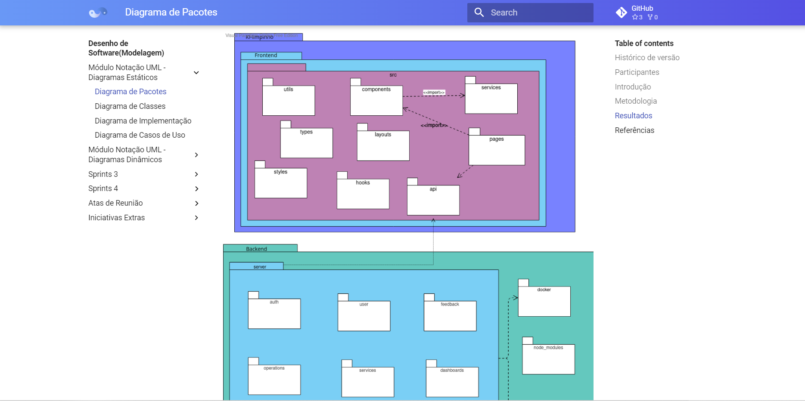

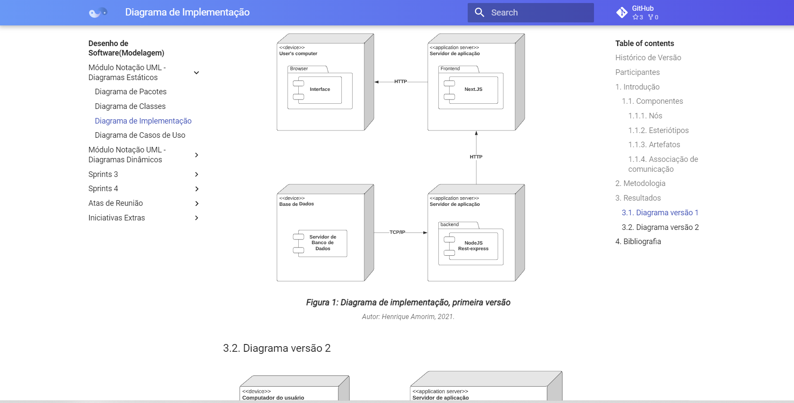

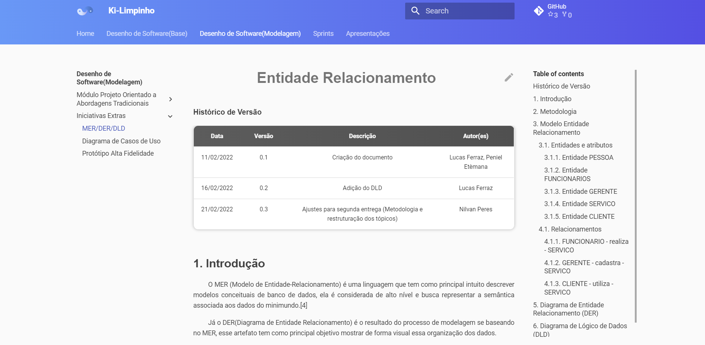

## Vídeo(s) Segunda Entrega <<FOCO: DSW(Modelagem)>>

[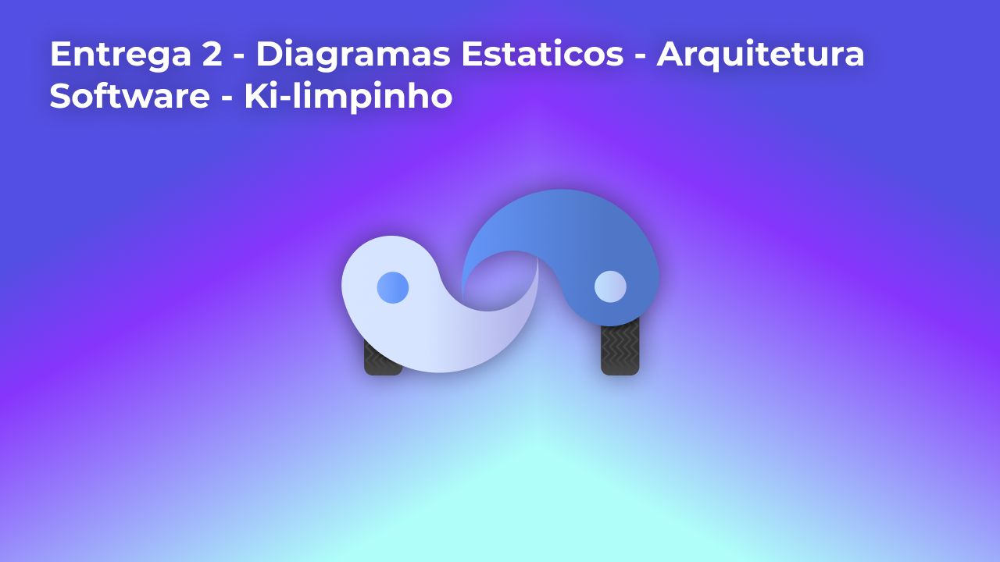](https://youtu.be/eWh2CRP5xsk)

[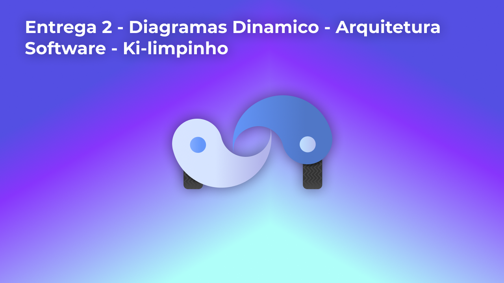](https://www.youtube.com/watch?v=SRXFpjQESlw)

[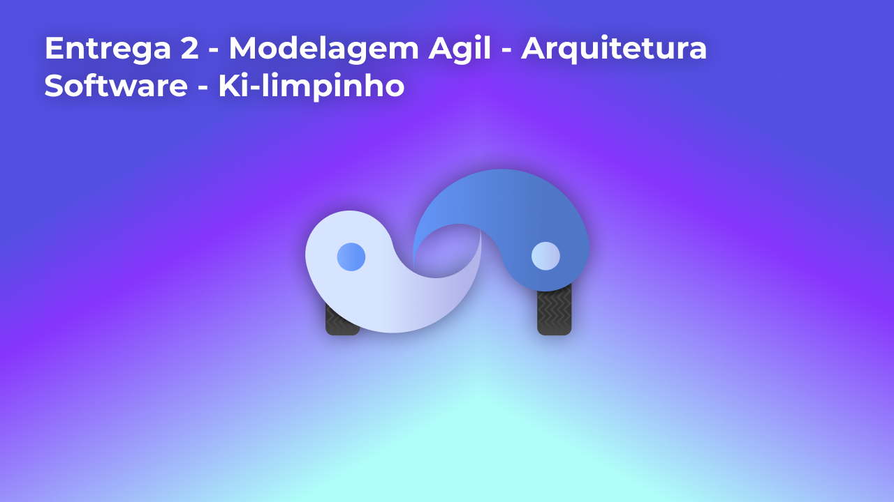](https://www.youtube.com/watch?v=yqWRY3LcKrg)

[](https://www.youtube.com/watch?v=WBk3WFXbHGU)

## Screenshots Terceira Entrega <<FOCO: DSW(Padrões de Projeto)>>

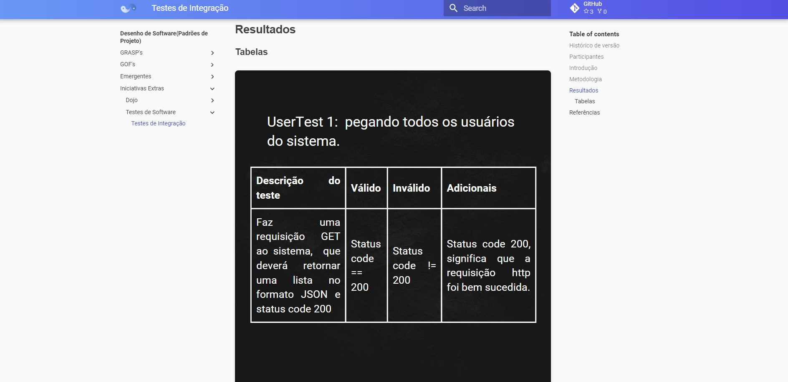

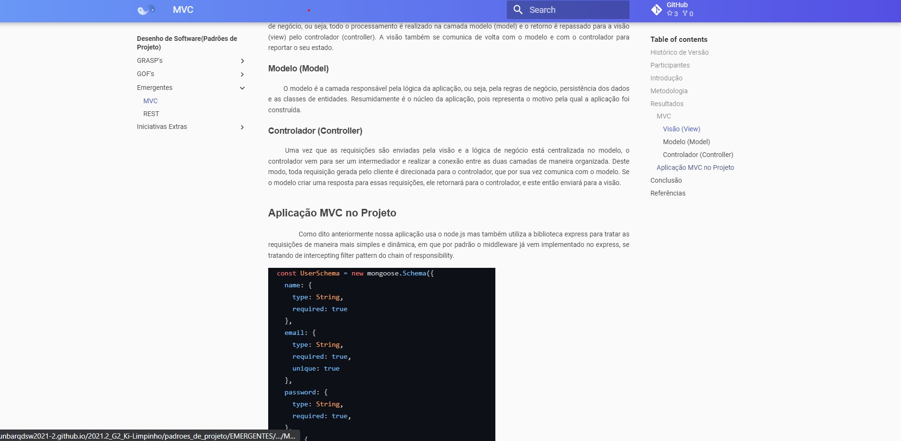

## Vídeo(s) Terceira Entrega <<FOCO: DSW(Padrões de Projeto)>>

[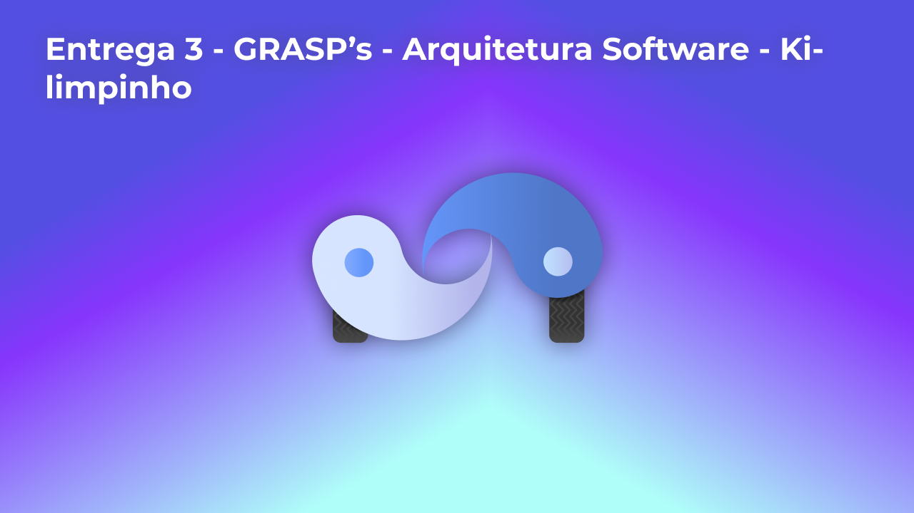](https://youtu.be/yo2EaORhJVo)
[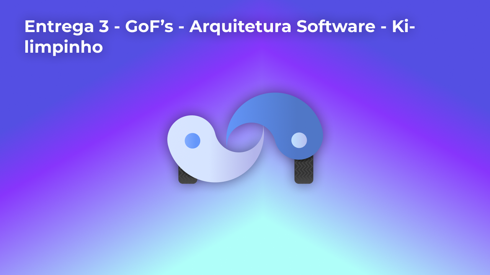](https://youtu.be/c6FY5MfW3Rc)
[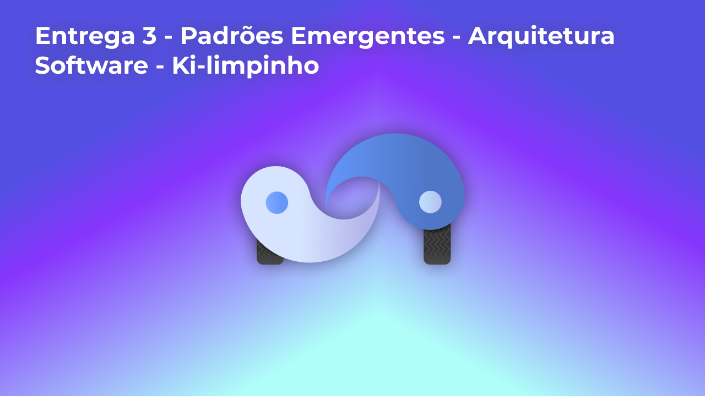](https://youtu.be/cZJIIPAEC-E)
[](https://www.youtube.com/watch?v=lB12Kmqjkjk)

## Screenshots Quarta Entrega (FINAL) <<FOCOS: Arquitetura & Reutilização de Software & PROJETO FINAL>>


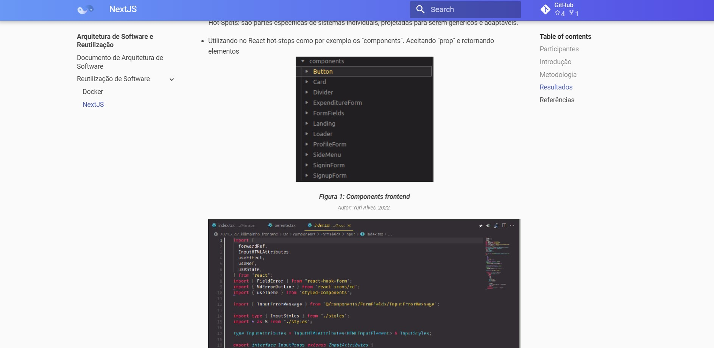
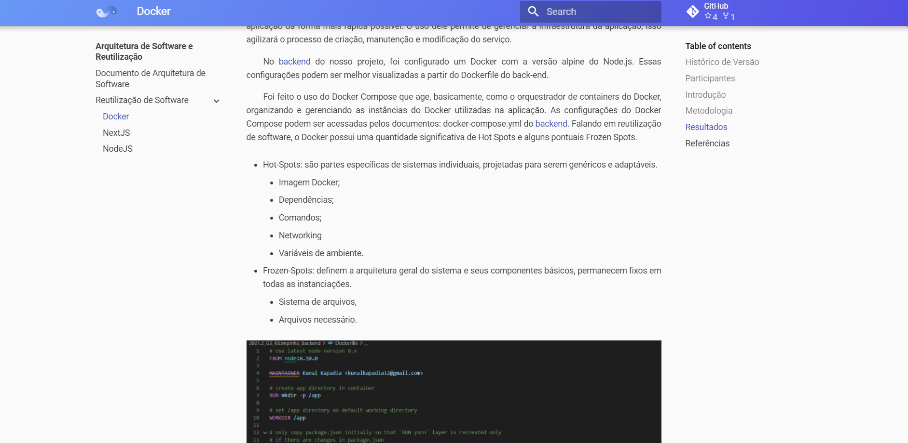
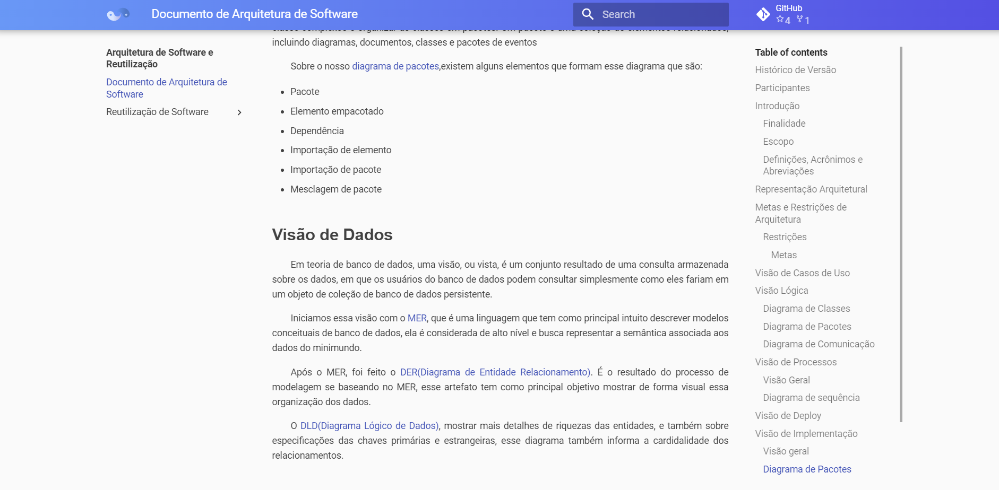

## Vídeo(s) Quarta Entrega (FINAL) <<FOCOS: Arquitetura & Reutilização de Software & PROJETO FINAL>>

[](https://youtu.be/jE-lXad90xk)
[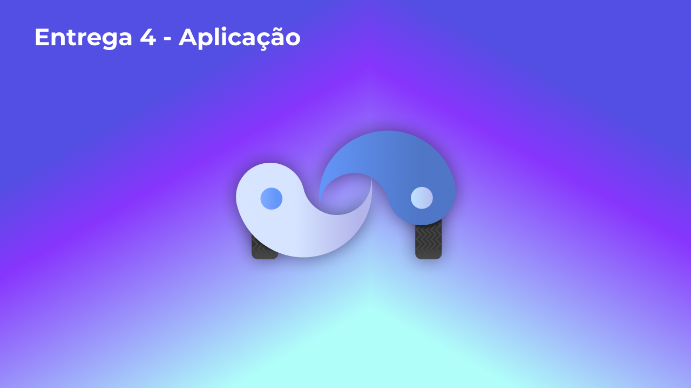](https://www.youtube.com/watch?v=oicQyrVyeG8)

## Descritivo dos Principais Aspectos Técnicos 
**Principal(is) Metodologia(s) Adotada(s)**: 
Scrum e Xp<br>
**Principais Linguagens Utilizadas e/ou Pretendidas**: 
Foi utilizado JavaScript para o font e back, usando os frameworks.<br>
**Principais Tecnologias Utilizadas e/ou Pretendidas**: 
Para o desenvolvimento do front forma utilizados o framework Next.js e para o back Node.js<br>
**Principal(is) Estilo(s) Arquitetural(is) Adotado(s)**: 
GRASP's: adapter, alta coesão e baixo acoplamento. MVC<br>

## O Projeto está rodando?
( X ) SIM
( ) NÃO

## Informações Complementares 

### Configurações para rodar o Front

Pré-requisitos, possuir o node 14 ou versão superior.

- Clonando projeto.

```shell
git clone git@github.com:UnBArqDsw2021-2/2021.2_g2_kilimpinho_frontend.git

cd 2021.2_g2_kilimpinho_frontend
```

- Inicilizando o projeto

```shell
yarn

yarn dev
```

Apos a primeira inicialização, utilize apenas o `yarn dev`, pois é ele o responsável por subir o Front.


### Configurações para rodar o Docker

Pré-requisitos, possuir docker e docker-compose instalado na maquina.

- Clonando projeto.

```shell
git clone git@github.com:UnBArqDsw2021-2/2021.2_G2_Ki-Limpinho_Backend.git

cd 2021.2_G2_Ki-Limpinho_Backend
```

- Primeiro acesso. Para buildar o projeto escreva.

```shell
docker-compose up --build
```

Para acessos futuros utilize apenas `docker-compose up`, pois o --build serve apenas para construção inicial do container.