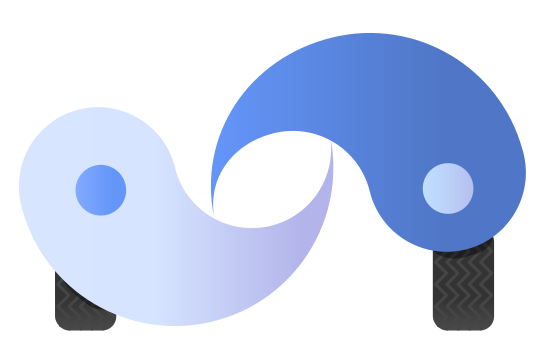
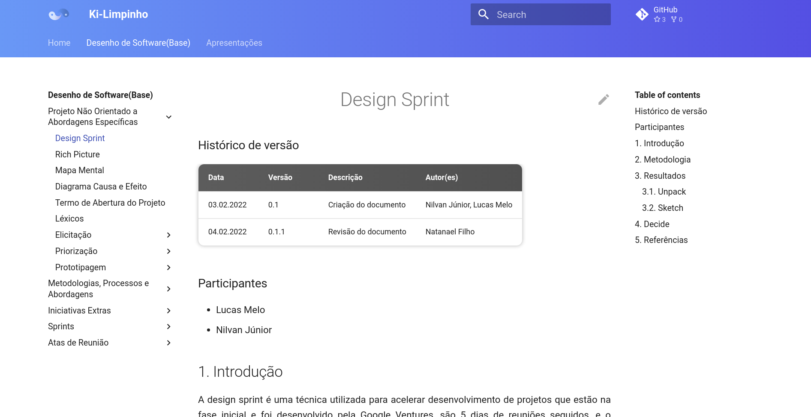
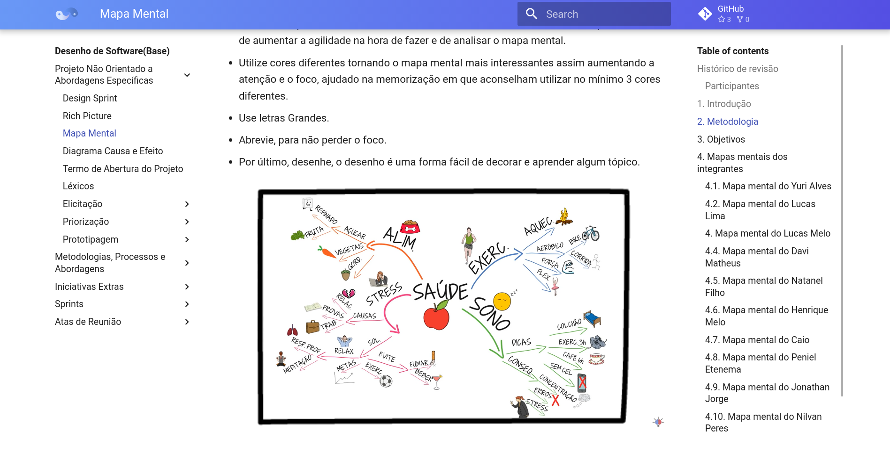
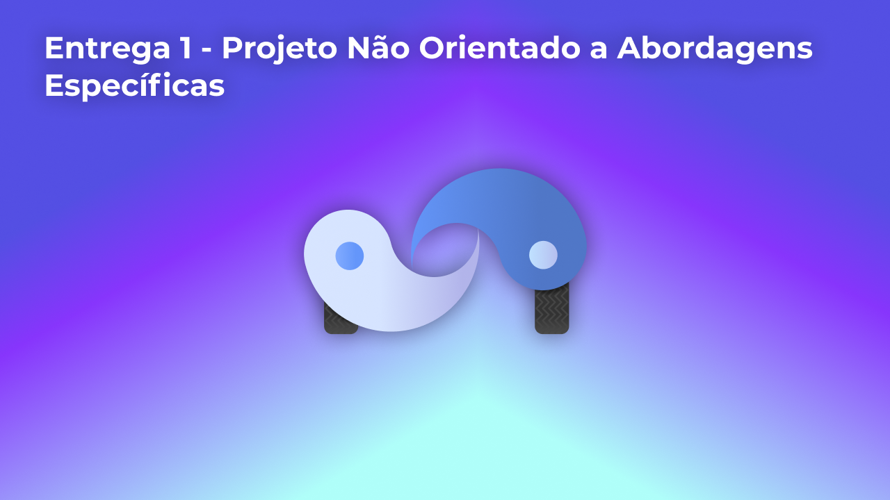
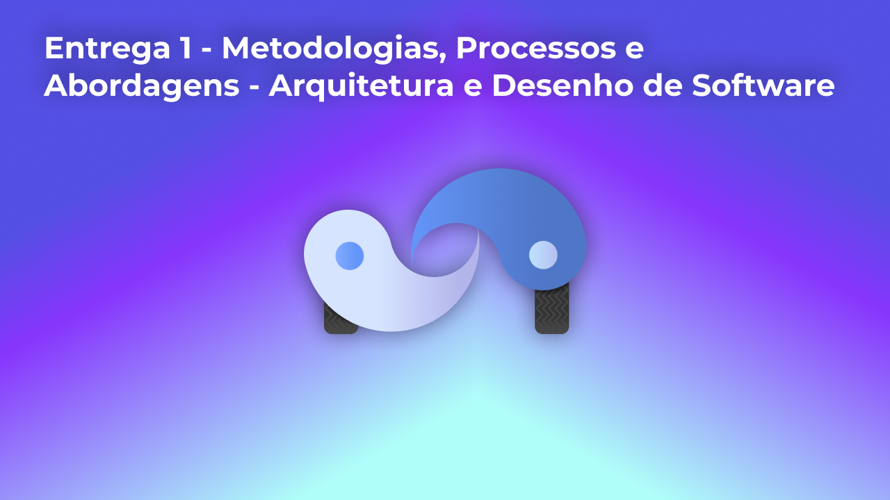
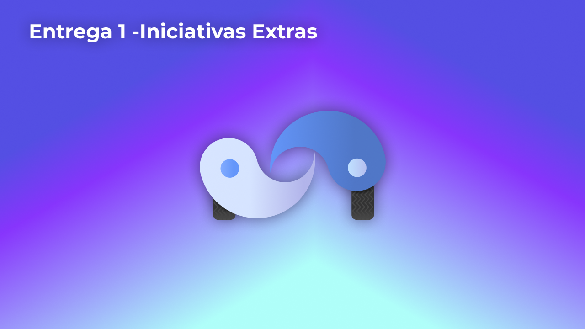

# Ki-Limpinho 💦🚗

  

**Código da Disciplina**: FGA0208 
**Número do Grupo**: 02 

## Alunos 🤓
|Matrícula | Aluno |
| -- | -- |
| 18/0074741  |  Caio Martins Ferreira |
| 19/0042419 |  Davi Matheus da Rocha de Oliveira |
| 17/0144488  |  Henrique Amorim |
| 18/0103580  |  Jonathan Jorge Barbosa Oliveira |
| 18/0105345  |  Lucas Lima Ferraz |
| 18/0125885  |  Lucas Melo dos Santos |
| 19/0058650  |  Natanael Fernandes Coelho Filho |
| 17/0122468  |  Nilvan Peres Costa |
| 18/0011308  |  Peniel Etèmana Désirez-Jésus Zannoukou |
| 18/0078640  |  Yuri Alves Bacarias |

## Sobre 🤔
Você trabalhou a semana toda e decide fazer aquela viagem no sábado que tanto sonhava, acorda cedo para levar o carro para lavar, e depois tem que ficar horas esperando o carro ficar pronto, triste né. É pior ainda quando você é um gerente de uma empresa e tem que além de gerenciar os funcionários, lidar com ações repetitivas da gerência financeira, 😨.

É por isso que a Ki-limpinho fornece uma aplicação web que ajuda ao cliente no monitoramento do veículo e ao gerente na organização do lava-jato e gerência das finanças. Com ela, o cliente consegue manter contato com o lava-jato e acompanhar o status do carro, já o gerente pode visualizar dashboards, planilhas, etc. que fornece a liquidez mensal e entre outros fatores importantes para a gestão do lava-jato.

## Screenshots Primeira Entrega <<FOCO: DSW(Base)>>

## Vídeo(s) Primeira Entrega <<FOCO: DSW(Base)>>

## Screenshots Segunda Entrega <<FOCO: DSW(Modelagem)>>
Adicione 2 ou mais screenshots do projeto em termos de artefatos da Segunda Entrega.

## Vídeo(s) Segunda Entrega <<FOCO: DSW(Modelagem)>>
Adicione o(s)s vídeo(s) da Segunda Entrega.

## Screenshots Terceira Entrega <<FOCO: DSW(Padrões de Projeto)>>
Adicione 2 ou mais screenshots do projeto em termos de artefatos da Terceira Entrega.

## Vídeo(s) Terceira Entrega <<FOCO: DSW(Padrões de Projeto)>>
Adicione o(s)s vídeo(s) da Terceira Entrega.

## Screenshots Quarta Entrega (FINAL) <<FOCOS: Arquitetura & Reutilização de Software & PROJETO FINAL>>
Adicione 2 ou mais screenshots do projeto em termos de interface e/ou funcionamento.

## Vídeo(s) Quarta Entrega (FINAL) <<FOCOS: Arquitetura & Reutilização de Software & PROJETO FINAL>>
Adicione o(s)s vídeo(s) da Entrega Final.

## Descritivo dos Principais Aspectos Técnicos 
**Principal(is) Metodologia(s) Adotada(s)**: xxxxxx 
**Principais Linguagens Utilizadas e/ou Pretendidas**: xxxxxx 
**Principais Tecnologias Utilizadas e/ou Pretendidas**: xxxxxx 
**Principal(is) Estilo(s) Arquitetural(is) Adotado(s)**: xxxxxx 

## O Projeto está rodando?
( ) SIM
( ) NÃO
Se SIM, insira um manual (ou um script) para auxiliar ainda mais os interessados em consultar o projeto.

## Informações Complementares 
Quaisquer outras informações sobre seu projeto podem ser descritas nessa seção.