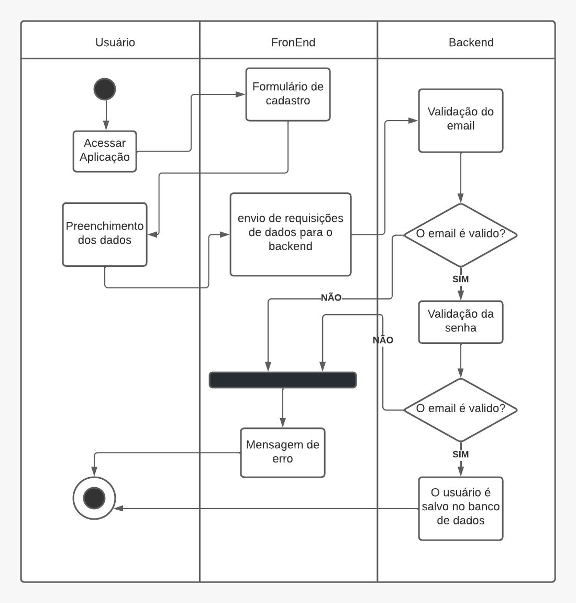
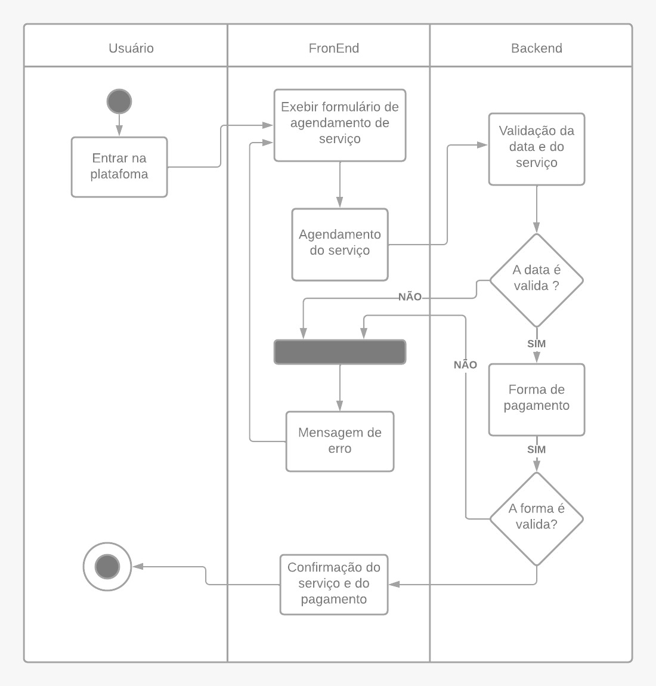
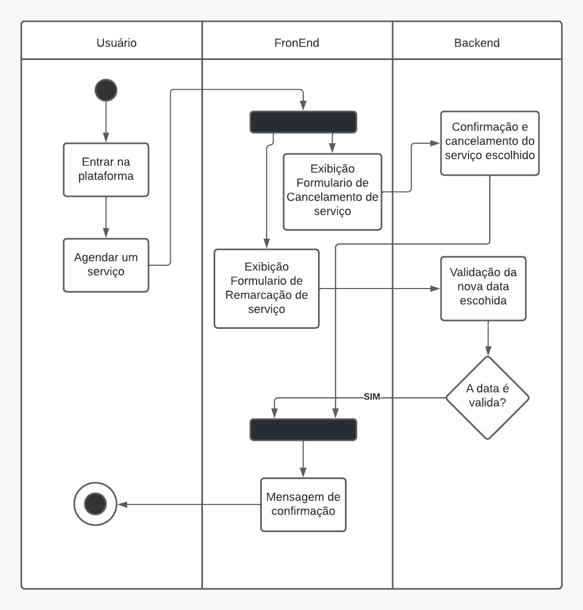
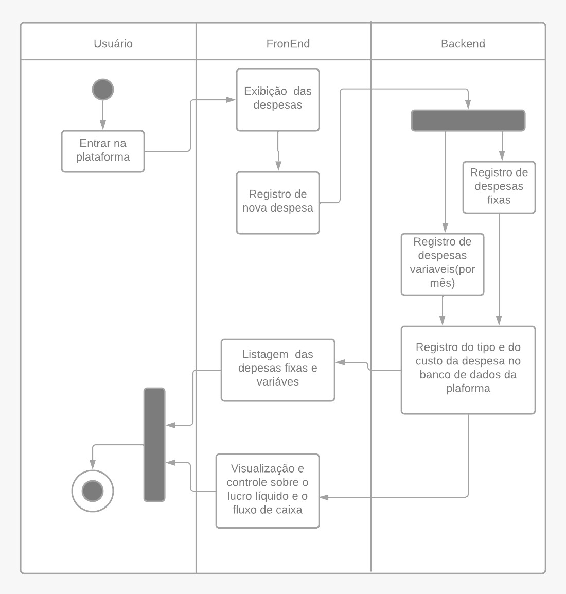

# 
 Diagrama de Atividades

### Histórico de Versão

| Data | Versão | Descrição | Autor(es)|
| -- | -- | -- | -- |
| 11.02.2022 | 0.1 | Criação do documento | Davi Matheus |
| 13.02.2022 | 0.1 | Adição dos diagramas de atividades | Davi Matheus |
| 14.02.2022 | 0.1.1 | Revisão do documento | Natanael Filho |
| 14.02.2022 | 0.1.2 | Aplicando mudancas solicitadas no PR | Nilvan Peres |

## 1. Introdução

&emsp;&emsp; A Linguagem de modelagem unificada inclui diversos subconjuntos de diagramas, incluindo diagramas de estrutura, de interação e de comportamento. Em que diagramas de atividade, com diagramas de caso de uso e de máquina de estados, são considerados diagramas de comportamento porque descrevem o que é necessário acontecer no sistema sendo modelado, e nessa gama de diagramas dinâmicos, destaca-se o diagrama de Atividades.

&emsp;&emsp;
E nessa gama de diagramas dinâmicos, destaca-se o diagrama de Atividades , em que eles ajudam a unir as pessoas das áreas de negócios e de desenvolvimento de uma organização para entender o mesmo processo e comportamento.  Ou seja, o foco está nos procedimentos, processos de negócio e fluxo de trabalho de um projeto.

## 2. Metodologia

&emsp;&emsp;Para a modelagem do diagrama de atividades, é necessário primeiro entender sua composição em que alguns dos componentes mais comuns são:
 

- Ações: uma etapa da atividade em que o usuário ou software realiza uma determinada tarefa. No Lucidchart, ações são simbolizadas por retângulos de cantos arredondados.
- Nó de decisão: um ramo condicional no fluxo representado por um diamante. Inclui uma única entrada e duas ou mais saídas.
- Fluxos de controle: outro nome dado aos conectores que mostram o fluxo entre as etapas no diagrama.
- Nó inicial: simboliza o início da atividade. É representado por um círculo preto.
Nó final: representa a etapa final da atividade. É representado por um círculo preto delineado.

&emsp;&emsp; Com isso dito, se conduziu necessário a modularização da aplicação em diversos contextos para que, desta forma, cada fluxo de atividades pudesse ser melhor descrito e para que cada diagrama pudesse ser analisado de maneira independente, em que os fluxos idealizados foram:
 

- Cadastro de usuário
- Pagamento de serviços
- Remarcação /Cancelamento de serviços
- Controle dos dashboards da aplicação
- Fluxo de caixa do gerente

&emsp;&emsp;Vale ressaltar que cada diagrama foi divido em 3 instâncias, estas são as camadas do usuário, do frontend e do backend. Cada camada representa a instância de determinada ação, isto é, em qual nível comportamental uma determinada ação acontece na aplicação. A camada do usuário descreve todas as atividades desempenhadas ao nível da pessoa que utiliza a plataforma Ki-Limpinho, em que o usuário pode ser ou o cliente ou o gerente. No que lhe concerne, a camada do frontend engloba todas as atividades desempenhadas pela solução computacional em contato direto com o usuário. Por fim, a camada do backend representa todas as atividades descritas nas regras de negócio e lógicas de processamento da aplicação.
 

## 3. Diagrama de Atividades

### 3.1. Cadastro de usuário

&emsp;&emsp;O fluxo de cadastro de usuário descreve o caminho que deve ser executado pelo usuário(tanto pelo cliente tanto pelo gerente) ao tentar se cadastrar na plataforma.

    
    <figcaption align='center'>
        <b>Figura 1: Diagrama de atividades - cadastro de usuário</b>
         
        <small>Autor: Davi Matheus.</small>
    </figcaption>

### 3.2. Pagamento de um serviço

&emsp;&emsp;O fluxo de pagamento de um serviço  descreve o caminho percorrido pelo usuário, este já deve estar devidamente cadastrado na aplicação, ao executar a tarefa de agendar um serviço e depois todo o processo do pagamento na plataforma. 

    
    <figcaption align='center'>
        <b>Figura 2: Diagrama de atividades - Pagamento de um serviço</b>
         
        <small>Autor: Davi Matheus.</small>
    </figcaption>

### 3.3. Remarcar/Cancelar um serviço

&emsp;&emsp;O fluxo de cancelamento ou de remarcação de uma lavagem descreve o caminho percorrido pelo cliente ao tentar alterar a data de um serviço previamente agendado, ou ate mesmo cancela-lo. Em que para realizar esta tarefa este cliente já deve estar cadastrado e vinculado a plataforma, e também é importante informar essa ação e única não podendo ser alterada posteriormente. 

    
    <figcaption align='center'>
        <b>Figura 3: Diagrama de atividades - Remarcar/Cancelar um serviço </b>
         
        <small>Autor: Davi Matheus.</small>
    </figcaption>

### 3.4. Fluxo de caixa da plataforma

&emsp;&emsp;O diagrama de controle de caixa do lava-jato descreve o fluxo de atividades percorrido pelo gerente através da utilização do ‘website’ para o controle das despesas fixas e variáveis(mensais) que um determinado lava-jato precisa gerenciar para assim conseguir gerar um lucro.

    
    <figcaption align='center'>
        <b>Figura 4: Diagrama de atividades - Fluxo de caixa </b>
         
        <small>Autor: Davi Matheus.</small>
    </figcaption>

## 5. Conclusão

 

&emsp;&emsp;A partir da realização dos diagramas de atividades foi-se capaz além de entender melhor o fluxo da plataforma em geral, e identificar melhoras maneiras para a obtenção do resultado naquela específica tarefa, também conseguiu entender o projeto Ki-limpinho a níveis comportamentais.

## 4. Referência

> [1] Activity Diagrams. **UML Diagrams**. Disponível em: https://www.uml-diagrams.org/activity-diagrams.html (Último acesso em 12/02/2022)

> [2] SERRANO, Milene. Arquitetura e Desenho de Software AULA - DIAGRAMA DE ATIVIDADES (Último acesso em 13/02/2022)

> [3] O que é diagrama de atividades UML?. **Lucidchart**. https://www.lucidchart.com/pages/pt/o-que-e-diagrama-de-atividades-uml (Último acesso em 14/08/2022)

