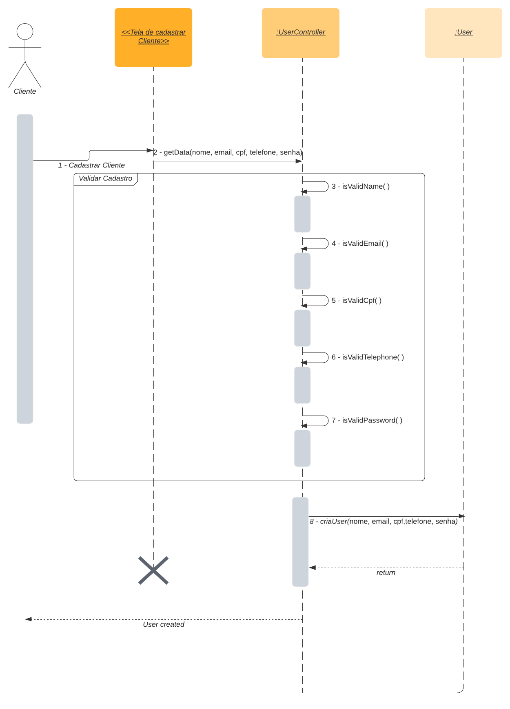
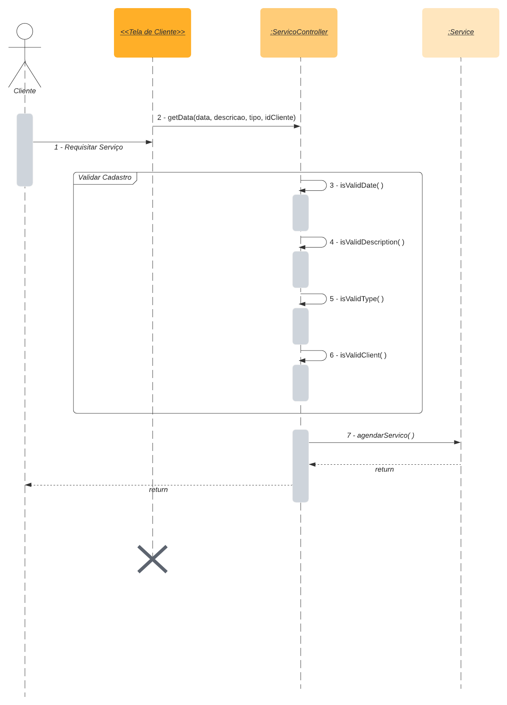
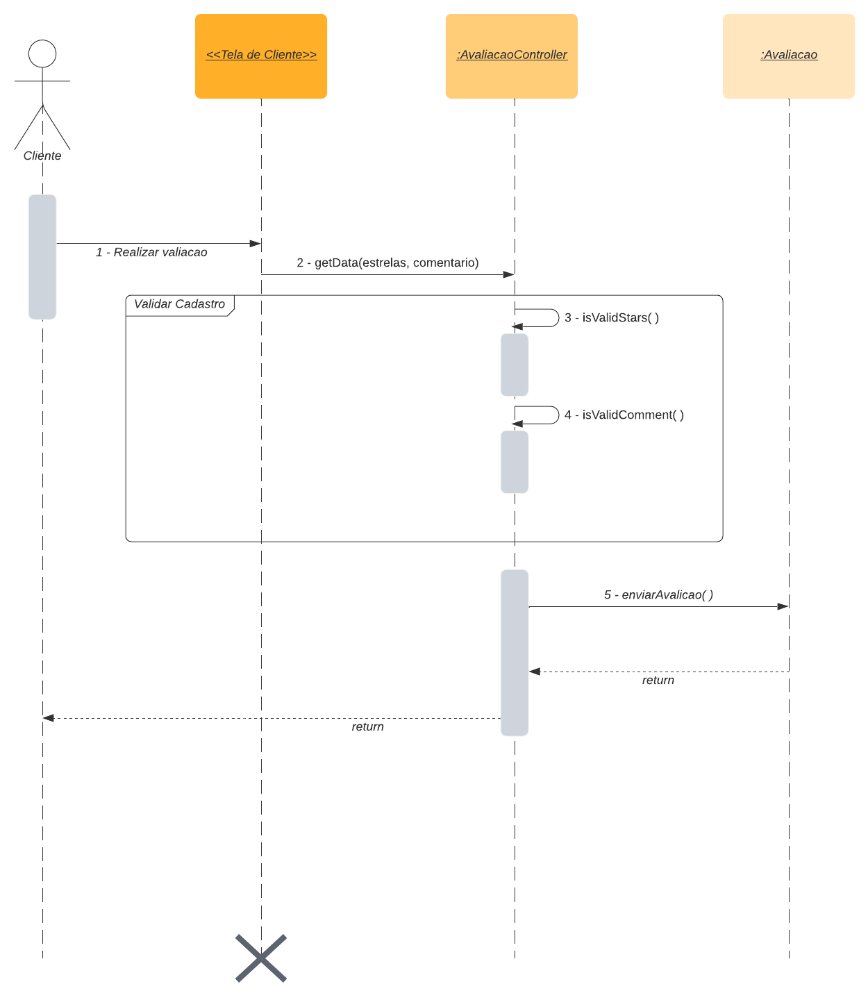
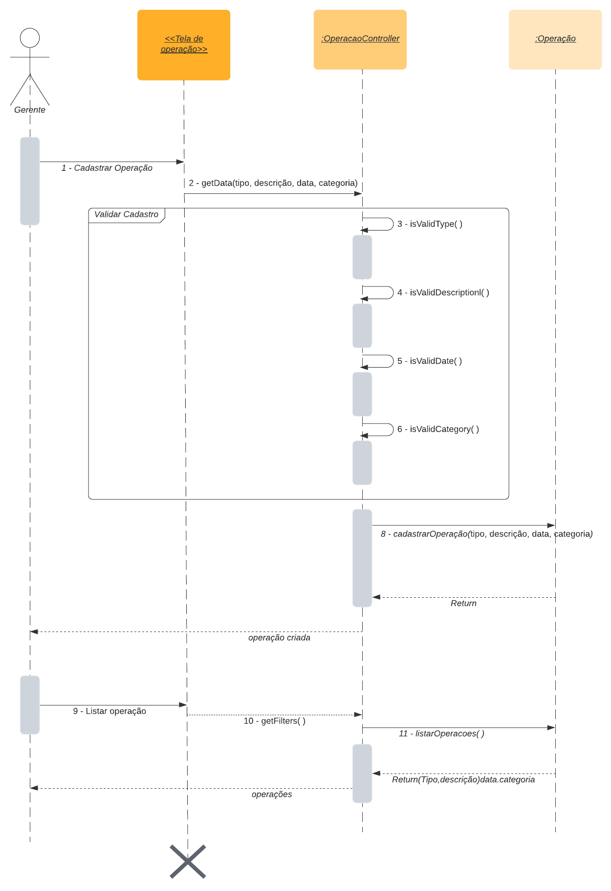

# 
 Diagrama de Sequencia

### Histórico de Versão 

| Data       | Versão | Descrição            | Autor(es)                 |
| ---------- | ------ | -------------------- | ------------------------- |
| 12.02.2022 | 0.1    | Criação do documento | Yuri Alves e Caio Martins |
| 12.02.2022 | 0.2    | Criação de topicos   | Yuri Alves e Caio Martins |
| 12.02.2022 | 0.3    | adição de imagens    | Yuri Alves e Caio Martins |
| 12.02.2022 | 0.3.1   | Revisão - faltou adicionar as referências   | Lucas Melo |
| 13.02.2022 | 0.3.2   | Revisão - acho que vale a pena adicionar feature dos Dashboards | Nilvan |

## 1. Introdução

&emsp;&emsp;Os diagramas de sequência são um tipo de modelagem dinâmica em UML para a melhor visualização de processos, objetos e suas mensagens trocadas sempre procurando mostrar uma sequência de eventos e métodos disparados por seus agentes e os seus objetivos. Assim colaborando para um melhor entendimento dos processos de determinado caso de uso, pois com o diagrama de sequência é possível documentar o ato dos autores e suas consequências.

## 2. Metodologia

&emsp;&emsp;O diagrama de sequência foi criado com a utilização da ferramenta Lucidchart e baseando-se no diagrama de classes já construído. Construção baseada nas normas de criação de diagramas e construído com as principais features do sistema.

## 3. Diagramas

    
    <figcaption align='center'>
        <b>Figura 1: Cadastro Cliente</b>
         
        <small>Autor: Caio Martins, Yuri Alves, 2021.</small>
    </figcaption>

    
    <figcaption align='center'>
        <b>Figura 2: Agendar de Serviço</b>
         
        <small>Autor: Caio Martins, Yuri Alves, 2021.</small>
    </figcaption>

    
    <figcaption align='center'>
        <b>Figura 3: Avaliar Serviço</b>
         
        <small>Autor: Caio Martins, Yuri Alves, 2021.</small>
    </figcaption>

    
    <figcaption align='center'>
        <b>Figura 4: Cadastro e listagem de operações</b>
         
        <small>Autor: Caio Martins, Yuri Alves, 2021.</small>
    </figcaption>

  

## 4. Referências

> [1] Diagrama de Sequência, Disponível em: <https://docente.ifrn.edu.br/givanaldorocha/disciplinas/engenharia-de-software-licenciatura-em-informatica/diagrama-de-sequencia>. Acesso em: 12 de Fevereiro de 2022.

> [2] O que é um diagrama de sequência UML?: Disponível em: <https://www.lucidchart.com/pages/pt/o-que-e-diagrama-de-sequencia-uml#section_4>. Acesso em: 12 de Fevereiro de 2022.

> [3] Animalesco - Diagrama de sequência. Disponível em <https://unbarqdsw2021-1.github.io/2021.1_G01_Animalesco_docs/#/pages/diagrama-de-sequencia>. Acesso em: 12 de Fevereiro de 2022.
