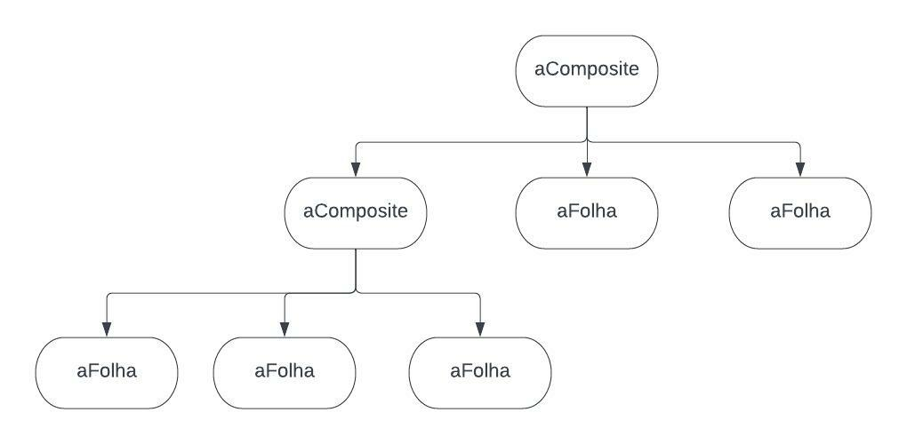

# 
 GOFS Estruturais (Composite)

### Histórico de versão 

| Data      | Versão | Descrição            | Autor(es)                                   |
| --------- | ------ | -------------------- | ------------------------------------------- |
| 15.3.2022 | 0.1    | Criação do documento | [Yuri Alves](https://github.com/yuriAlves5) |
| 15.3.2022 | 0.2    | adição da introdução | [Yuri Alves](https://github.com/yuriAlves5) |
| 21.3.2022 | 0.3    | Adição do diagrama   | [Yuri Alves](https://github.com/yuriAlves5) |

### Participantes

-   [Yuri Alves](https://github.com/yuriAlves5)

### Introdução

&emsp;&emsp;
    O <i>composite</i> é um padrão de desing estrutural que permite o reuso de um mesmo objeto. O composite reune os objetos em formato de estrutura de árvore.de acordo com Erich Gamma em <i>Design Patterns</i>, essa forma de estruturação é possivel tratar objetos individuais e objetos compostos de forma uniforme. Toda essa estrutura é baseada  no Polimorfismo dos objetos. 

### Metodologia

&emsp;&emsp; 
    Uma tipica estrutura da forma <i>composite</i> deve seguir em principios a seguinte forma.
    

    
    <figcaption align='center'>
        <b>Figura 1: Exemplo de árvore</b>
         
        <small>Autor: Yuri Alves, 2021.</small>
    </figcaption>
    

    <li>
    Onde o "aComposite" define o comportamente das filhas, salvando o seus componentes e implementando um relaao de operação "<i>child-related</i>" entre elas.
    </li>
    <li>
    Já o "aFolha" define a folha da estrutura em forma de arvores onde ela não poderá ter filhos e com um comportamento de objetos primitivos.
    </li>

### Implementação

&emsp;&emsp;
    Ainda de acordo com Erich Gamma em <i>Design Patterns</i>, a implementação do <i>composite</i> cria inumeras questões a serem consideradas podendo citar:
    <ol>
        <li>
            <strong>black</strong>
        </li>
    </ol>

## Referências

> [1] Design Patters - Elements of Reusable Object-Oriented Software. Disponível em: http://www.uml.org.cn/c%2B%2B/pdf/DesignPatterns.pdf. Acesso em: 15 mar. de 2022.
