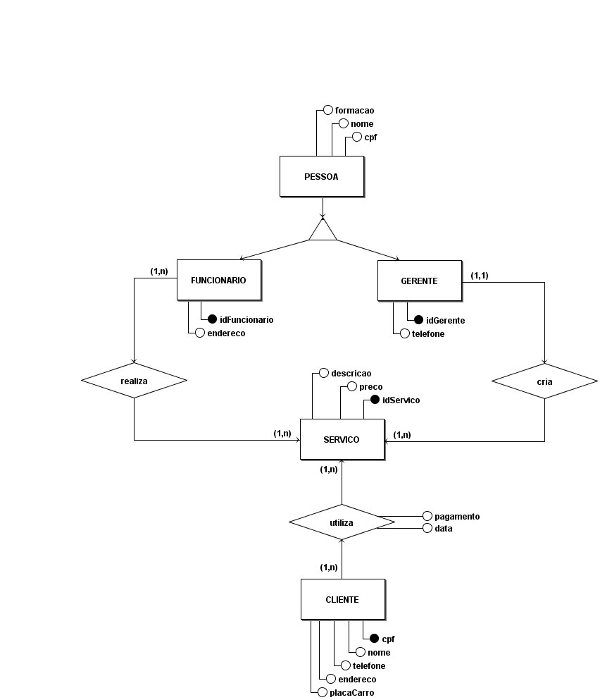

# 
 Entidade Relacionamento

#### Histórico de Versão

|    Data    | Versão |      Descrição       |     Autor(es)     |
| :--------: | :----: | :------------------: | :---------------: |
| 11/02/2022 |  0.1   | Criação do documento | Lucas Ferraz, Peniel Etèmana |
| 16/02/2022 |  0.2   | Adição do DLD | Lucas Ferraz |
| 21/02/2022 |  0.3   | Ajustes para segunda entrega (Metodologia e restruturação dos tópicos) | Nilvan Peres |

## 1. Introdução

&emsp;&emsp;
    O MER (Modelo de Entidade-Relacionamento) é uma linguagem que tem como principal intuito descrever modelos conceituais de banco de dados, ela é considerada de alto nível e busca representar a semântica associada aos dados do minimundo.[4]

&emsp;&emsp;
    Já o DER(Diagrama de Entidade Relacionamento) é o resultado do processo de modelagem se baseando no MER, esse artefato tem como principal objetivo mostrar de forma visual essa organização dos dados.

&emsp;&emsp;
    O DLD(Diagrama Lógico de Dados) irá mostrar mais detalhes de riquezas das entidades, e também sobre especificações das chaves primárias e estrangeiras, esse diagrama também informa a cardidalidade dos relacionamentos.

## 2. Metodologia

&emsp;&emsp;
    Por acreditar que o MER, DER e DLD são complementares um ao outro para representar o banco de dados, decidimos deixar as três técnicas no mesmo documento para dar uma ideia de continuidade. Esse artefato foi produzido com o auxílio da plataforma <a href="https://www.brmodeloweb.com/lang/pt-br/index.html">Br modelo</a>. 

## 3. Modelo Entidade Relacionamento

&emsp;&emsp;
    SISTEMA WEB KILIMPINHO – Descrito pelas Entidades PESSOA, FUNCIONARIO, GERENTE, SERVICO e CLIENTE.

### 3.1. Entidades e atributos
#### 3.1.1. Entidade PESSOA

&emsp;&emsp;
    Representa as características em comum entre FUNCIONARIO e GERENTE. A ocorrêcia da entidade PESSOA será associado aos seguintes atributos: **cpf**, **nome**, **formacao**.

#### 3.1.2. Entidade FUNCIONARIOS

&emsp;&emsp;
    Representa os funcionarios do lava-jato. A ocorrência da entidade FUNCIONARIO será associado aos seguintes atributos: **idFuncionario**, **endereco**.

#### 3.1.3. Entidade GERENTE

&emsp;&emsp;
    Representa os gerentes do lava-jato. A ocorrência da entidade GERENTE será associado aos seguintes atributos: **idGerente**,  **telefone**.

#### 3.1.4. Entidade SERVICO

&emsp;&emsp;
    Representa os seviços registrados no sistema WEB KiLimpinho. A ocorrência da entidade SERVICO será associado aos seguintes atributos: **idServico**, **preco**, **descricao**.

#### 3.1.5. Entidade CLIENTE

&emsp;&emsp;
    Representa os clientes cadastrados no sistema WEB KiLimpinho. A ocorrência da entidade CLIENTE será associado aos seguintes atributos: **cpf**,**nome**, **telefone**, **endereco**, **placaCarro**.

### 4.1. Relacionamentos

#### 4.1.1. FUNCIONARIO - realiza - SERVICO

&emsp;&emsp;
    Um FUNCIONARIO pode realizar um ou mais SERVICO e um SERVICO pode ser feito por um ou mais FUNCIONARIO. 
    **Cardinalidade: n : m**.

#### 4.1.2. GERENTE - cadastra - SERVICO

&emsp;&emsp;
    Um GERENTE pode cadastrar um ou mais SERVICO, mas um SERVICO só pode ser cadastrado por um GERENTE.
    **Cardinalidade: 1 : n**.

#### 4.1.3. CLIENTE - utiliza -  SERVICO

&emsp;&emsp;
    Um CLIENTE pode utilizar um ou mais SERVICO e um SERVICO pode ser utilizado por um ou mais CLIENTE. 
    **Cardinalidade: n : m**.

## 5. Diagrama de Entidade Relacionamento (DER)

    
    <figcaption align='center'>
        <b>Figura 1: DER KiLimpinho</b>
         
        <small>Autor: Lucas Ferraz, Peniel Etèmana, 2022.</small>
    </figcaption>

## 6. Diagrama de Lógico de Dados (DLD)

    
    <figcaption align='center'>
        <b>Figura 3: DLD KiLimpinho</b>
         
        <small>Autor: Lucas Ferraz, 2022.</small>
    </figcaption>

## 7. Referências

> [1] Modelo Entidade Relacionamento (MER) e Diagrama Entidade-Relacionamento (DER). Disponível em: [https://www.devmedia.com.br/modelo-entidade-relacionamento-mer-e-diagrama-entidade-relacionamento-der/14332](https://www.devmedia.com.br/modelo-entidade-relacionamento-mer-e-diagrama-entidade-relacionamento-der/14332). Acesso em 11 de fev, de 2022.

> [2] Animalesco - MER. Disponível em: [https://unbarqdsw2021-1.github.io/2021.1_G01_Animalesco_docs/#/pages/MER?id=_2-modelo-entidade-relacionamento](https://unbarqdsw2021-1.github.io/2021.1_G01_Animalesco_docs/#/pages/MER?id=_2-modelo-entidade-relacionamento). Acesso em 11 de fev, de 2022.

> [3] Qual a diferença entre MER (Modelo de Entidade Relacionamento) e DER (Diagrama de Entidade Relacionamento)? - Stackoverflow. Disponível em: [https://pt.stackoverflow.com/questions/328342/qual-a-diferen%C3%A7a-entre-mer-modelo-de-entidade-relacionamento-e-der-diagrama-d](https://pt.stackoverflow.com/questions/328342/qual-a-diferen%C3%A7a-entre-mer-modelo-de-entidade-relacionamento-e-der-diagrama-d). Acesso em 21 de fev, de 2022.