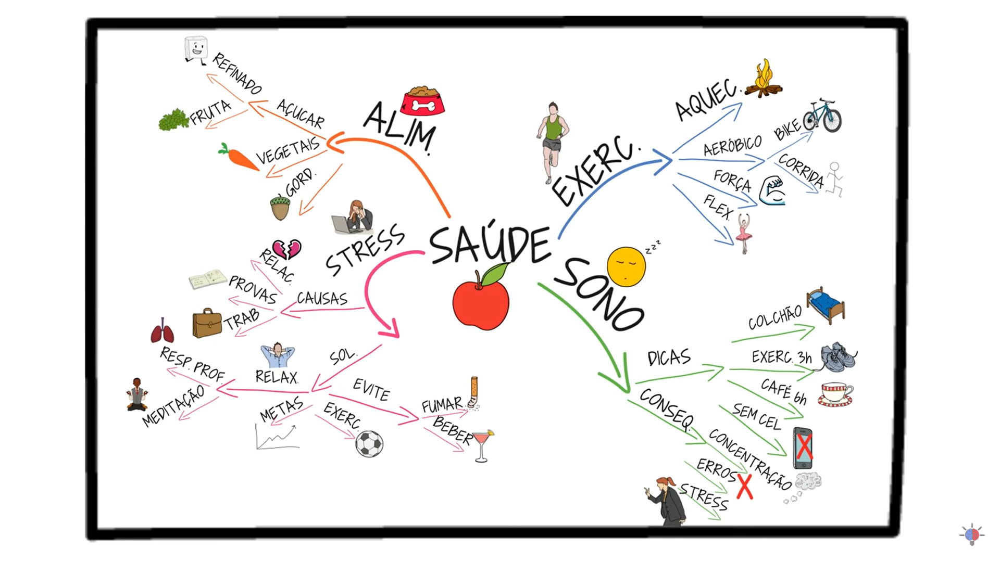
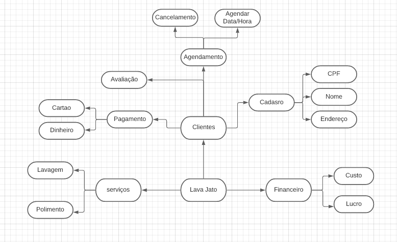
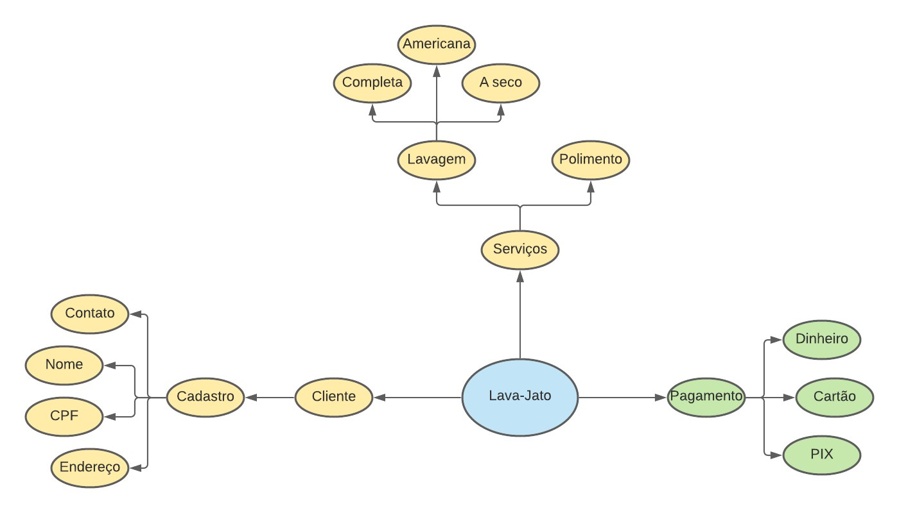
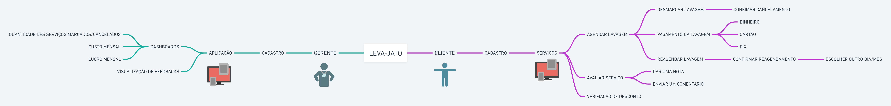
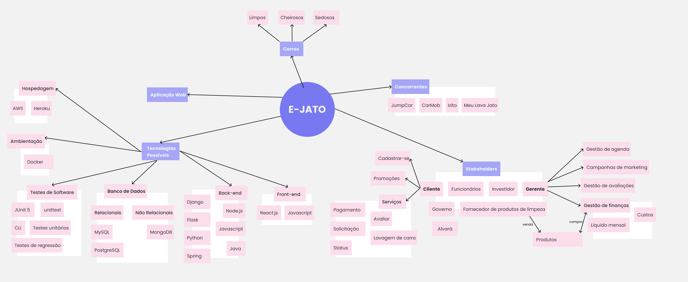
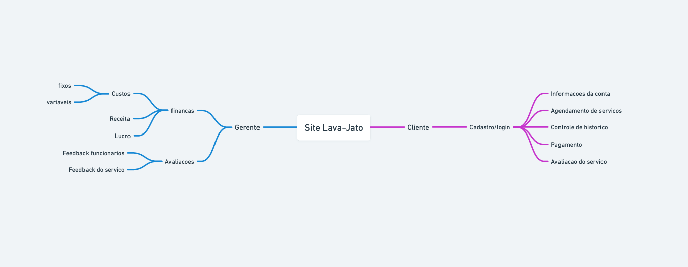
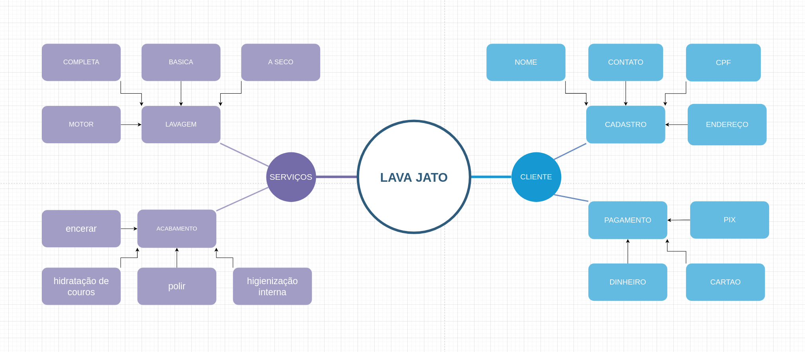
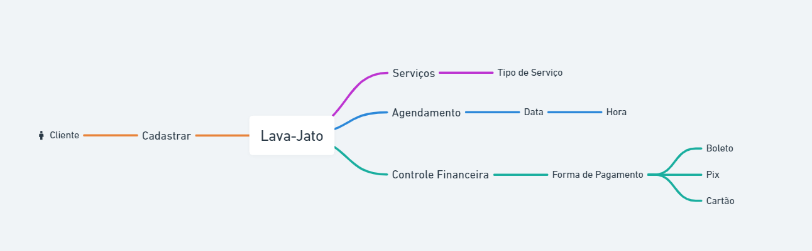
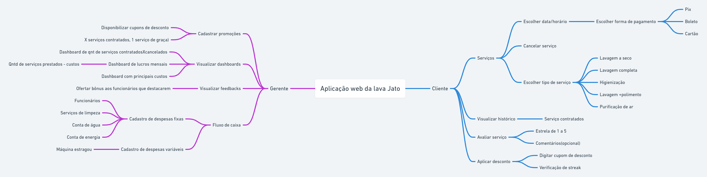

# 
 Mapa mental

## Histórico de Versão 

| Data   | Versão | Modificação  | Autor  |
| :- | :- | :- | :- |
| 02.02.2022 | 0.1 | Criação e elaboração do documento | [Davi matheus](https://github.com/DaviMatheus) |
| 03.02.2022 | 0.2 | Adição dos topicos 5 e 6 | [Davi matheus](https://github.com/DaviMatheus) |
| 04.02.2022 | 0.2.1 | Revisão:Correção de texto e descrição do documento | [Lucas Melo](https://github.com/luucas-melo) |
| 04.02.2022 | 0.2.2 | Revisão do documento | [Natanael Filho](https://github.com/fernandes-natanael) |
| 11.03.2022 | 0.2.3 | Padronizar estrutura | [Jonathan Jorge](https://github.com/Jonathan-Oliveira) |

## Participantes

* [Caio Martins](https://github.com/linktocaio)
* [Davi matheus](https://github.com/DaviMatheus)
* [Henrique Amorim](https://github.com/HenriqueAmorim20)
* [Jonathan Jorge](https://github.com/Jonathan-Oliveira)
* [Lucas Lima](https://github.com/mibasFerraz)
* [Lucas Melo](https://github.com/luucas-melo)
* [Natanael Filho](https://github.com/fernandes-natanael)
* [Nilvan Peres](https://github.com/NilvanPeres)
* [Peniel Etèmana](https://github.com/zpeniel09)
* [Yuri Alves](https://github.com/yuriAlves5)

##  Introdução

&emsp;&emsp;
Mapa mental é uma técnica de organização e memorização de pensamentos lógicos e ideias difundida pelo psicólogo inglês Tony Buzan. O modelo mais utilizado hoje foi desenvolvido para potencializar a capacidade do cérebro de armazenar conhecimento e elaborar raciocínio lógico, o uso dessa técnica se torna extremamente importante, no momento que se há a necessidade de documentar, estruturar e criar fluxos mentais de ideias que possam soar vagas, mas que se estruturam e solidificam com o desenvolvimento de artefatos visuais. Para a criação pode ser usado uma folha de papel ou aplicativos ou sites de criação de fluxo e podem ser elaborado em grupo ou individualmente.

&emsp;&emsp;
A técnica consiste em expandir palavras-chave relacionadas ao tema do centro para as laterais da página em que o uso dessa técnica está totalmente ligada “as funções e operações da mente de encadear, relacionar, comparar, classificar, etc., ou seja, processar, de uma forma geral, as informações coletadas no universo exterior quanto do interior”. (SILVA, Milena da Costa, 2010).

&emsp;&emsp;
 Esse documento elaborar um mapa mental a respeito das ideias iniciais a partir de um brainstorm do projeto e também apresentar todos os mapas mentais criados pelos integrantes do grupo durante o processo de entendimento do projeto. Esse documento também servirá como base para ideias futuras e construções de artefatos mediante a definição do projeto, metodologia e tecnologias.

&emsp;&emsp;
Além de construir uma visão simplista e geral de como foi pensado o projeto e suas funcionalidades, abarcando também stakeholders que podem ser atingidos com o mesmo.

##  Metodologia

&emsp;&emsp;
O termo mapa mental foi apresentado pela primeira vez por Buzan durante um capítulo da série Use Your Head, da BBC TV, em 1974. No programa, o psicólogo explicou como funciona o modelo de sequenciamento de ideias em árvore radial, que atualmente é o mais utilizado em todo o mundo e essas etapas são:

- Etapa 1: uma ideia central representada no centro do diagrama.
- Etapa 2: "Ligue ramos principais à imagem central e una os ramos secundários aos principais, os terciários aos secundários e assim sucessivamente.". (SILVA, Milena da Costa, 2010).
- Etapa 3: escreva uma única palavra-chave por ramo.
- Etapa 4: utilize imagens durante o processo.

&emsp;&emsp;
O mapa mental não é só um artefato que fica preso no padrão, também possui alguns fatores criativos, em que segundo Felipe Lima e William Douglas do livro: Mapas mentais e memorizações tem certas dicas para elaborar um mapa mental mais criativo e dinâmico:

- Comece pelo centro, indo para as bordas em que isso nos ajuda na nossa modelagem mental, em que mostra uma melhor ideia de todo trabalho feito e da sua complexidade, além de aumentar a agilidade na hora de fazer e de analisar o mapa mental.
- Utilize cores diferentes tornando o mapa mental mais interessantes assim aumentando a atenção e o foco, ajudado na memorização em que aconselham utilizar no mínimo 3 cores diferentes.
- Use letras Grandes.
- Abrevie, para não perder o foco.
- Por último, desenhe, o desenho é uma forma fácil de decorar e aprender algum tópico.

  
  <figcaption align='center'>
        <b>
            <a href='../assets/img/mapa_mental/exemplo_mapa_mental.png'>
               Figura 1: Mapa mental feito por software
            </a>
        </b>   
       
      <small>Fonte: https://www.youtube.com/watch?v=m1qW0wPJV1M&t=217s.</small>
  </figcaption>

## Resultados

### Mapas mentais dos integrantes

Nesse tópico é apresentado os mapa mentais criados por cada um dos integrantes.

####  Mapa mental do Yuri Alves

    
    <figcaption align='center'>
        <b>
            <a href='../assets/img/mapa_mental/mapa_mental_Yuri.png'>
                Figura 2: Mapa mental do Yuri Alves
            </a>
        </b>
         
        <small>Autor: <a href='https://github.com/yuriAlves5'>  Yuri Alves</a>, 2022.</small>
    </figcaption>

####  Mapa mental do Lucas Lima

    
    <figcaption align='center'>
        <b>
            <a href='../assets/img/mapa_mental/mapa_mental_mibas.jpeg'>
                Figura 3: Mapa mental do Lucas Lima
            </a>
        </b>
         
        <small>Autor: <a href='https://github.com/mibasFerraz'>  Lucas Lima</a>, 2022.</small>
    </figcaption>

#### Mapa mental do Lucas Melo

    
    <figcaption align='center'>
        <b>
            <a href='../assets/img/mapa_mental/mapa_mental_Lucas.png'>
                Figura 4: Mapa mental do Lucas Melo
            </a>
        </b>
         
        <small>Autor: <a href='https://github.com/luucas-melo'>  Lucas Melo</a>, 2022.</small>

    </figcaption>

####  Mapa mental do Davi Matheus

    
    <figcaption align='center'>
        <b>
            <a href='../assets/img/mapa_mental/mapa_mental_Davi.png'>
                Figura 5: Mapa mental do Davi Matheus
            </a>
        </b>        
         
        <small>Autor: <a href='https://github.com/DaviMatheus'> Davi Matheus</a>, 2022.</small>
    </figcaption>

#### Mapa mental do  Natanel Filho

    
    <figcaption align='center'>
        <b>
            <a href='../assets/img/mapa_mental/mapa_mental_Natanel.png'>
                Figura 6: Mapa mental do Natanel
            </a>
        </b>            
         
        <small>Autor: <a href='https://github.com/fernandes-natanael'>Natanel Filho</a>, 2022.</small>
    </figcaption>

#### Mapa mental do Henrique Melo

    
    <figcaption align='center'>
        <b>
            <a href='../assets/img/mapa_mental/mapa_mental_Henrique.png'>
                Figura 7: Mapa mental do Henrique
            </a>
        </b>       
         
        <small>Autor: <a href='https://github.com/HenriqueAmorim20'>Henrique Melo</a>, 2022.</small>
    </figcaption>

#### Mapa mental do Caio

    
    <figcaption align='center'>
        <b>
            <a href='../assets/img/mapa_mental/mapa_mental_Caio.png'>
                Figura 8: Mapa mental do Caio
            </a>
        </b>  
         
        <small>Autor: <a href='https://github.com/linktocaio'>Caio Martins</a>, 2022.</small>
    </figcaption>

#### Mapa mental do Peniel Etenema

    
    <figcaption align='center'>
        <b>
            <a href='../assets/img/mapa_mental/mapa_mental_Peniel.png'>
                Figura 9: Mapa mental do Peniel Etenema
            </a>
        </b>
         
      <small>Autor: <a href='https://github.com/zpeniel09'>Peniel Etenema</a>, 2022.</small>
    </figcaption>

####  Mapa mental do Jonathan Jorge

    
    <figcaption align='center'>
        <b>
            <a href='../assets/img/mapa_mental/mapa_mental_Jonathan.png'>
                Figura 10: Mapa mental do Jonathan Jorge
            </a>
        </b>
         
        <small>Autor: <a href='https://github.com/Jonathan-Oliveira'>Jonathan Jorge </a>, 2022.</small>
    </figcaption>

#### Mapa mental do Nilvan Peres

    
    <figcaption align='center'>
        <b>
            <a href='../assets/img/mapa_mental/mapa_mental_Nilvan.png'>
                Figura 11: Mapa mental do Nilvan Peres
            </a>
        </b>
         
        <small>Autor:  <a href='https://github.com/NilvanPeres'> Nilvan Peres </a>, 2022.</small>
    </figcaption>

## Visão geral

A visão geral do projeto propõe definir conceito, aplicativos similares e listar possíveis funcionalidades, stakeholders, plataformas e tecnologias. Essas ideias foram levantadas a partir de um brainstorm feito por toda a equipe, onde foram aceitos quaisquer ideias a respeito do que poderia ser o projeto. O mapa mental a respeito dessa visão pode ser visto abaixo:

  
  <figcaption align='center'>
        <b>
            <a href='../assets/img/mapa_mental/mapa_grupo.png'>
                Figura 12: Mapa mental de visão geral do projeto feito pelo Whimsical
            </a>
        </b>
       
      <small>Autor: <a href='https://github.com/DaviMatheus'>Davi Matheus</a>, 2022.</small>
  </figcaption>

## Conclusão

Essa atividade de elaboração de mapas mentais individuais e depois um mapa mental do grupo colaborou para o entendimento coletivo da aplicação que culminou na melhor estruturação das ideias dadas pelos membros da equipe, acerca do projeto em que após analisar cada um dos mapas mentais produzidos foi possível identificar conjunto de funcionalidades que todos citaram, assim conseguindo levantar mais requisitos e todos os integrantes entenderem o fluxo do projeto.
.

## Referências

> [1] **Silva, Milena da Costa**. Mapas mentais: uma ferramenta para o desenvolvimento da competência em informação – Rio de Janeiro, 2010 (Último acesso em 03/02/2022).

> [2] Mapa mental: como fazer e para que serve essa técnica? **Mariane Roccelo**. Disponível em https://www.estudarfora.org.br/mapa-mental/ (Último acesso em 03/02/2022)

> [3] Como fazer um MAPA MENTAL Passo a Passo | Seja Um Estudante Melhor. Canal **SejaUmaPessoaMelhor** Disponível em https://www.youtube.com/watch?v=m1qW0wPJV1M (Último acesso em 03/02/2022)
