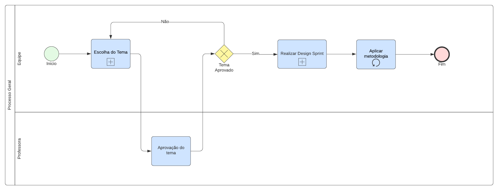
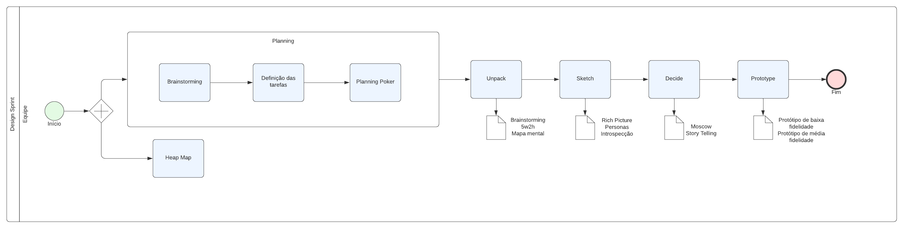
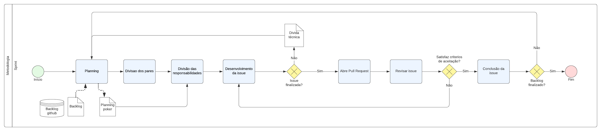
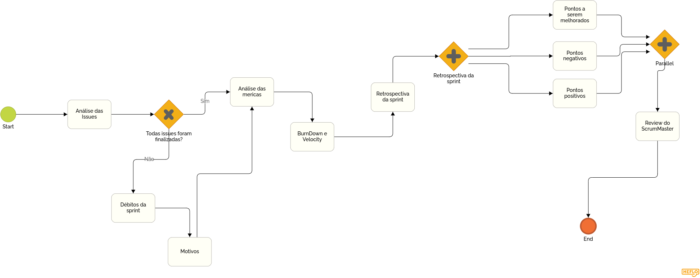

# 
 Modelagem BPMN

## Histórico de Versão

| Data       | Versão | Descrição                | Autor(es)                                      |
| ---------- | ------ | ------------------------ | ---------------------------------------------- |
| 03.02.2022 | 0.1    | Criação do documento     | [Peniel Etèmana](https://github.com/zpeniel09)                             |
| 03.02.2022 | 0.2    | Adição das imagens 1 a 4 | [Caio Martins](https://github.com/linktocaio), [Jonathan Jorge](https://github.com/Jonathan-Oliveira), [Peniel Etèmana](https://github.com/zpeniel09) |
| 04.02.2022 | 0.3    | Correção do documento e adição do BPMN para sprint Review | [Nilvan Peres](https://github.com/NilvanPeres) |
| 04.02.2022 | 0.3.1 | Revisão e correção do documento, primeira entrega | [Natanael Filho](https://github.com/fernandes-natanael) |
| 11.03.2022 | 0.3.2 | Padronizar estrutura | [Jonathan Jorge](https://github.com/Jonathan-Oliveira) |

## Participantes

* [Caio Martins](https://github.com/linktocaio)
* [Jonathan Jorge](https://github.com/Jonathan-Oliveira)
* [Peniel Etèmana](https://github.com/zpeniel09)

##  Metodologias

&emsp;&emsp; A notação BPMN (Business Process Model and Notation) refere-se à representação gráfica de processos, por meio de diagramas, seguindo um padrão de modelagem. Esse padrão possui um conjunto de símbolos e regras que permite modelar diferentes fluxos de processos, com vários níveis de detalhamento.

&emsp;&emsp; O BPMN permite criar processos de negócio, definir melhorias em processos já existentes, documentar e disseminar processos (novos ou existentes). Definir novos processos e fluxos de trabalho, ajudar na identificação dos requisitos de software (mais especificamente para a área de TI – Tecnologia da Informação) e automatizar processos.

&emsp;&emsp; A modelagem com BPMN mostra-se bastante eficiente uma vez que permite aos interessado no processo terem uma visão gráfica como é fluxo de tarefas, expressando de maneira simples e direta todo o processo de negócio. Assim, é possível visualizar cada etapa do processo e seus responsáveis, e ter clareza quanto ao funcionamento do negócio e facilitando a identificação de pontos de melhoria do processo.
 

## Resultados 

### Processo Geral

Figura 1: Diagrama BPMN do processo de definição da metodologia.

### Definir Tema

Figura 2: Diagrama BPMN do processo de definição do tema.

### Design Sprint

[Figura 3: Diagrama BPMN do processo de definição do design de sprint.](assets/img/bpmn/processo_geral_bpmn.png)

### Sprint Planning

Figura 4: Diagrama BPMN do processo de definição do planejamento da sprint.

### Review da Sprint

Figura 4: Diagrama BPMN do processo de definição do planejamento da sprint.

## Referências

> [1]   SERRANO, Milene. BPMN, 2022. Vídeo-aulas apresentadas na Disciplina de Arquitetura e Desenho de Software do curso de engenharia de software da UnB, FGA. Acesso em: 02 de fevereiro de 2022.

> [2]  EUAX CONSULTING. O que é BPMN (Business Process Model and Notation) e como aplicar essa notação na Modelagem de Processos. Disponível nesse [link](https://www.euax.com.br/2017/02/o-que-e-bpmn-business-process-model-and-notation/). Acesso em 03 de fevereiro de 2022.

