# 
 Rich Pictures

## Histórico de Versão 
|    Data    | Versão | Descrição            | Autor(es)       |
| :- | :- | :- | :- |
| 02.02.2022 |  0.1   | Criação do documento | [Davi matheus](https://github.com/DaviMatheus) |
| 04.02.2022 |  0.2   |Revisão do documento |[Lucas Melo](https://github.com/luucas-melo) |
| 04.02.2022 | 0.2.1 | Revisão do documento | [Natanael Filho](https://github.com/fernandes-natanael) |
| 11.03.2022 | 0.2.2 | Padronizar estrutura | [Jonathan Jorge](https://github.com/Jonathan-Oliveira) |

## Participantes

* [Davi matheus](https://github.com/DaviMatheus)
* [Caio Martins](https://github.com/linktocaio)
* [Davi matheus](https://github.com/DaviMatheus)
* [Henrique Amorim](https://github.com/HenriqueAmorim20)
* [Jonathan Jorge](https://github.com/Jonathan-Oliveira)
* [Lucas Lima](https://github.com/mibasFerraz)
* [Lucas Melo](https://github.com/luucas-melo)
* [Natanael Filho](https://github.com/fernandes-natanael)
* [Nilvan Peres](https://github.com/NilvanPeres)
* [Peniel Etèmana](https://github.com/zpeniel09)
* [Yuri Alves](https://github.com/yuriAlves5)

## Introdução

&emsp;&emsp;
<code>Rich pictures</code> se trata de uma forma de modelagem de ideias pouco formal e ideal para reuniões já que propicia um rápido entendimento sobre problemas complexos ou mal definidos. É um modelo informal, bem fácil de entender, baseando-se em rascunhar desenhos e usar textos curtos e objetivos para expressar um momento, um desejo. O interessante dessa técnica é que ela pode ser construído colaborativamente com os  stackholders, em que eles intervém, mexem e colaborarão para se criar um <code>rich picture</code>, pode-se utilizar ou  mão livre ou um software , as <code>rich pictures</code> por ser um modelo informal não há consenso sobre sua sintaxe e sobre sua forma de uso com isso deixamos que nosso criativo e imaginário nos guie durante o processo de criação deste artefato.

&emsp;&emsp;
 O objetivo desse documento é apresentar todos os rich pictures criados pelos integrantes do grupo durante o processo de entendimento do projeto. O tema escolhido está associado a gestão de um lava a jato, visando permitir mais flexibilidade para os clientes marcarem os serviços na melhor data e avaliarem a qualidade do serviço prestado, além de facilitar o gerenciamento dos proprietários a partir de dashboards.

    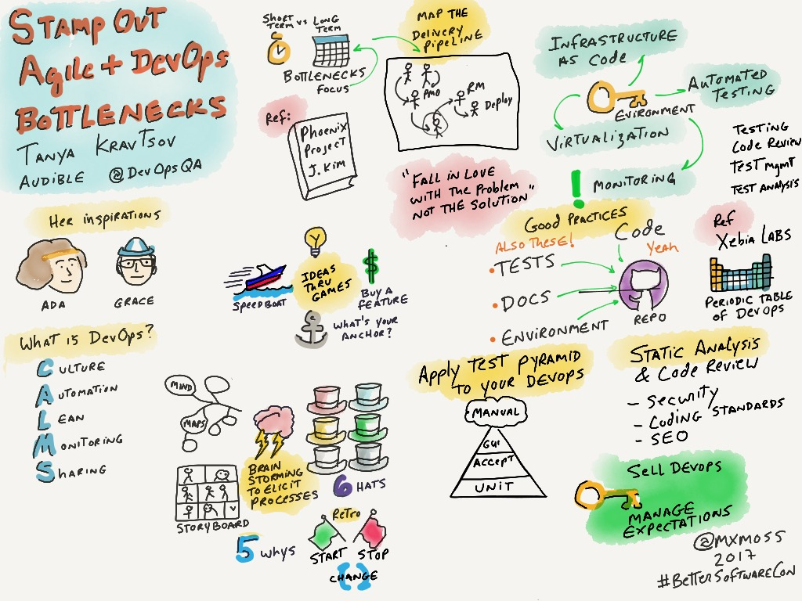
    <figcaption align='center'>
        <b>
            <a href='../assets/img/rich_pictures/rich_picture_exemplo.jpeg'>
               Figura 1: Exemplo de rich picture
            </a>
        </b>   
         
        <small>Fonte: http://mxmossman.blogspot.com/2017/10/better-software-2017.html.</small>
    </figcaption>

## Metodologia

&emsp;&emsp;
 Para elaboração do <code>rich picture</code> cada membro do grupo confecionará um sobre o projeto e após analisar o <code>rich picture</code> de cada membro, o grupo irá discutir qual será o eleito a ser o <code>rich picture</code> final e se há necessidade de melhorias.

## Resultados

### Rich-Pictures dos integrantes

Nesse tópico é apresentado os rich-pictures criados por cada um dos integrantes.

#### Rich-Picture do Yuri Alves

    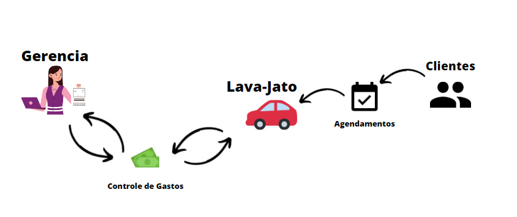
    <figcaption align='center'>
        <b>
            <a href='../assets/img/rich_pictures/rich_picture_Yuri.png'>
                Figura 2: Rich-Picture do Yuri Alves
            </a>
        </b>
         
        <small>Autor: <a href='https://github.com/yuriAlves5'>Yuri Alves</a>, 2022.</small>
    </figcaption>

####  Rich-Picture do Lucas Lima

    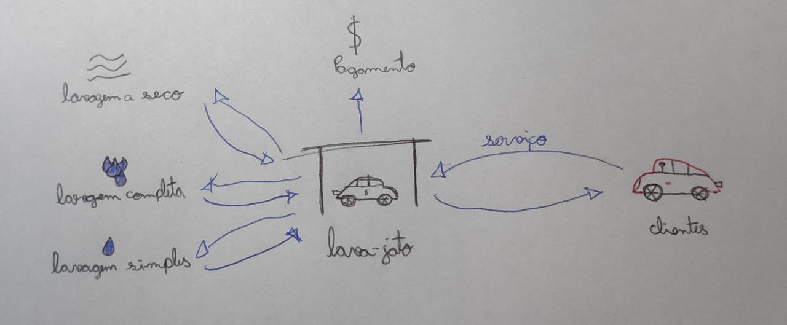
    <figcaption align='center'>
        <b>
            <a href='../assets/img/rich_pictures/rich_picture_mibas.jpeg'>
              Figura 2: Rich-Picture do Lucas Lima<
            </a>
        </b>
         
        <small>Autor: <a href='https://github.com/mibasFerraz'>Lucas Lima</a>, 2022.</small>
    </figcaption>

####  Rich-Picture do Lucas Melo

    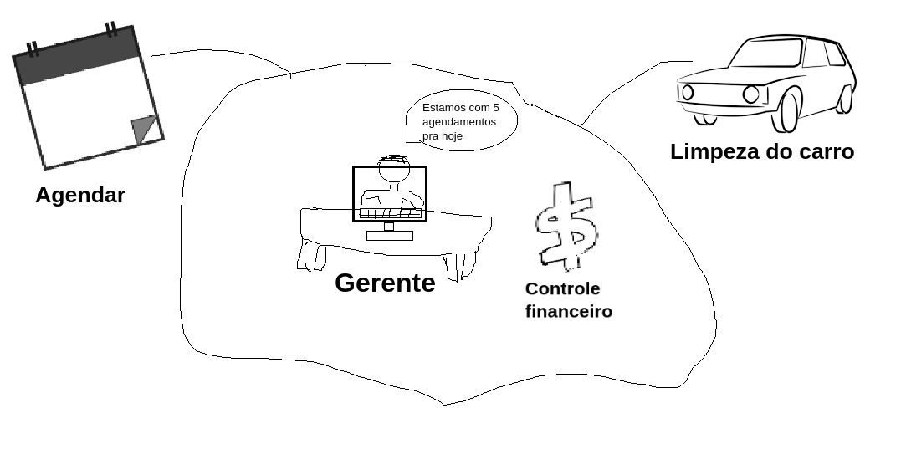
    <figcaption align='center'>
        <b>
            <a href='../assets/img/rich_pictures/rich_picture_Lucas_melo.png'>
               Figura 3: Rich-Picture do Lucas Melo
            </a>
        </b>        
         
        <small>Autor: <a href='https://github.com/luucas-melo'>Lucas Melo</a>, 2022.</small>
    </figcaption>

#### Rich-Picture do Davi Matheus

    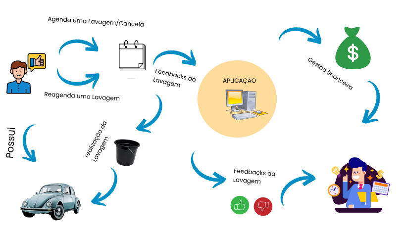
    <figcaption align='center'>
        <b>
            <a href='../assets/img/rich_pictures/rich_picture_Davi.png'>
               Figura 4: Rich-Picture do Davi Matheus
            </a>
        </b>                
         
        <small>Autor: <a href='https://github.com/DaviMatheus'>Davi Matheus</a>, 2022.</small>
    </figcaption>

####  Rich-Picture do Nilvan Peres

    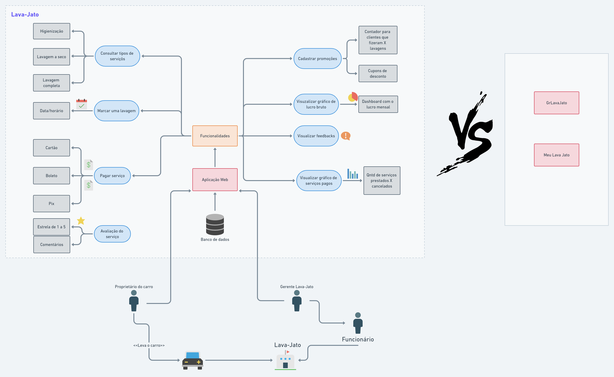
    <figcaption align='center'>
        <b>
            <a href='../assets/img/rich_pictures/rich_picture_Nilvan.png'>
               Figura 5: Rich-Picture do Nilvan Peres
            </a>
        </b>           
         
        <small>Autor:  <a href='https://github.com/NilvanPeres'> Nilvan Peres </a>, 2022.</small>
    </figcaption>

#### Rich-Picture do  Natanel Filho

    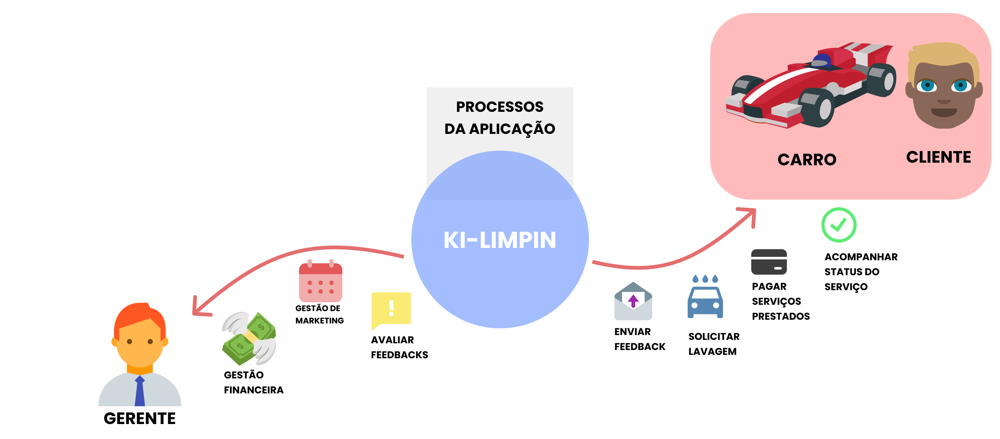
    <figcaption align='center'>
        <b>
            <a href='../assets/img/rich_pictures/rich_picture_Natanel.png'>
               Figura 6: Rich-Picture do Natanel
            </a>
        </b>
         
        <small>Autor: <a href='https://github.com/fernandes-natanael'>Natanel Filho</a>, 2022.</small>
    </figcaption>

#### Rich-Picture do Henrique Melo

    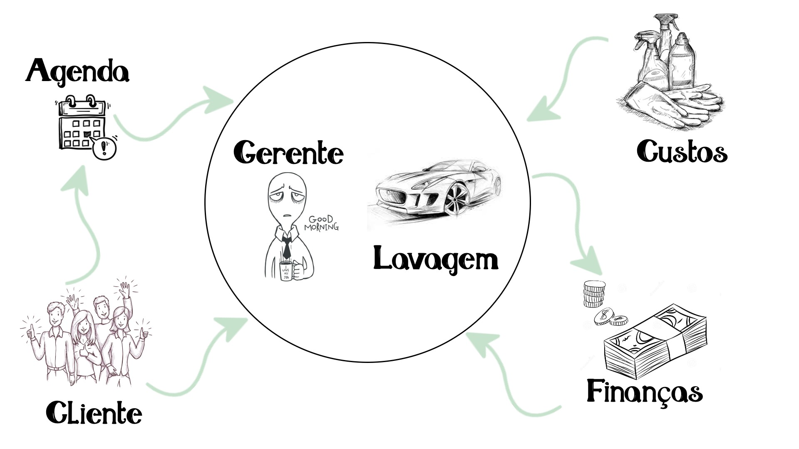
    <figcaption align='center'>
        <b>
            <a href='../assets/img/rich_pictures/rich_picture_Henrique.png'>
               Figura 7: Rich-Picture do Henrique
            </a>
        </b>
         
        <small>Autor: <a href='https://github.com/HenriqueAmorim20'>Henrique Melo</a>, 2022.</small>
    </figcaption>

#### Rich-Picture do Caio Martins

    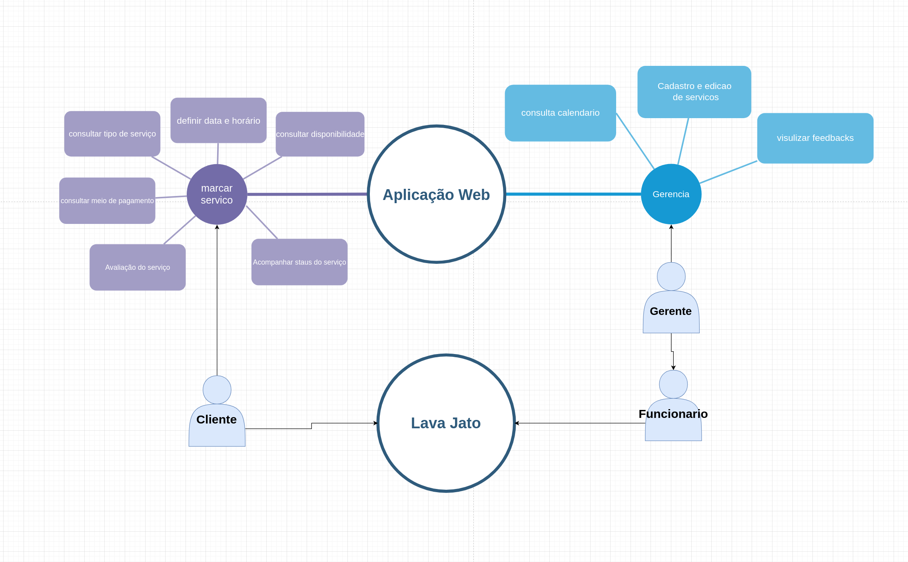
    <figcaption align='center'>
        <b>
            <a href='../assets/img/rich_pictures/rich_picture_Caio.png'>
               Figura 8: Rich-Picture do Caio
            </a>
        </b>
         
        <small>Autor: <a href='https://github.com/linktocaio'>Caio Martins</a>, 2022.</small>
    </figcaption>

#### Rich-Picture do Peniel Etenema

    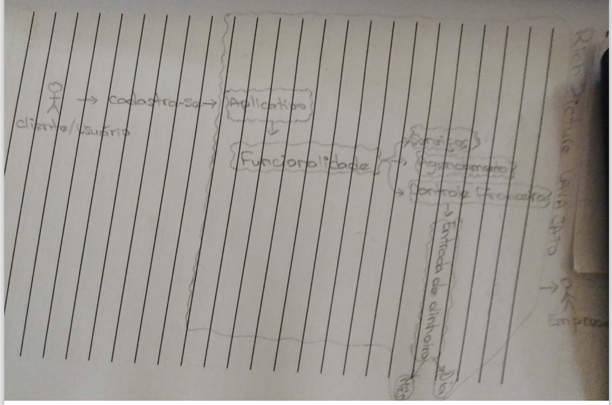
    <figcaption align='center'>
        <b>
            <a href='../assets/img/rich_pictures/rich_picture_Peniel.png'>
              Figura 9: Rich-Picture do Peniel Etèmana
            </a>
        </b>
         
        <small>Autor: <a href='https://github.com/zpeniel09'>Peniel Etenema</a>, 2022.</small>
    </figcaption>

####  Rich-Picture do Jonathan Jorge

    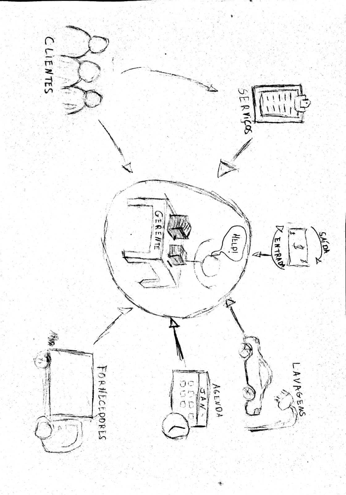
    <figcaption align='center'>
        <b>
            <a href='../assets/img/rich_pictures/rich_picture_Jhontan.png'>
              Figura 10: Rich-Picture do Jonathan Jorge
            </a>
        </b>
        
        <small>Autor: <a href='https://github.com/Jonathan-Oliveira'>Jonathan Jorge</a>, 2022.</small>
    </figcaption>

### Rich-Pictures escolhida pelo grupo

    
    <figcaption align='center'>
        <b>
            <a href='../assets/img/rich_pictures/rich_picture_Nilvan.png'>
              Figura 11: Rich-Picture do Grupoe
            </a>
        </b>        
         
        <small>Autor:  <a href='https://github.com/NilvanPeres'> Nilvan Peres </a>, 2022.</small>
    </figcaption>

## Conclusão

Essa atividade de elaboração de rich pictures individuais e depois um rich picture escolhido pelo  grupo colaborou para o entendimento coletivo da aplicação. Em que escolhemos a rich picture do integrante Nilvan devido seu alto nível de complexidade e sua ótima visão do fluxo do projeto. Após analisar cada um dos rich pictures produzidos foi possível identificar conjunto de funcionalidades que todos citaram, assim conseguindo levar mais requisitos e todos os integrantes entenderem o fluxo do projeto.

## Referências

> [1]  [Open Access] Leite, Julio Cesar Sampaio do Prado. Livro Vivo - Engenharia de Requisitos. Disponível em: [http://livrodeengenhariaderequisitos.blogspot.com/](http://livrodeengenhariaderequisitos.blogspot.com/) (Último acesso em 27/07/2022).

> [2]  Monk, A; Howard, S. The Rich Picture. A Tool for Reasoning About Work Context. Disponível em [https://www.ics.uci.edu/~wscacchi/Software-Process/Readings/RichPicture.pdf](https://www.ics.uci.edu/~wscacchi/Software-Process/Readings/RichPicture.pdf). (Último acesso em 27/07/2022).

> [3]  WAGENINGEN University. Rich Picture. Disponível em [http://www.mspguide.org/tool/rich-picture](http://www.mspguide.org/tool/rich-picture). (Último acesso em 27/07/2022).

