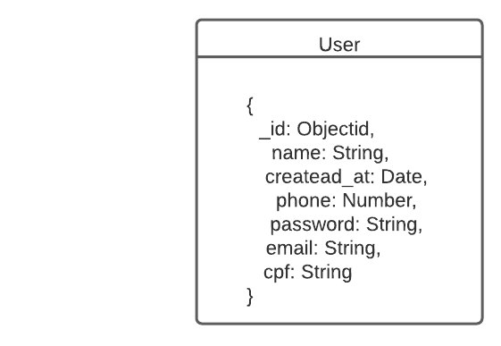
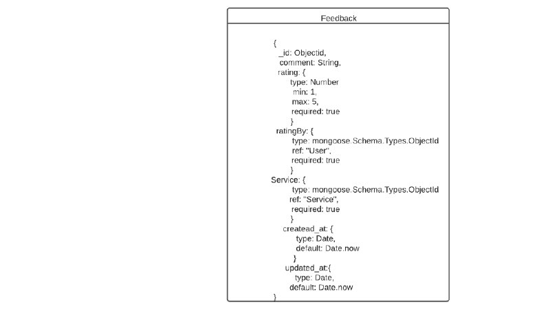
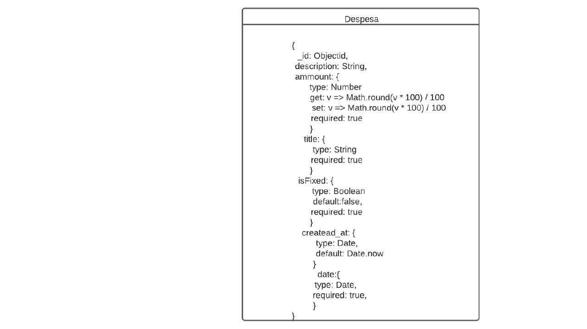

# 
 Documento de Arquitetura de Software

## Histórico de Versão 

|Data | Versão | Descrição | Autor(es)|
| :-:|:-:|:-:|:-: |
| 14.04.2022 | 0.1 | Abertura do documento |[Peniel Etèmana](https://github.com/zpeniel09)|
| 14.04.2022 | 0.2 | Adição introdução, finalidade, escopo |[Peniel Etèmana](https://github.com/zpeniel09)|
| 17.04.2022 | 0.3 | Adição visão geral e representação arquitetural |[Peniel Etèmana](https://github.com/zpeniel09)|
| 17.04.2022 | 0.4 | Adição metas e Restrições de Arquitetura |[Peniel Etèmana](https://github.com/zpeniel09)|
| 18.04.2022 | 0.5 | Adição Visão de Casos de Uso |[Peniel Etèmana](https://github.com/zpeniel09)|
| 18.04.2022 | 0.6 | Adição Visão lógica |[Peniel Etèmana](https://github.com/zpeniel09)|
| 18.04.2022 | 0.7 | Adição Visão de Processos e de Deploy |[Peniel Etèmana](https://github.com/zpeniel09)|
| 18.04.2022 | 0.8 | Adição Visão de Implementação e de Dados |[Peniel Etèmana](https://github.com/zpeniel09)|
| 18.04.2022 | 0.9 | Adição Visão de tamanho e desempenho e qualidade |[Peniel Etèmana](https://github.com/zpeniel09)|
| 18.04.2022 | 1.0 |  Revisão do documento  | [Jonathan Jorge](https://github.com/Jonathan-Oliveira) e [Yuri Alves](https://github.com/yuriAlves5)|
| 18.04.2022 | 1.0 |  Revisão do documento  e Adicao de visao de dados| [Davi Matheus](https://github.com/DaviMatheus) 
## Participantes

* [Peniel Etèmana](https://github.com/zpeniel09)
* [Davi Matheus](https://github.com/DaviMatheus) 

## Introdução

&emsp;&emsp;O documento de arquitetura de software fornece uma visão geral de arquitetura abrangente do sistema de software.

&emsp;&emsp;Esse documento serve como meio de comunicação entre o arquiteto de software e outros membros do equipe de projeto, com relação a decisões arquiteturalmente significativas tomadas sobre o projeto.

&emsp;&emsp;Nas linhas a seguir, estaremos falando um pouco mais sobre esse documento de arquitetura de software.

### Finalidade

&emsp;&emsp;Este documento fornece uma visão arquitetural abrangente do sistema, usando diversas visões de arquitetura para representar diferentes aspectos do sistema. Ele pretende capturar e transmitir as decisões arquiteturas significativas que foram tomadas em relação ao sistema.

### Escopo

&emsp;&emsp;O Documento da Arquitetura de Software se aplica ao Sistema de Ki-Limpinho que será desenvolvido pela Integração do Contexto. Neste documento estaremos abordando os principais pontos desenvolvidos na arquitetura do projeto, a partir desse breve resumo de cada tópico é possível se orientar com relação a outros documentos da arquitetura desenvolvidos no projeto, onde é possível ter uma visão detalhada de cada tema.

&emsp;&emsp;Ki-Limpinho é uma aplicação que visa auxiliar no gerenciamento e comunicação com o cliente por parte do lava-jato, de modo que, durante o uso a frequência da execução de ações repetitivas por parte do gerente seja minimizada e o usuário possa facilmente solicitar serviços e também acompanha-los.

### Definições, Acrônimos e Abreviações

* RUP (Rational Unified Process)
* API (Aplication Programming Interface): Ela é um conjunto de definições e protocolos usado no desenvolvimento e na integração de software de aplicações, permitindo que um serviço interaja com outros produtos e serviços sem a necessidade de saber como eles foram implementados.
* GoF (Gang of Four)
* GRASP	(General Responsibility Assignment Software Patterns)
* DB (Database): Conhecido com Banco de Dados, local onde persistem os dados que devem ser salvos pela aplicação.

## Representação Arquitetural

&emsp;&emsp;A representação arquitetural serve para caracterizar a arquitetura de software de um sistema, possibilitando a:

* Identificação de componentes – o arquiteto identifica quais os principais elementos que tem funcionalidades bem definidas como, um componente de cadastro de (informações de) usuários e um componente de autenticação de usuário numa aplicação Web.
* Identificação de mecanismos de interação – a comunicação entre objetos por meio da troca de mensagens constitui uma forma através da qual os componentes de software interagem entre si.
* Identificação de propriedades – o arquiteto pode analisar as propriedades oferecidas por cada estilo baseado na organização dos componentes e nos mecanismos de interação, conforme discutido abaixo.

&emsp;&emsp;Das tecnologias:

* No nosso [frontend](https://github.com/UnBArqDsw2021-2/2021.2_g2_kilimpinho_frontend), foi utiliza o [TypeScript](https://www.typescriptlang.org/). É uma linguagem de programação de código aberto desenvolvida pela Microsoft. É um superconjunto sintático estrito de JavaScript e adiciona tipagem estática opcional à linguagem.

* No [backend](https://github.com/UnBArqDsw2021-2/2021.2_G2_Ki-Limpinho_Backend) do nosso projeto, utilizamos as tecnologias [Node.js](https://nodejs.org/pt-br/) que é um software de código aberto, multiplataforma, baseado no interpretador V8 do Google e que permite a execução de códigos JavaScript fora de um navegador web; o [Express](https://expressjs.com/pt-br/) que é um framework para aplicativo da web do Node.js mínimo e flexível que fornece um conjunto robusto de recursos para aplicativos web e móvel. Ele é o principal bloco de construção de aplicações web com JavaScript e Node.JS; o [MongoDB](https://www.mongodb.com/pt-br) que é um software de banco de dados open source. Ele segue o modelo de banco de dados orientado a documentos, também chamado de bancos de dados NoSQL. É um dos bancos mais populares, possuindo uma comunidade ativa; o [Docker](https://www.docker.com/) que é uma tecnologia open source que permite aos desenvolvedores empacotar, entregar e executar aplicações em containers leves e autossuficientes. Contém uma comunidade que sempre está trabalhando para melhorar essa tecnologia.

## Metas e Restrições de Arquitetura

### Restrições

* O software deve ser desenvolvido nas tecnologias definidas;
* O software deve rodar nos navegadores: Web Firefox e Google Chrome;
* O ambiente de desenvolvimento do software deve funcionar tanto em Windows, Linux e MacOS;
* É preciso ter uma conexão com a internet para utilizar a aplicação;
* O escopo do projeto deve ser concluído até o final da disciplina.

#### Metas

* Portabilidade – Deve ser possível utilizar a plataforma em qualquer navegador web.
* Usabilidade - O software deve possuir alta aprendibilidade e inteligibilidade, para que atenda aos requisitos elicitados no formulário criado pelo grupo;
* Manutenibilidade: O código e as documentações realizadas pelo grupo devem estar num nível de qualidade, seguindo os padrões de projeto e bibliografia, onde a sua manutenção seja fácil de ser realizada a qualquer momento que for desejado.

## Visão de Casos de Uso

&emsp;&emsp; A visão de casos de uso é documenta o que o sistema faz do ponto de vista do usuário. Em outras palavras, ela descreve as principais funcionalidades do sistema e a interação dessas funcionalidades com os usuários do mesmo sistema. Nesse diagrama não nos aprofundamos em detalhes técnicos que dizem como o sistema faz.

&emsp;&emsp;Esse diagrama é composto basicamente por quatro partes que são:

* Cenário: Sequência de eventos que acontecem quando um usuário interage com o sistema.
* Ator: Usuário do sistema, ou melhor, um tipo de usuário.
* Use Case: É uma tarefa ou uma funcionalidade realizada pelo ator (usuário)
* Comunicação: é o que liga um ator com um caso de uso

&emsp;&emsp;Foram levantados alguns casos de usos nesse [documento de caso de uso](https://unbarqdsw2021-2.github.io/2021.2_G2_Ki-Limpinho/modelagem/diagramas/DiagramaCasoUso/), sendo assim, iremos falara um pouco mais sobre os casos de uso mais significativos.

* **[UC01 - Listar despesas](https://unbarqdsw2021-2.github.io/2021.2_G2_Ki-Limpinho/modelagem/diagramas/casosDeUso/UC01/)**
* **[UC02 - Registar despesas](https://unbarqdsw2021-2.github.io/2021.2_G2_Ki-Limpinho/modelagem/diagramas/casosDeUso/UC02/)**
* **[UC05 - Visualizar serviços](https://unbarqdsw2021-2.github.io/2021.2_G2_Ki-Limpinho/modelagem/diagramas/casosDeUso/UC05/)**
* **[UC08 - Realizar cadastro](https://unbarqdsw2021-2.github.io/2021.2_G2_Ki-Limpinho/modelagem/diagramas/casosDeUso/UC08/)**
* **[UC09 - Realizar Logout](https://unbarqdsw2021-2.github.io/2021.2_G2_Ki-Limpinho/modelagem/diagramas/casosDeUso/UC09/)**
* **[UC11 – Realizar login](https://unbarqdsw2021-2.github.io/2021.2_G2_Ki-Limpinho/modelagem/diagramas/casosDeUso/UC11/)**

## Visão Lógica

&emsp;&emsp;A visão lógica descreve como o sistema é estruturado, em termos de unidades de implementação. Os elementos são pacotes, classes e interfaces. O relacionamento entre os elementos mostra as dependências, as realizações de interface, os relacionamentos parte-todo e assim por diante.

### Diagrama de Classes

&emsp;&emsp; O diagrama de classes é um dos principais artefatos de modelagem estática, nele conseguimos representar como cada entidade da nossa aplicação relaciona com as demais, a fim de esclarecer a estrutura estática do sistema, esse artefato também pode ser considerado o "blueprint" da aplicação, pois na hora do desenvolvimento os responsáveis devem consultar o artefato a fim de mapear como deve ser implementado as interações das classes no software.

&emsp;&emsp;Ele consiste na seguinte estrutura: Classes, Atributos e Operações. Por ter essas estruturas, esse artefato é carro-chefe em linguagens orientadas a objetos. Também ressaltar que a UML(Unified Modeling Language) definiu padrões que devem ser seguidos para confeccionar esse artefato, para que qualquer pessoa interessada no projeto consiga entender do que se trata e padronizar como documento deve ser desenvolvido. Para mais detalhes sobre o nosso diagrama de classes, vale clica nesse link [aqui](https://unbarqdsw2021-2.github.io/2021.2_G2_Ki-Limpinho/DiagramaDeClasses/).

### Diagrama de Pacotes

&emsp;&emsp;O diagrama de pacotes é um diagrama de estrutura UML que mostra a estrutura do sistema projetado no nível de pacotes. Esse artefato proporciona uma visão hierárquica dos elementos da aplicação. Existem alguns elementos que formam os diagramas de pacotes que são:

* Pacote
* Elemento empacotado
* Dependência
* Importação de elemento
* Importação de pacote
* Mesclagem de pacote

&emsp;&emsp;Para mais detalhes sobre nosso diagrama de pacotes, clique nesse [link](https://unbarqdsw2021-2.github.io/2021.2_G2_Ki-Limpinho/DiagramaDePacotes/).

### Diagrama de Comunicação

&emsp;&emsp;O diagrama de comunicação é um diagrama de estrutura UML que mostra o comportamento que representa a comunicação entra um ou mais participantes, mostrando o fluxo de mensagens entre os objetos em uma interação.

&emsp;&emsp;Os diagramas de comunicação assemelham-se aos diagramas de objetos, nos quais uma linha de vida representa os objetos na interação e as setas representam as mensagens transmitidas entre as linhas de vida. Pontas de setas indicam a direção das mensagens, para frente ou para trás, e números de sequência indicam a ordem na qual as mensagens são transmitidas.

&emsp;&emsp;Para mais detalhes sobre nosso diagrama de comunicação, clique nesse [link](https://unbarqdsw2021-2.github.io/2021.2_G2_Ki-Limpinho/diagramaDeComunicacao/)

## Visão de Processos

### Visão Geral

&emsp;&emsp;Descreve como o sistema de tempo-de-execução é estruturado na forma de um conjunto de elementos que têm interações e comportamento de tempo-de-execução. A estrutura de tempo-de-execução normalmente tem pouca semelhança com a estrutura de código. Consiste de redes de comutação rápida de objetos de comunicação. Os elementos são componentes que têm presença em tempo de execução (processos, threads, servlets, etc), data store. A interação entre os elementos varia, de acordo com a tecnologia. Esta visão é útil para pensarmos sobre os atributos de qualidade do sistema de tempo-de-execução, tais como desempenho e confiabilidade.

### Diagrama de sequência

&emsp;&emsp;Os diagramas de sequência são um tipo de modelagem dinâmica em UML para a melhor visualização de processos, objetos e suas mensagens trocadas sempre procurando mostrar uma sequência de eventos e métodos disparados por seus agentes e os seus objetivos. Assim colaborando para um melhor entendimento dos processos de determinado caso de uso, pois com o diagrama de sequência é possível documentar o ato dos autores e suas consequências.

&emsp;&emsp;Para mais detalhes sobre nosso diagrama de sequência, clique nesse [link](https://unbarqdsw2021-2.github.io/2021.2_G2_Ki-Limpinho/DiagramaDeSequencia/).

## Visão de Deploy

&emsp;&emsp;O deploy é um termo famoso entre os desenvolvedores de software. Ele pode significar muitas coisas, dependendo do ambiente e da tecnologia. Porém, os significados que condizem mais com a prática e podem resumir o seu funcionamento são: implantar, colocar em posição, disponibilizar para uso ou simplesmente colocar no ar.

&emsp;&emsp;Na prática, também é utilizado quando um sistema foi disponibilizado para uso – seja no ambiente de desenvolvimento, para testes ou produção.

## Visão de Implementação

### Visão geral

&emsp;&emsp;Uma visão geral sobre a visão de implementação é que ela descreve como o sistema é mapeado para o hardware. Ela é  utilizada no fluxo de trabalho Análise & Design, ilustra a distribuição do processamento em um conjunto de nós do sistema, incluindo a distribuição física dos processos e threads. Ela é refinada durante cada iteração, mostra a distribuição física do processamento no sistema.

### Diagrama de Pacotes

&emsp;&emsp;Os diagramas de pacotes são diagrama estruturais comumente usados para simplificar os diagramas de classe complexos e organizar as classes em pacotes. Um pacote é uma coleção de elementos relacionados, incluindo diagramas, documentos, classes e pacotes de eventos

&emsp;&emsp;Sobre o nosso [diagrama de pacotes](https://unbarqdsw2021-2.github.io/2021.2_G2_Ki-Limpinho/DiagramaDePacotes/),existem alguns elementos que formam esse diagrama que são:

* Pacote
* Elemento empacotado
* Dependência
* Importação de elemento
* Importação de pacote
* Mesclagem de pacote

## Visão de Dados

&emsp;&emsp;Em teoria de banco de dados, uma visão, ou vista, é um conjunto resultado de uma consulta armazenada sobre os dados, em que os usuários do banco de dados podem consultar simplesmente como eles fariam em um objeto de coleção de banco de dados persistente.

&emsp;&emsp; Como dito assim, a visão de dados é um tema que mostrarquais são os dados persistentes na aplicação, em que normalmente se utiliza ferramentas como um Modelo Entidade-Relacionamento e/ou Diagrama Entidade-Relacionamento, porém na nossa aplicação foi utilizado um sistema não-relacional, o MongoDB, com isso  tornando essas ferramentas inoportunas nessa situação.

&emsp;&emsp; Como dito anteriormente  utilizamos o MongoDB em que uma das sua caracteristica é ser um banco de dados orientado a documentos JSON, assim foi  preferivel utilizar um sistema que mostra os objetos da camada "Model", pois esses são os objetos que são mapeados para a camada persistente. Assim abaixo estão as tabelas principais da nossa aplicação.

> Figura 3: Visão de dados - user. Autor: Davi Matheus. 

> Figura 3: Visão de dados - feedback. Autor: Davi Matheus. 

> Figura 3: Visão de dados - despesas. Autor: Davi Matheus. 

## Tamanho e Desempenho

&emsp;&emsp;Uma visão geral do tamanho e desempenho é a discrição do desempenho e das características do software que impactam na arquitetura de software. Um dos requisitos mínimos: é necessário possuir uma conexão com a internet, navegador (com alguns dos suportes a seguirHTML 5, CSS e JavaScript); ela poderia ser rodado nos sistemas operacionais que são:Windows, Linux ou MacOS;

## Qualidade

&emsp;&emsp;Tem como objetivo de garantir a qualidade do software através da definição e normatização de processos de desenvolvimento. O glossário do IEEE define qualidade como “Grau de conformidade de um sistema, componente ou processo com os respectivos requisitos”, ou, alternativamente, como “Grau de conformidade de um sistema, componente ou processo com as necessidades e expectativas de clientes ou usuários”.

&emsp;&emsp;Para alcançar os objetivos de qualidade de código,foram usados algumas características da medição de qualidade de software que são:

* Funcionalidade: ela permite se o conjunto de funções satisfazem as necessidades explícitas e implícitas para a finalidade a que se destina o nosso produto.
* Confiabilidade: permite de saber se o desempenho se mantém ao longo do tempo e em condições estabelecidas.
* Usabilidade: permite de saber se nosso software é fácil utilizar ou não.
* Eficiência: com a eficiência, podemos saber se os recursos e os tempos utilizados são compatíveis com o nível de desempenho requerido para o produto.
* Manutenibilidade: Facilidade para correções, atualizações e alterações do software.
* Portabilidade: É possível utilizar o produto em diversas plataformas com pequeno esforço de adaptação

## Referências

> [1] **SERRANO, Milene.** Arquitetura e Desenho de Software. **AULA - ARQUITETURA & DAS – PARTE II.** Acesso em 14, Abril de 2022.

> [2] **Docker**. Disponível em: <https://stack.desenvolvedor.expert/appendix/docker/oquee.html>. Acesso em 17, Abril de 2022.

> [3] **Representação Arquitetural**. Disponível em: <https://www.devmedia.com.br/arquitetura-de-software-desenvolvimento-orientado-para-arquitetura/8033#:~:text=O%20estilo%20arquitetural%20considera%20o,todos%20os%20componentes%20do%20sistema.>. Acesso em 17, Abril de 2022.

> [4] **Visão de casos de uso**. Disponível em: <https://www.devmedia.com.br/o-que-e-uml-e-diagramas-de-caso-de-uso-introducao-pratica-a-uml/23408>. Acesso em 18, Abril de 2022.

> [5] **Visão lógica, de Processo e de Implementação**. Disponível em: <https://www.trt9.jus.br/pds/pdstrt9/guidances/guidelines/architectural_view_FF6EDA37.html#:~:text=Vis%C3%A3o%20L%C3%B3gica%3A%20Descreve%20como%20o,todo%20e%20assim%20por%20diante.>

> [6] **Visaõ de deploy**. Disponível em: <https://www.hostgator.com.br/blog/o-que-e-deploy-e-como-realiza-lo/>. Acesso em 18, Abril de 2022.

> [7] **Visão de Implementação**. Disponível em: <https://www.cin.ufpe.br/~gta/rup-vc/core.base_rup/guidances/concepts/deployment_view_64CB74A6.html>. Acesso em 18, Abril de 2022.

> [8] **Qualidade**. Disponível em: <https://www.devmedia.com.br/qualidade-de-software-engenharia-de-software-29/18209>. Acessso em 18, Abril de 2022.