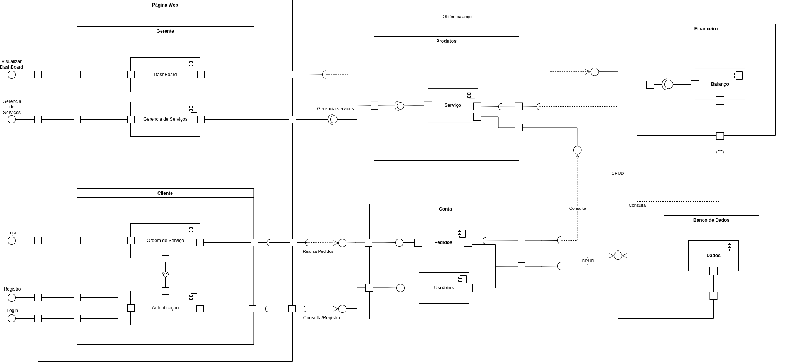

# 
 Diagrama de Componentes

### Histórico de Versão 

| Data       | Versão | Descrição                | Autor(es)                     |
| ---------- | ------ | ------------------------ | ----------------------------- |
| 18.02.2022 | 0.1    | Criação do documento     | Caio Martins e Jonathan Jorge |
| 19.02.2022 | 0.2    | Introdução e Metodologia | Caio Martins e Jonathan Jorge |
| 19.02.2022 | 0.3    | Imagem do diagrama       | Caio Martins e Jonathan Jorge |
| 19.02.2022 | 0.4    | Correção da data de descrição da imagem       | Caio Martins e Jonathan Jorge |
| 19.02.2022 | 0.5    | Revisão, correção do documento e adição do link para melhor visualização do diagrama      | Peniel Zannoukou |

## 1. Introdução

&emsp;&emsp;O diagrama de componentes é um tipo de modelagem em UML para a melhor visualização de processos por meio de componentes de trabalho, módulos de classes que representa sistemas ou subsistemas independentes com capacidade de interagir, apresentando um conjunto de interfaces requeridas e fornecidas. Assim colaborando para um melhor entendimento das estruturas e suas relações. Esse diagrama de componentes é fundamental na criação de um sistema de software.

## 2. Metodologia

&emsp;&emsp;O diagrama de Componentes foi criado com a utilização da ferramenta Draw.io e baseando-se no diagrama de classes, pacotes e sequencia previamente construído. Construção baseada nas normas de criação de diagramas e construído com as principais features do sistema.

## 3. Diagrama de Componentes

[Figura 1: Diagrama de Componentes](../assets/img/componentes/diagrama_componentes.png)

<small>
Autores: Caio Martins, Jonathan Jorge, 2022
</small>
 

## 4. Referências

> - Diagramas de Componentes, Disponível em: <https://www.ibm.com/docs/pt-br/rsas/7.5.0?topic=services-component-diagrams>. Acesso em: 19 de Fevereiro de 2022. 
> - "Diagrama de componentes UML ": Disponível em: <https://www.lucidchart.com/pages/pt/diagrama-de-componentes-uml>. Acesso em: 19 de Fevereiro de 2022.
> - Component Diagram Tutorial. Disponível em: <https://online.visual-paradigm.com/diagrams/tutorials/component-diagram-tutorial/>. Acesso em: 19 de Fevereiro de 2022.
