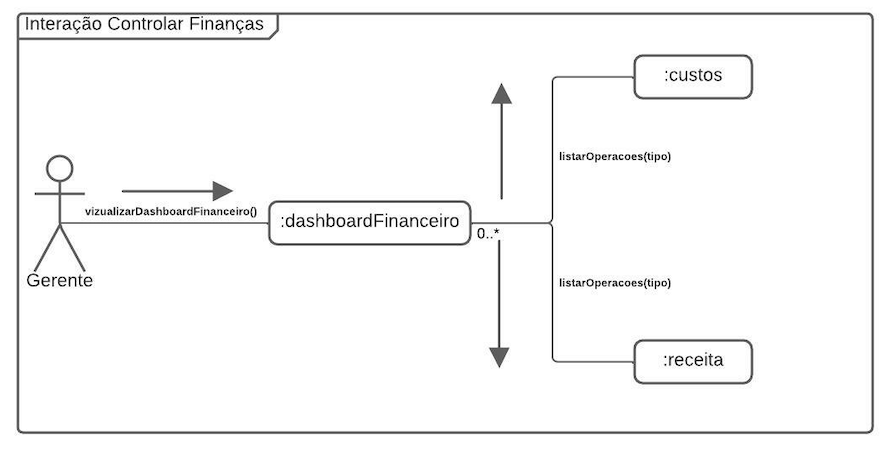
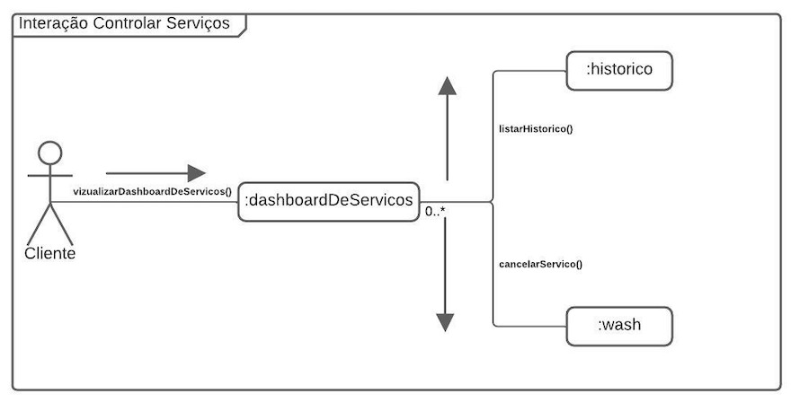

# 
 Diagrama de Comunicação

### Histórico de versão 

| Data       | Versão | Descrição            | Autor(es)  |
| ---------- | ------ | -------------------- | ---------- |
| 17.02.2022 | 0.1    | Criação do documento | Yuri Alves |
| 18.02.2022 | 0.2    | Adição da introdução | Yuri Alves |
| 20.02.2022 | 0.3    | Adição dos diagramas | Yuri Alves |
| 20.02.2022 | 0.4    | Complementação da introdução | Henrique Amorim |
| 21.02.2022 | 0.5    | Complementação dos diagramas | Henrique Amorim |
| 21.02.2022 | 0.5.1   | Revisão Documento | Nilvan Peres |

## Participantes

-   Yuri Alves
-   Henrique Amorim

  

## 1-Introdução

 
    

        O diagrama de comunicação é um diagrama de estrutura UML que mostra o comportamento que representa a comunicação entra um ou mais participantes, mostrando o fluxo de mensagens entre os objetos em uma interação.
    

    

        Os diagramas de comunicação assemelham-se aos diagramas de objetos, nos quais uma linha de vida representa os objetos na interação e as setas representam as mensagens transmitidas entre as linhas de vida. Pontas de setas indicam a direção das mensagens, para frente ou para trás, e números de sequência indicam a ordem na qual as mensagens são transmitidas.
    

## 2-Diagramas

    
    <figcaption align='center'>
        <b>Figura 1: Comunicação cliente</b>
         
        <small>Autor: Yuri Alves, 2021.</small>
    </figcaption>

    
    <figcaption align='center'>
        <b>Figura 2: Comunicação gerente criação lava jato</b>
         
        <small>Autor: Yuri Alves, 2021.</small>
    </figcaption>

    
    <figcaption align='center'>
        <b>Figura 2: Comunicação controle de finanças</b>
         
        <small>Autor: Henrique Amorim, 2022.</small>
    </figcaption>

    
    <figcaption align='center'>
        <b>Figura 2: Comunicação controle de serviços</b>
         
        <small>Autor: Henrique Amorim, 2022.</small>
    </figcaption>

## Referências

> [1] - Rational Software Architect RealTime Edition. Disponível em: <https://www.ibm.com/docs/pt-br/rsar/9.5?topic=diagrams-creating-communication>. Acesso em: 17 fev. 2022.  
> [2] - Diretriz: Diagrama de Comunicação. Disponível em: <https://www.cin.ufpe.br/~gta/rup-vc/core.base_rup/guidances/guidelines/communication_diagram_FFFEA1B5.html>. Acesso em: 17 fev. 2022.  
> [3] - Diagramas de comunicação. Disponível em: <https://www.ibm.com/docs/pt-br/radfws/9.6?topic=SSRTLW_9.6.0/com.ibm.xtools.sequence.doc/topics/ccommndiag.html>. Acesso em: 20 fev. 2022.  
