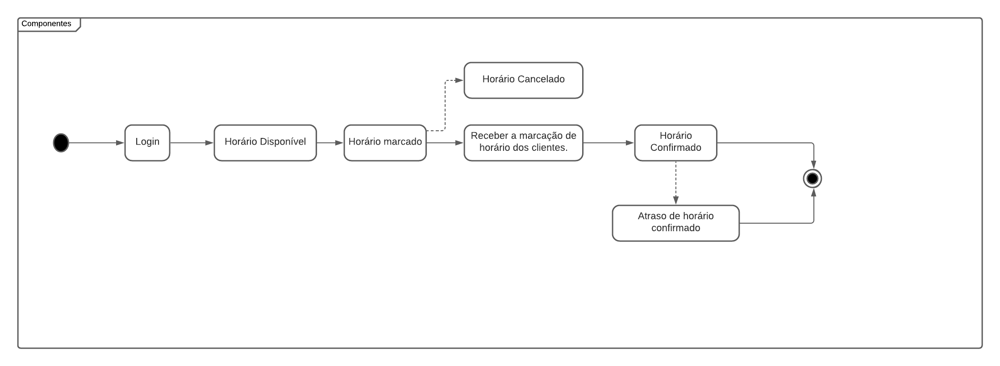
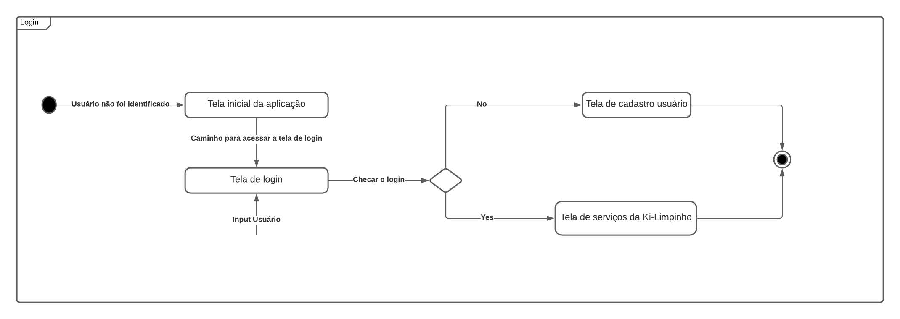

# 
 Diagrama de Estados

### Histórico de Versão

| Data       | Versão | Descrição                | Autor(es)                                          |
| ---------- | ------ | ------------------------ | -------------------------------------------------- |
| 09.02.2022 | 0.1    | Criação do documento     | [Peniel Zannoukou](https://github.com/zpeniel09)   |
| 11.02.2022 | 0.2    | Adição dos diagramas     | [Lucas Lima](https://github.com/mibasFerraz), [Peniel Zannoukou](https://github.com/zpeniel09)   |

### Participantes

-   Lucas Lima Ferraz
-   Peniel Zannoukou

## Introdução

&emsp;&emsp; Um diagrama de estados, por vezes conhecidos como diagrama de máquina de estados, é um tipo
de diagrama comportamental na linguagem de modelagem unificada(UML) que mostra transições entre vários objetos. Ele ajuda a identificar os fluxos dos processos envolvidos na aplicação, onde eles começam, terminam ou se repetem até que uma dada condição seja satisfeita. Esse diagrama é de grande valia pois esclarece à equipe qual deverá ser o fluxo da aplicação para o agendamento de um horário.

## Metodologia

&emsp;&emsp; A modelagem de estados foi desenvolvida utilizando a ferramenta <a href="https://www.lucidchart.com">LucidChart</a> durante a reunião
entre os integrantes do grupo, principalmente entre esses participantes presente neste documento. O diagrama foi elaborado através da identificação do fluxo que o sistema deve seguir para agendar um horário.

## Diagrama

### Diagrama de componentes

    
    <figcaption align='center'>
        <b>Figura 1: Diagrama de componentes</b>
         
        <small>Autores: Lucas Lima e Peniel Zannoukou, 2022.</small>
    </figcaption>

### Diagrama de login

    
    <figcaption align='center'>
        <b>Figura 1: Diagrama de login</b>
         
        <small>Autores: Lucas Lima e Peniel Zannoukou, 2022.</small>
    </figcaption>

## Referências

> - SERRANO, Milene. Modelagem - Diagrama de Estados, 2022. Vídeo-aulas complementares apresentadas na Disciplina de Arquitetura e Desenho de Software do curso de engenharia de software da UnB, FGA. Acesso em: 09 de fevereiro de 2022.
> - UML. State Machine Diagrams. [S. l.], 2020. Disponível em: <https://www.uml-diagrams.org/state-machine-diagrams.html>. Acesso em: 09 fev. 2022.
> - Unified Modeling Language (UML) | State Diagrams. Disponível em: <https://www.geeksforgeeks.org/unified-modeling-language-uml-state-diagrams/>. Acesso em: 11 fev. 2022.