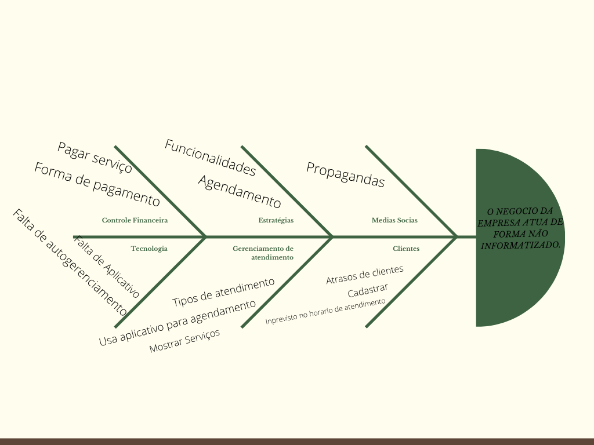

# 
 Diagrama Causa Efeito

### Histórico de Versão 

| Data | Versão | Descrição | Autor(es)|
| -- | -- | -- | -- |
| 01.02.2022 | 0.1 | Criação do documento | Peniel Zannoukou |
| 04.02.2022 | 0.2 | Melhorias após o PR | Peniel Zannoukou |
| 04.02.2022 | 0.3 | Revisão do Documento | Davi e Natanael |

## Metodologia

&emsp;&emsp; O Diagrama de Ishikawa , também conhecido como "Diagrama de Causa e Efeito" ou "Espinha-de-peixe", é utilizado pela administração para o gerenciamento e controle de qualidade sendo uma ferramenta gráfica que auxilia em diversos processos. Os diagramas de Ishikawa são ferramentas sistemáticas muito úteis para encontrar, classificar e documentar as causas da variação da qualidade em uma determinada produção e organizar a mútua relação entre elas. Esse diagrama vai analisando sobre diferentes perspectivas,diferentes pontos de vistas, levantando uma série de causas que podem estar levando à um dado efeito.

&emsp;&emsp; Para construção do diagrama de causa e efeito foram definidos os problemas e suas possíveis causas, para o escopo do projeto foram escolhidas 6 categorias das possíveis causas, sendo elas as seguintes: 

  

<li>Estratégias: quais são as estratégias adotadas atualmente pelas empresas de Lava-Jato</li>
<li>Tecnologia: que tipo de tecnologias são utilizadas pelas empresas de Lava-Jato para agendamento de atendimento</li>
<li>Controle financeira: Como as empresas de Lava-Jato comtrolam a entrada de dinheiro</li>
<li>Gerenciamento de atendimento: os métodos de gerenciamento mais utilizados pelos funcionários da empresa</li>
<li>Medias sociais: por onde é feita a divulgação dos serviços prestados por essas empresas de Lava-Jato</li>
<li>Clientes: como os clientes são afetados pela forma de atendimento pelo aplicativo.</li> 

 

&emsp;&emsp; Dessa forma foi possível fazer uma dedução mais objetiva das possíveis causas e montar uma estratégia para resolver os problemas levantados.
 

## Resultado

Figura 1: Diagrama Causa-Efeito

Autor: Peniel Zannoukou

&emsp;&emsp; Após a confecção do diagrama foi possível notar que para cada uma das seguintes categorias foram identificadas as seguintes causas que afetam direta ou indiretamente os problemas levantados:

* Estratégias: a estratégia usado pela maioria dos lava-jato é pela ordem de chegada, o que pode causar certa dificuldade, uma vez que o cliente pode não ter tempo para ir esperar até que chegue sua vez; 
* Tecnologia: Um aplicativo digno para ajudar essa empresa a receber os agendamentos; 
* Controle financeira: muitas vezes os donos dos lava-jato não conseguem gerenciar de maneira efetiva todas as entradas de dinheiro, dessa forma a má gestão da entrada de dinheiro podem ser bem prejudiciais;
* Gerenciamento de atendimento: Nem todos as empresas usam um meio informatizado para agendar, dessa forma, há um gasto maior de tempo devido ao deslocamento que precisa ser feito até o local ou até mesmo gasto de tempo de ligação a fim de conhecer as possibilidades de atendimento em determinado horário e dia. Apesar de algumas empresas estarem adotando o uso de aplicativo devido a pandemia, ainda assim, muitos outros continuam sem utilizar, o que pode causar uma confusão quando tiverem muitas pessoas presente para serem atendidos; 
* Medias sociais: com a variedade de redes sociais, muitas vezes é desgastante ter que publicar todos os serviços oferecidos pelas empresas, sendo assim a ausência de um ambiente único de publicação dos serviços é um fator dificultante; 
* Clientes: com imprevistos cotidianos que levam a impossibilidade de prosseguir com o que foi agendado no sistema, os clientes tendem a esquecer de avisar a ausência ou simplesmente não comparecem ao estabelecimento. Além disso, nem todas as empresas conseguem organizar-se de tal maneira que consigam avisar com atecedência aos seus clientes o atendimento marcado. 

## Conclusão 
Através do uso do diagrama de causa e efeito foi possível ter uma visão maior sobre as causas dos problemas que nossa aplicação deve ser capaz de resolver, dessa forma, devemos levantar requisitos que sejam capazes de ser a solução para cada uma das causas identificadas.

## Referência

> ISHIKAWA, Kaoru. Controle de Qualidade Total. 6. ed. Rio de Janeiro, Campus Editora, 1998. 
> ANDRADE, Luiza. Diagrama de Ishikawa: o que é e como fazer. Siteware, 2017. Disponível em: https://www.siteware.com.br/blog/metodologias/diagrama-de-ishikawa/. Acesso em: 3 de Fevereiro de 2022. 
> SILVEIRA, Cristiano Bertulucci.Diagrama de Ishikawa, Causa e Efeito ou Espinha de Peixe. Citisystems, 2012. Disponível em: https://www.citisystems.com.br/diagrama-de-ishikawa/. Acesso em: 03/02/2022. 
> "O que são os 6M no diagrama de causa e efeito?": https://radardeprojetos.com.br/o-que-sao-os-6m-no-diagrama-de-causa-e-efeito/. Último acesso em 03/02/2022

