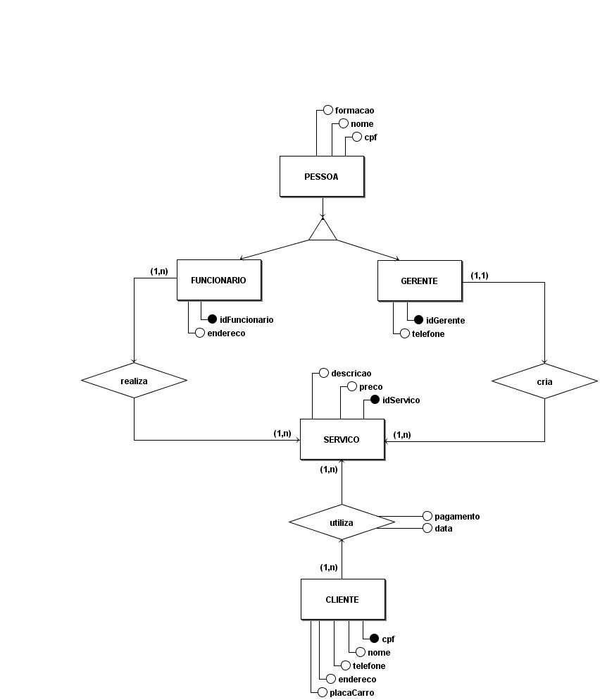

# 
 Entidade Relacionamento

#### Histórico de Versão

|    Data    | Versão |      Descrição       |     Autor(es)     |
| :--------: | :----: | :------------------: | :---------------: |
| 11/02/2022 |  0.1   | Criação do documento | Lucas Ferraz, Peniel Etèmana |

## 1 Introdução

O Modelo de Entidade-Relacionamento (ME-R) é baseado na percepção do mundo real que consiste em um conjunto de objetos básicos chamados ENTIDADES e nos RELACIONAMENTOS entre estes objetos.
O ME-R foi desenvolvido para facilitar o projeto de banco de dados, permitindo a especificação de um esquema de “negócio”, onde tal esquema representa a estrutura lógica geral do Banco de Dados (BD).

## 2 Modelo Entidade Relacionamento

SISTEMA WEB KILIMPINHO – Descrito pelas Entidades PESSOA, FUNCIONARIO, GERENTE, SERVICO e CLIENTE.

### 2.1 Entidades e atributos
#### 2.1.1 Entidade PESSOA
Representa as características em comum entre FUNCIONARIO e GERENTE. A ocorrêcia da entidade PESSOA será associado aos seguintes atributos: **cpf**, **nome**, **formacao**.

#### 2.1.2 Entidade FUNCIONARIO
Representa os funcionarios do lava-jato. A ocorrência da entidade FUNCIONARIO será associado aos seguintes atributos: **idFuncionario**, **endereco**.

#### 2.1.3 Entidade GERENTE
Representa os gerentes do lava-jato. A ocorrência da entidade GERENTE será associado aos seguintes atributos: **idGerente**,  **telefone**.

#### 2.1.4 Entidade SERVICO
Representa os seviços registrados no sistema WEB KiLimpinho. A ocorrência da entidade SERVICO será associado aos seguintes atributos: **idServico**, **preco**, **descricao**.

#### 2.1.5 Entidade CLIENTE
Representa os clientes cadastrados no sistema WEB KiLimpinho. A ocorrência da entidade CLIENTE será associado aos seguintes atributos: **cpf**,**nome**, **telefone**, **endereco**, **placaCarro**.

### 2.2 Relacionamentos

#### 2.2.1 FUNCIONARIO - realiza - SERVICO
Um FUNCIONARIO pode realizar um ou mais SERVICO e um SERVICO pode ser feito por um ou mais FUNCIONARIO. 
**Cardinalidade: n : m**.

#### 2.2.2 GERENTE - cadastra - SERVICO
Um GERENTE pode cadastrar um ou mais SERVICO, mas um SERVICO só pode ser cadastrado por um GERENTE.
**Cardinalidade: 1 : n**.

#### 2.2.3 CLIENTE - utiliza -  SERVICO
Um CLIENTE pode utilizar um ou mais SERVICO e um SERVICO pode ser utilizado por um ou mais CLIENTE. 
**Cardinalidade: n : m**.

    
    <figcaption align='center'>
        <b>Figura 1: MER KiLimpinho</b>
         
        <small>Autor: Lucas Ferraz, Peniel Etèmana, 2022.</small>
    </figcaption>

## Bibliografia

1. Modelo Entidade Relacionamento (MER) e Diagrama Entidade-Relacionamento (DER). Disponível em: https://www.devmedia.com.br/modelo-entidade-relacionamento-mer-e-diagrama-entidade-relacionamento-der/14332. Último acesso em (11/02/2022).