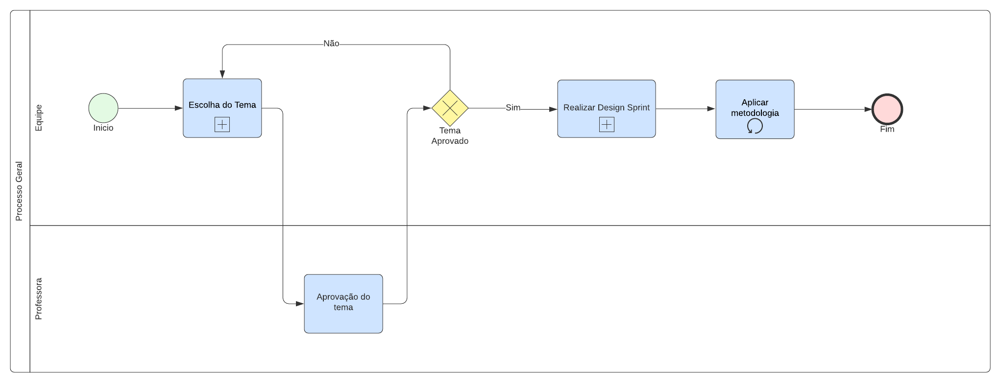
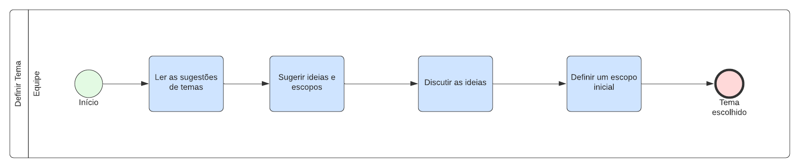
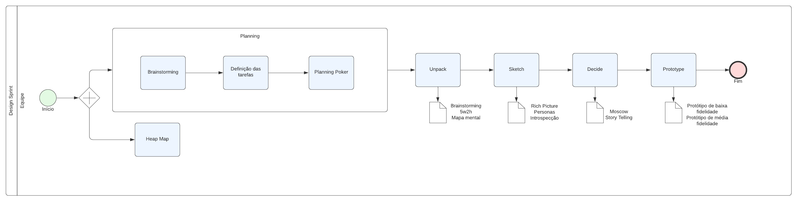
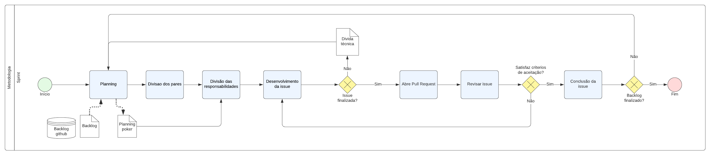

# 
 Modelagem BPMN

### Histórico de Versão 

| Data       | Versão | Descrição                | Autor(es)                                      |
| ---------- | ------ | ------------------------ | ---------------------------------------------- |
| 03.02.2022 | 0.1    | Criação do documento     | Peniel Zannoukou                               |
| 03.02.2022 | 0.2    | Adição das imagens 1 a 4 | Caio Martins, Jonathan Jorge, Peniel Zannoukou |

## Participantes

-   Caio Martins
-   Jonathan Jorge
-   Peniel Zannoukou

## Metodologias

&emsp;&emsp; A notação BPMN (Business Process Model and Notation) refere-se à representação gráfica de processos, por meio de diagramas, seguindo um padrão de modelagem. Esse padrão possui um conjunto de símbolos e regras que permite modelar diferentes fluxos de processos, com vários níveis de detalhamento.

&emsp;&emsp; O BPMN permite criar processos de negócio, definir melhorias em processos já existentes, documentar e disseminar processos (novos ou existentes). Definir novos processos e fluxos de trabalho, ajudar na identificação dos requisitos de software (mais especificamente para a área de TI – Tecnologia da Informação) e automatizar processos.

&emsp;&emsp; A modelagem com BPMN mostra-se bastante eficiente uma vez que permite aos interessado no processo terem uma visão gráfica como é fluxo de tarefas, expressando de maneira simples e direta todo o processo de negócio. Assim, é possível visualizar cada etapa do processo e seus responsáveis, e ter clareza quanto ao funcionamento do negócio e facilitando a identificação de pontos de melhoria do processo.
 

## Processo Geral

[Figura 1: Diagrama BPMN do processo de definição da metodologia.](assets/bpmn/processo_geral_bpmn.png)

## Definir Tema

[Figura 2: Diagrama BPMN do processo de definição do tema.](assets/bpmn/processo_geral_bpmn.png)

## Design Sprint

[Figura 3: Diagrama BPMN do processo de definição do design de sprint.](assets/bpmn/processo_geral_bpmn.png)

## Sprint Planning

[Figura 4: Diagrama BPMN do processo de definição do planejamento da sprint.](assets/bpmn/processo_geral_bpmn.png)

## Referências

> -   SERRANO, Milene. BPMN, 2022. Vídeo-aulas apresentadas na Disciplina de Arquitetura e Desenho de Software do curso de engenharia de software da UnB, FGA. Acesso em: 02 de fevereiro de 2022. 
> -   EUAX CONSULTING. O que é BPMN (Business Process Model and Notation) e como aplicar essa notação na Modelagem de Processos. Disponível nesse [link](https://www.euax.com.br/2017/02/o-que-e-bpmn-business-process-model-and-notation/). Acesso em 03 de fevereiro de 2022. 
