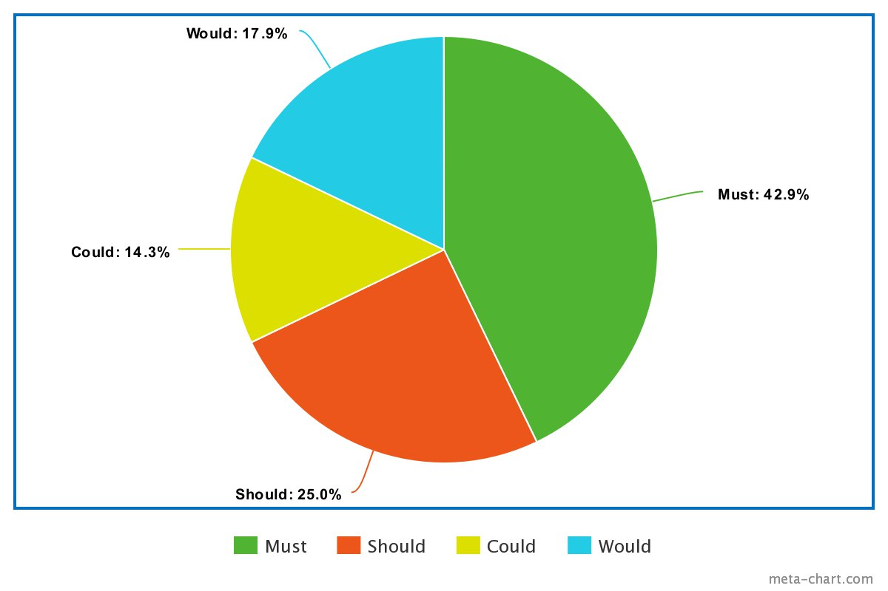

# 
 Moscow

### Histórico de Versão
|    Data    | Versão | Descrição            | Autor(es)       |
| :--------: | :----: | :------------------: | :-------------: |
| 03.01.2022 |  0.1   | Criação do documento e versão inicial | Lucas Melo, Lucas Lima |
| 04.01.2022 |  0.2   | Revisão do documento | Nilvan Peres |

### Responsáveis pelo documento
- Lucas Melo
- Lucas Lima

### Introdução

&emsp;
  MoSCoW é  um método que auxilia na determinação de um sistema de prioridades. Essa técnica está ligada às metodologias ágeis e define a importância e importância dos requisitos de um sistema ou projeto.
O nome dessa técnica é dada devido as possíveis classificações de prioridade, sendo elas:

* Must: tarefas que vão agregar valor ao produto final e são indispensáveis;
* Should: os requisitos que recebem essa prioridade são aqueles que são importantes mas não são vitais para o sistema;
* Could: são requisitos que seriam desejáveis, porém não são estrategicamente essenciais;
* Would/Want/Won't : requisitos menos críticos que possuem menor retorno sobre o investimento quando comparado a outros.

### Resultados

<table>
    <thead style="background-color: lightblue">
        <tr>
            <th style="text-align:center">US</th>
            <th style="text-align:center">História de Usuário</th>
            <th style="text-align:center">Prioridade</th>
        </tr>
    </thead>
    <tbody >
        <tr>
            <td style="vertical-align: middle;text-align:center;border: 0.5px solid rgba(0,0,0,0.2);"><a href="../../User-Stories/US01/" >US01</a></td>
            <td style="vertical-align: middle;text-align:center;border: 0.5px solid rgba(0,0,0,0.2);">Eu, como novo usuário do sistema, desejo realizar cadastro no site do lava-jato para ter uma conta.</td>
            <td>Must</td>
        </tr>
        <tr>
            <td style="vertical-align: middle;text-align:center;border: 0.5px solid rgba(0,0,0,0.2);"><a href="../../User-Stories/US02/" >US02</a></td>
            <td style="vertical-align: middle;text-align:center;border: 0.5px solid rgba(0,0,0,0.2);">Eu, como um usuário do sistema, desejo realizar o login na aplicação do lava-jato para ter acesso à todas as funcionalidades.</td>
            <td>Must</td>
        </tr>
        <tr>
            <td style="vertical-align: middle;text-align:center;border: 0.5px solid rgba(0,0,0,0.2);"><a href="../../User-Stories/US03/" >US03</a></td>
            <td style="vertical-align: middle;text-align:center;border: 0.5px solid rgba(0,0,0,0.2);">Eu, como um usuário do sistema, desejo visualizar minha senha, para que eu consiga confirmar se digitação está correta.</td>
            <td>Could</td>
        </tr>
        <tr>
            <td style="vertical-align: middle;text-align:center;border: 0.5px solid rgba(0,0,0,0.2);"><a href="../../User-Stories/US04/" >US04</a></td>
            <td style="vertical-align: middle;text-align:center;border: 0.5px solid rgba(0,0,0,0.2);">Eu, como cliente do sistema, desejo logar automaticamente quando marcar a opção de lembrar o login.</td>
            <td>Could</td>
        </tr>
        <tr>
            <td style="vertical-align: middle;text-align:center;border: 0.5px solid rgba(0,0,0,0.2);"><a href="../../User-Stories/US05/" >US05</a></td>
            <td style="vertical-align: middle;text-align:center;border: 0.5px solid rgba(0,0,0,0.2);">Eu, como cliente do sistema, desejo fazer logout da aplicação, para que ninguém acesse minha conta na mesma sessão.</td>
            <td>Must</td>
        </tr>
        <tr>
            <td style="vertical-align: middle;text-align:center;border: 0.5px solid rgba(0,0,0,0.2);"><a href="../../User-Stories/US06/">US06</a></td>
            <td style="vertical-align: middle;text-align:center;border: 0.5px solid rgba(0,0,0,0.2);">Eu, como cliente, desejo ter uma página de perfil, para que consiga acessar as minhas informações.</td>  
            <td>Should</td>  
        </tr>
        </tr>
        <tr>
        </tr>
        <tr>
            <td style="vertical-align: middle;text-align:center;border: 0.5px solid rgba(0,0,0,0.2);"><a href="../../User-Stories/US07/"  >US07</a></td>
            <td style="vertical-align: middle;text-align:center;border: 0.5px solid rgba(0,0,0,0.2);">Eu, como cliente, desejo editar minhas informações de perfil, para que eu possa atualizar meus dados quando necessário.
            <td>Should</td>  
        </td>
        </tr>
            <td style="vertical-align: middle;text-align:center;border: 0.5px solid rgba(0,0,0,0.2);"><a href="../../User-Stories/US08/"  >US08</a></td>
            <td style="vertical-align: middle;text-align:center;border: 0.5px solid rgba(0,0,0,0.2);">Eu, como cliente, desejo deletar minha conta, para que todos meus registros sejam apagados.</td>
            <td>Would</td>
        </tr>
            <td style="vertical-align: middle;text-align:center;border: 0.5px solid rgba(0,0,0,0.2);"><a href="../../User-Stories/US09/">US09</a></td>
            <td style="vertical-align: middle;text-align:center;border: 0.5px solid rgba(0,0,0,0.2);">Eu, como cliente, desejo escolher minha forma de pagamento, para que eu possa pagar da maneira que eu preferir.</td>   
            <td>Must</td> 
        </tr>
        <tr>
            <td style="vertical-align: middle;text-align:center;border: 0.5px solid rgba(0,0,0,0.2);"><a href="../../User-Stories/US10/">US10</a></td>
            <td style="vertical-align: middle;text-align:center;border: 0.5px solid rgba(0,0,0,0.2);"> Eu, como cliente, desejo agendar um serviço, para que eu possa ter meu carro lavado.</td>
            <td>Must</td>     
        </tr>
        <tr>
            <td style="vertical-align: middle;text-align:center;border: 0.5px solid rgba(0,0,0,0.2);"><a href="../../User-Stories/US11/"  >US11</a></td>
            <td style="vertical-align: middle;text-align:center;border: 0.5px solid rgba(0,0,0,0.2);"> Eu, como cliente, desejo cancelar um serviço, para que eu possa desmarcar a ação caso eu esteja ocupado ou simplesmente não posso comparecer a data anteriormente agendada.
            <td>Should</td> 
        </td>
        </tr>
            <td style="vertical-align: middle;text-align:center;border: 0.5px solid rgba(0,0,0,0.2);"><a href="../../User-Stories/US12/">US12</a></td>
            <td style="vertical-align: middle;text-align:center;border: 0.5px solid rgba(0,0,0,0.2);">Eu, como cliente, desejo remarcar um serviço, para que eu possa obter a lavagem em uma data mais adequada a minha agenda.</td>  
            <td>Should</td>   
        </tr>
        </tr>
            <td style="vertical-align: middle;text-align:center;border: 0.5px solid rgba(0,0,0,0.2);"><a href="../../User-Stories/US13/">US13</a></td>
            <td style="vertical-align: middle;text-align:center;border: 0.5px solid rgba(0,0,0,0.2);">Eu, como cliente, desejo  fazer um comentário sobre determinado serviço para que eu possa deixar um feedback construtivo sobre a lavagem realizada.</td> 
            <td>Would</td>    
        </tr>
         </tr>
            <td style="vertical-align: middle;text-align:center;border: 0.5px solid rgba(0,0,0,0.2);"><a href="../../User-Stories/US14/">US14</a></td>
            <td style="vertical-align: middle;text-align:center;border: 0.5px solid rgba(0,0,0,0.2);">Eu, como cliente, desejo verificar o status de um determinado serviço agendado/contratado para que eu possa ver de forma detalhada o percursso da lavagem.</td>
            <td>Would</td>                
        </tr>
            <td style="vertical-align: middle;text-align:center;border: 0.5px solid rgba(0,0,0,0.2);"><a href="../../User-Stories/US15/">US15</a></td>
            <td style="vertical-align: middle;text-align:center;border: 0.5px solid rgba(0,0,0,0.2);">Eu, como cliente, desejo recomendar a aplicação para amigos, para que eu possa receber descontos e brindes.</td>
            <td>Would</td>
        <tr>
            <td style="vertical-align: middle;text-align:center;border: 0.5px solid rgba(0,0,0,0.2);"><a href="../../User-Stories/US16/" >US16</a></td>
            <td style="vertical-align: middle;text-align:center;border: 0.5px solid rgba(0,0,0,0.2);"> Eu, como gerente do lava-jato, desejo cadastrar uma conta no site do lava-jato para poder usar a aplicação.</td>
            <td>Must</td>
        </tr>
            <td style="vertical-align: middle;text-align:center;border: 0.5px solid rgba(0,0,0,0.2);"><a href="../../User-Stories/US17/" >US17</a></td>
            <td style="vertical-align: middle;text-align:center;border: 0.5px solid rgba(0,0,0,0.2);"> Eu, como um gerente do sistema, desejo realizar o login na aplicação do lava-jato para ter acesso as funcionalidades que estão disponíveis para mim.</td>
            <td>Must</td>
        <tr>
        <tr>
            <td style="vertical-align: middle;text-align:center;border: 0.5px solid rgba(0,0,0,0.2);"><a href="../../User-Stories/US18/" >US18</a></td>
            <td style="vertical-align: middle;text-align:center;border: 0.5px solid rgba(0,0,0,0.2);">Eu, como um gerente do sistema, desejo login automático quando marco a opção de lembrar login.</td>
            <td>Could</td>
        </tr>
        </tr>
        <tr>
            <td style="vertical-align: middle;text-align:center;border: 0.5px solid rgba(0,0,0,0.2);"><a href="../../User-Stories/US19/" >US19</a></td>
            <td style="vertical-align: middle;text-align:center;border: 0.5px solid rgba(0,0,0,0.2);">Eu, como um gerente do sistema, desejo visualizar minha senha para saber se não há erros de digitação.</td>
            <td>Could</td>
        </tr>
        <tr>
            <td style="vertical-align: middle;text-align:center;border: 0.5px solid rgba(0,0,0,0.2);"><a href="../../User-Stories/US20/" >US20</a></td>
            <td style="vertical-align: middle;text-align:center;border: 0.5px solid rgba(0,0,0,0.2);">Eu, como gerente do sistema, desejo fazer logout, quando desejar sair da aplicação.</td>
            <td>Must</td>
        </tr>
        <tr>
            <td style="vertical-align: middle;text-align:center;border: 0.5px solid rgba(0,0,0,0.2);"><a href="../../User-Stories/US21/" >US21</a></td>
            <td style="vertical-align: middle;text-align:center;border: 0.5px solid rgba(0,0,0,0.2);">Eu, como gerente do lava-jato desejo modificar as minhas informações pessoais registradas na aplicação.</td>
             <td>Should</td>
        </tr>
        <tr>
            <td style="vertical-align: middle;text-align:center;border: 0.5px solid rgba(0,0,0,0.2);"><a href="../../User-Stories/US22/" >US22</a></td>
            <td style="vertical-align: middle;text-align:center;border: 0.5px solid rgba(0,0,0,0.2);">Eu, como gerente do lava-jato, desejo visualizar um dashboard com a quantidade de serviços contratados/cancelados, para ter mais controle sobre quantidade de serviços prestados</td>
            <td>Should</td>
        </tr>
        <tr>
            <td style="vertical-align: middle;text-align:center;border: 0.5px solid rgba(0,0,0,0.2);"><a href="../../User-Stories/US23/" >US23</a></td>
            <td style="vertical-align: middle;text-align:center;border: 0.5px solid rgba(0,0,0,0.2);"> Eu, como gerente do lava-jato desejo visualizar um gráfico com o lucro bruto líquido.</td>
            <td>Must</td>
        </tr>
        <tr>
            <td style="vertical-align: middle;text-align:center;border: 0.5px solid rgba(0,0,0,0.2);"><a href="../../User-Stories/US24/" >US24</a></td>
            <td style="vertical-align: middle;text-align:center;border: 0.5px solid rgba(0,0,0,0.2);">Eu, como gerente do lava-jato, desejo visualizar um dashboard com o gasto mensal, para análise do negócio.</td>
            <td>Must</td>
        </tr>
        <tr>
            <td style="vertical-align: middle;text-align:center;border: 0.5px solid rgba(0,0,0,0.2);"><a href="../../User-Stories/US25/" >US25</a></td>
            <td style="vertical-align: middle;text-align:center;border: 0.5px solid rgba(0,0,0,0.2);">Eu, como gerente do sistema, desejo cadastrar cupons de descontos, para os clientes conseguirem aplica-los no serviço desejado.</td>
            <td>Could</td>
        </tr>
        <tr>
            <td style="vertical-align: middle;text-align:center;border: 0.5px solid rgba(0,0,0,0.2);"><a href="../../User-Stories/US26/" >US26</a></td>
            <td style="vertical-align: middle;text-align:center;border: 0.5px solid rgba(0,0,0,0.2);">Eu, como gerente do sistema, desejo determinar recompensas a partir da quantidade de serviços contratados pelo mesmo cliente, para que os clientes ganhem brindes ou serviços gratuitos.</td>
            <td>Could</td>
        </tr>
        <tr>
            <td style="vertical-align: middle;text-align:center;border: 0.5px solid rgba(0,0,0,0.2);"><a href="../../User-Stories/US27/" >US27</a></td>
            <td style="vertical-align: middle;text-align:center;border: 0.5px solid rgba(0,0,0,0.2);">Eu, como gerente do sistema desejo registrar despesas fixas e variáveis(mês).</td>
            <td>Must</td>
        </tr>
        <tr>
            <td style="vertical-align: middle;text-align:center;border: 0.5px solid rgba(0,0,0,0.2);"><a href="../../User-Stories/US28/" >US28</a></td>
            <td style="vertical-align: middle;text-align:center;border: 0.5px solid rgba(0,0,0,0.2);">Eu, como gerente do sistema desejo listar despesas fixas e variáveis(mês), para ter controle sobre lucro líquido e o fluxo de caixa.</td>
            <td>Must</td>
        </tr>
    </tbody>
</table>

### Conclusão

Através da priorização podemos determinar qual a importância de um requisito para o projeto. Os resultados que determinam a relação de tags(Must, Should, Could, Would) por requisitos podem ser observados no gráfico a seguir.

## Referências

> [1] - Método MosCoW. Voitto - BR, 01 ago. 2021. Disponível em <a href=https://www.voitto.com.br/blog/artigo/metodo-moscow target="_blank">https://www.voitto.com.br/blog/artigo/metodo-moscow</a>. Acesso em 20 de ago. 2021