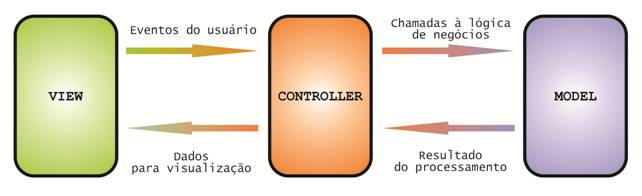

# 
 Design Sprint

## Histórico de Versão 

|Data | Versão | Descrição | Autor(es)|
| :-:|:-:|:-:|:-: |
| 18.03.2022 | 0.1 | Criação do documento |[Davi matheus](https://github.com/DaviMatheus) [Jonathan Jorge](https://github.com/Jonathan-Oliveira)|
| 19.03.2022 | 0.2 | Adição da introdução, metodologia e resultados  |[Davi matheus](https://github.com/DaviMatheus) [Jonathan Jorge](https://github.com/Jonathan-Oliveira)|

## Participantes

* [Davi matheus](https://github.com/DaviMatheus)
* [Jonathan Jorge](https://github.com/Jonathan-Oliveira)

## Introdução

&emsp;&emsp;

Soluções para problemas que alguém um dia teve e resolveu aplicando um modelo que foi documentado e que pode ser adaptado integralmente de acordo com a necessidade do solução é denominado Padrões de projeto. Este documento abordar o padrão de modelo MVC que tem como objetivo separar a lógica de negócio da lógica de apresentação.

## Metodologia

&emsp;&emsp;
Foi realizado uma pesquisa bibliográfica sobre o assunto, para conceituar e para aplicação do MVC no projeto foi utilizado a linguagem javascript com o framework react para o front e nodejs para o back.

## Resultados

### MVC

&emsp;&emsp;
MVC do inglês significa Model View Controller. Traduzindo para o português a expressão significa Modelo, Visão e Controlador, ou seja, o modelo é responsável por armazenar os dados, a visão é responsável por exibir os dados e o controller é responsável por interagir com o modelo e a visão. O padrão foi desenvolvido por Trygve Reenskaug em 1979 com a finalidade de ser utilizado como arquitetura para aplicações para desktops, porém, o padrão ficou popular com o uso em sistemas web, a partir da adesão de diversos frameworks no mercado, mas ainda é bastante usado em outros tipos de projetos, como mobile e desktop.

&emsp;&emsp;
O uso do padrão trás um grande benefício por isolar as regras de negócio da lógica de apresentação. Isto possibilita uma grande flexibilidade e reaproveitamento das classes com a interface de usuário, que podem ser modificadas sem que haja necessidade de alterar as regras de negócio.

&emsp;&emsp;
A seguir há uma explicação dos conceitos  dos componentes que acompanham essa arquitetura:

    
    <figcaption align='center'>
        <b>
            <a href='../../../assets/img/padroes_de_projeto/MVC.jpg'>
               Figura 1: Diagrama de fluxo MVC
            </a>
        </b>
         
        <small>Fonte:<a href='https://www.devmedia.com.br/padrao-mvc-java-magazine/21995#2'>DevMedia Padrão MVC</a></small>
    </figcaption>

&emsp;&emsp;
Analisando a figura 1, percebe-se que o  fluxo do MVC é simples. O usuário interage com a interface gráfica (View), que é responsável por exibir os dados, a interface gráfica interage apenas com um intermediador (Controller), e este interage com a camada de negócio (Model), que executa as regras de negócio da aplicação. Com o uso dessas três camadas a dependência entre elas é isolada, o que facilita a manutenção e a evolução da aplicação.

Entrando em detalhes de cada camada temos:

#### Visão (View)

&emsp;&emsp;
A visão é responsável por exibir e interagir com o usuário. É por ela que acontecerá a entrada dos dados inseridas pelo usuário e também a saída dos dados após a execução de uma determinada regra de negócio. Ela não possui lógica de negócio, ou seja, todo o processamento é realizado na camada modelo (model) e o retorno é repassado para a visão (view) pelo controlador (controller). A visão também se comunica de volta com o modelo e com o controlador para reportar o seu estado.

#### Modelo (Model)

&emsp;&emsp;
O modelo é a camada responsável pela lógica da aplicação, ou seja, pela regras de negócio, persistência dos dados e as classes de entidades. Resumidamente é  o núcleo da aplicação, pois representa o motivo pela qual a aplicação foi construída.

#### Controlador (Controller)

&emsp;&emsp;
Uma vez que as requisições são enviadas pela visão e a lógica de negócio está centralizada no modelo, o controlador vem para ser um intermediador e  realizar a conexão entre as duas camadas de maneira organizada. Deste modo, toda requisição gerada pelo cliente é direcionada para o controlador, que por sua vez comunica com o modelo. Se o modelo criar uma resposta para essas requisições, ele retornará para o controlador, e este então enviará para a visão.

## Conclusão

&emsp;&emsp;
Neste documentos, foi apresentado o que é o MVC, quais sãos componentes e como interagem entre si. Percebe-se que que uma vez que a regra de negócio é definida em outra camada, na camada modelo, permite a obtenção de múltiplas visões dos mesmos dados, desacomplando a camada de negócio. Por conta dessas facilidades que o padrão oferece, o MVC passou a ser utilizado em diversos frameworks para desenvolvimento web, porém nada impede o uso em outras aplicações como mobile e desktop. Por não ser um conceito de linguagem de programação, o padrão pode ser implementado em qualquer linguagem de programação, já que está mais focado em separar as responsabilidades dos componentes do que da tecnologia em si.

## Referências

> [1] Introdução ao Padrão MVC Disponível em: <https://www.devmedia.com.br/introducao-ao-padrao-mvc/29308#:~:text=Hist%C3%B3ria%20do%20MVC,-O%20artigo%20apresenta&text=O%20Engenheiro%20Civil%20Christopher%20Alexander,problema%20espec%C3%ADfico%20em%20projetos%20distintos>.  Acesso em 18, Mar de 2022.

> [2] Padrão MVC - Java Magazine. Disponível em: <https://www.devmedia.com.br/padrao-mvc-java-magazine/21995#2>. Acesso em 19, Mar de 2022.

> [3] O que é padrão MVC? Disponível em: <https://www.lewagon.com/pt-BR/blog/o-que-e-padrao-mvc>. Acesso em 19, Mar de 2022.

> [4] Padrão MVC | Arquitetura Model-View-Controller. Disponível em: <https://www.portalgsti.com.br/2017/08/padrao-mvc-arquitetura-model-view-controller.html>. Acesso em 19, Mar de 2022.

