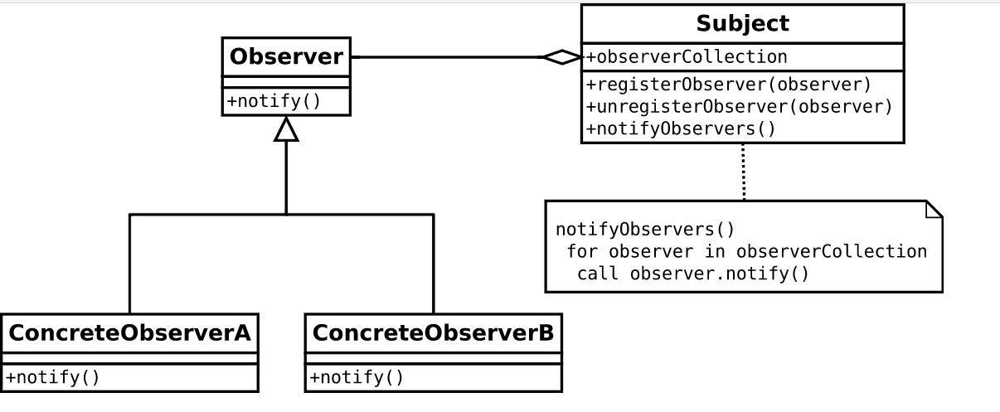
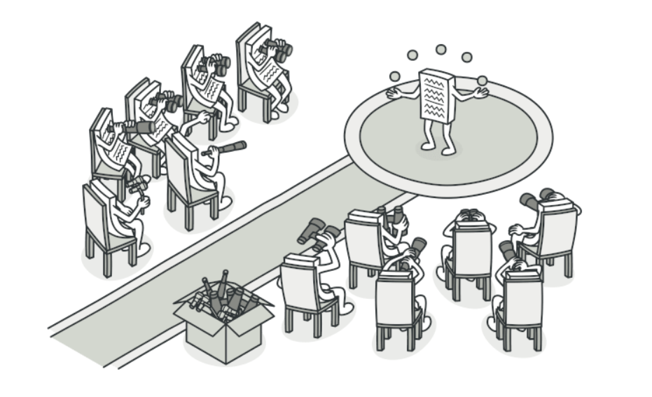

# <center> GOFS Comportamentis

## Histórico de Versão<br>

|    Data    | Versão |      Descrição      |                    Autor(es)                    |
| :--------: | :----: | :-----------------: | :---------------------------------------------: |
| 15.03.2022 |  0.1   | Criação do command  |  [Lucas Melo](https://github.com/luucas-melo)   |
| 16.03.2022 | 0.1.1  | Adição do observer  | [Peniel Etèmana](https://github.com/zpeniel09)  |
| 17.03.2022 | 0.1.2  |   Adição do State   |  [Caio Martins](https://github.com/linktocaio)  |
| 18.03.2022 | 0.1.3  | Criação do Iterator | [Lucas Ferraz](https://github.com/mibasFerraz)  |
| 19.03.2022 |  0.2   | Criação do Mediator | [Nilvan Peres](https://github.com/NilvanPeres)  |
| 20.03.2022 |  0.3   | Revisão do Mediator | [Davi Matheus ](https://github.com/DaviMatheus) |
| 21.03.2022 |  0.4   | Revisão do Iterator | [Nilvan Peres](https://github.com/NilvanPeres)  |
| 21.03.2022 |  0.5   |  Revisão do State   | [Nilvan Peres](https://github.com/NilvanPeres)  |
| 21.03.2022 |  0.6   | Revisão do command  | [Nilvan Peres](https://github.com/NilvanPeres)  |
| 21.03.2022 |  0.7   |  Revisão observer   | [Nilvan Peres](https://github.com/NilvanPeres)  |
| 21.03.2022 |  0.8   |   Adição Strategy   |   [Yuri Alves](https://github.com/yuriAlves5)   |
| 21.03.2022 |  0.8   |  Revisao documento  |  [Caio Martins](https://github.com/linktocaio)  |

## Participantes

-   [Lucas Ferraz](https://github.com/mibasFerraz)
-   [Nilvan Peres](https://github.com/NilvanPeres)
-   [Caio Martins](https://github.com/linktocaio)
-   [Lucas Melo](https://github.com/luucas-melo)
-   [Peniel Etèmana](https://github.com/zpeniel09)
-   [Yuri Alves](https://github.com/yuriAlves5)

## Introdução

&emsp;&emsp;GoFs Comportamentais são padrões voltados para alterações no nível do comportamento dos objetos. Auxiliam quando é necessério, por exemplo, usar vários algoritmos diferentes, cada qual mais apropriado para um determinado contexto. Permitem, nesse caso, usar mecanismos/recursos para facilitar tanto a incorporação de novos algoritmos para
novos contextos quanto a seleção de qual algoritmo usar dado um contexto.

## Iterator

&emsp;&emsp;A ideia principal o iterator é permitir percorrer os elementos de uma coleção sem expor sua representação subjacente (lista, pilha, árvore etc.). A ideia principal do padrão é extrair o comportamento de passagem de uma coleção para um objeto separado denominado iterador.

&emsp;&emsp;Além de implementar o algoritmo em si, um objeto iterador encapsula todos os detalhes do percurso, como a posição atual e quantos elementos faltam para o final. Por causa disso, vários iteradores podem passar pela mesma coleção ao mesmo tempo, independentemente uns dos outros. Todos os iteradores devem implementar a mesma interface. Isso torna o código do cliente compatível com qualquer tipo de coleção ou qualquer algoritmo de passagem, desde que haja um iterador adequado. Se você precisa de uma maneira especial de percorrer uma coleção, basta criar uma nova classe iteradora, sem ter que alterar a coleção ou o cliente.

&emsp;&emsp;Segundo o RefactoringGuru, o iterator deve ser aplicado quando:

-   Quando você deseja que o código realiza iterações sobre diferentes estrutura de dados, ou quando os tipos dessas estruturas ainda não são conhecidos.
-   O padrão permite a redução de duplicatas desnecessárias de códigos.
-   Use o padrão Iterator quando sua coleção tiver uma estrutura de dados complexa de árvores, mas você quer esconder sua complexidade dos clientes (seja por conveniência ou por razões de segurança).

&emsp;&emsp; Os principais participantes dessa padrão em JS são:

-   <b>Client</b> : referencia e invoca o iterator para ser utilizado na coleção de objetos.
-   <b>Iterator</b>: implementa a interface da iteração, com os métodos first(), next().
-   <b>Items</b>: Objetos individuais de uma coleção que está sendo iterada.

&emsp;&emsp;Como o Front-end da nossa aplicação é feita no framework React.JS, estamos utilizando uma abstração do padrão iterator. A linguagem JavaScript utiliza abstrações do padrão por meio de loops. Porém, pode ser considerada uma aplicação exagerada caso o sistema em questão trabalhe apenas com coleções simples e de baixa complexidade.

<p align="justify">&emsp;&emsp;
Na figura 1 abaixo, será representada a utilização desse padrão em código que pode ser encontrada no repositório do <a href='https://github.com/UnBArqDsw2021-2/2021.2_g2_kilimpinho_frontend/blob/develop/src/components/SideMenu/MenuItem.tsx'>frontend</a>.
</p>
<p style="text-align: center">

  <figcaption align='center'>
      <b>
          <a href='https://i.ibb.co/g7xS1mf/Screenshot-from-2022-03-21-08-35-02.png'>
                Figura 1: Aplicação do iterator no projeto
          </a>
      </b>
  </figcaption>
</p>

## State

&emsp;&emsp;No padrão state o comportamento de um objeto é dependente de seu estado, isso é, o comportamento de determinado objeto deve ser alterado em tempo de execução a depender de seu estado. O padrão state coloca cada condição em uma classe separada, assim o estado do objeto pode ser interpretado como um objeto ele próprio, dessa forma, o objeto original pode trocar de estado ao delegar o trabalho ao objeto relacionado.

&emsp;&emsp; O padrão pode ser utilizado quando:

-   O comportamento de um objeto depende do seu estado, e tal comportamento deve ser mudadado em tempo de execução de acordo com o estado do objeto.
-   Operações com múltiplas condições que dependem do estado do objeto.

&emsp;&emsp;A estrutura dessa padrão será descrita na figura 2. Onde um jogo onde o personagem pode se apresentar de diversas formas: andando, nadando, dirigindo um carro, um avião etc. Os controles para a interação com o jogador devem ser diferentes para cada um desses estados, dessa forma os controles devem possuir comportamentos diferentes para cada estado em que o personagem se encontra.

<p align='center'>
    
    <figcaption align='center'>
        <b>Figura 2: Estrutura State</b>
        <br>
        <small>Autor: <a href='https://refactoring.guru/pt-br/design-patterns/state'>Refactoring Guru</a>, 2022.</small>
    </figcaption>
</p>

&emsp;&emsp; Na figura 3 abaixo, será representado um exemplo de como aplicar esse padrão em JavaScript

<p align='center'>
  
  <figcaption align='center'>
        <b>
            <a href='https://i.ibb.co/hZwT2DZ/Screenshot-from-2022-03-21-10-38-40.png'>
               Figura 3: Aplicação do padrão State(ToyExample)
            </a>
        </b>   
      <br>
        <small>Autor: <a href='https://github.com/NilvanPeres'>Nilvan Peres</a>, 2022.</small>
  </figcaption>
</p>

## Mediator

<p align="justify">&emsp;&emsp;
    O padrão mediator permite que um objeto encapsule como será a interação com outros objetos, o mediator permite que o desacoplamento evitando que os objetos fiquem referenciando entre si. [1]
</p>
<p align="justify">&emsp;&emsp;
    O mediator deve ser aplicado quando:
        <li> Um grupo de objetos que se comunicam de forma definida, porém complexa. Resultando em interdependências não estruturadas e complexas de serem entendidas.</li>
        <li> A reutilização de um objeto se torna complexa, pois o mesmo está se comunicando ou se referindo a vários outros objetos.</li>
        <li> Um comportamento que é distruibuído entre várias classes e que deveria ser customizável.[2]</li> 
</p>
<p align="justify">&emsp;&emsp;
    <li><b>Vantagens:</b> </li>
        <ol>
            <li>Limita o uso de subclasses.</li>
            <li>Permite o desacoplamento das classes colegas.</li>
            <li>Simplifica os protocolos dos objetos. O mediador permite substituir a intereção de muitos para muitos, para uma interação de um (mediator) para muitos (colleagues).</li>
            <li>Abstração de como os objetos se relacionam. [2]</li>
        </ol>
    <li><b>Desvantagens:</b> </li>
        <ol>
            <li>Centralização do controle. O mediator permite que a troca de complexidade de interação para uma complexidade no próprio mediator. Como um mediador encapsula protocolos, ele pode se tornar mais complexo que qualquer colega individual. Isso pode tornar o mediador monolítico e complexo de manter.</li>
        </ol>
</p>
<p align="justify">&emsp;&emsp;
    Os principais participantes desse padrão são <b>Mediator(interface para comunicação com objetos colegas)</b>, <b>ConcreteMediator( implemena os comportamentos cooperativos a partir da coordenação dos objetos colegas), </b><b>Products(a instância do produto criado pela factory)</b>, <b> ColeagueClasses (se comunica com seu mediator quando necessário, caso contrário se comunica com outro colega)</b>. No código abaixo, será introduzindo um exemplo de prático de como aplicar esse padrão em JavaScript.
</p>

```
var Participant = function (name) {
    this.name = name;
    this.chatroom = null;
};

Participant.prototype = {
    send: function (message, to) {
        this.chatroom.send(message, this, to);
    },
    receive: function (message, from) {
        console.log(from.name + " to " + this.name + ": " + message);
    }
};

var Chatroom = function () {
    var participants = {};

    return {

        register: function (participant) {
            participants[participant.name] = participant;
            participant.chatroom = this;
        },

        send: function (message, from, to) {
            if (to) {                      // single message
                to.receive(message, from);
            } else {                       // broadcast message
                for (key in participants) {
                    if (participants[key] !== from) {
                        participants[key].receive(message, from);
                    }
                }
            }
        }
    };
};
```

Fonte: <a href="https://www.dofactory.com/javascript/design-patterns/mediator">DoFactory</a>[3]

## Observer

&emsp;&emsp;Entre os principais GoFs comportamentais temos o Observer, que consiste em definir um mecanismo eficiente para reagir
às alterações realizadas em determinados objetos.

&emsp;&emsp;No pattern observer, é criado uma relação de dependência um-para-muitos entre objetos que funciona da forma seguinte:quando um certo objeto, chamado subject tem seu estado modificado, outros objetos, chamados observers, são notificados.

&emsp;&emsp;O Observer é formado por métodos que possuem padrões de nomenclatura e comportamentos específicos. É importante seguir estes padrões para que implementações diferentes do Observer possam ser facilmente identificadas por desenvolvedores que não as codificaram.

&emsp;&emsp; Na figura 4 abaixo, será representado como funciona esse padrão no nível de modelagem, e quais são os participantes desse design.

<center>
 
<h6>Figura 4: Observer Padrão.</h6>
<h6>Fonte: Padrões de Projetos.</h6>
</center>

<center>
 
<h6>Figura 4: Exemplo de imagem sobre Observer.</h6>
<h6>Fonte: Padrões de Projetos.</h6>
</center>

&emsp;&emsp; Abaixo, um exemplo em código de como aplicar esse padrão em Javascript:

```
function Click() {
    this.handlers = [];  // observers
}

Click.prototype = {

    subscribe: function (fn) {
        this.handlers.push(fn);
    },

    unsubscribe: function (fn) {
        this.handlers = this.handlers.filter(
            function (item) {
                if (item !== fn) {
                    return item;
                }
            }
        );
    },

    fire: function (o, thisObj) {
        var scope = thisObj || window;
        this.handlers.forEach(function (item) {
            item.call(scope, o);
        });
    }
}

function run() {

    var clickHandler = function (item) {
        console.log("fired: " + item);
    };

    var click = new Click();

    click.subscribe(clickHandler);
    click.fire('event #1');
    click.unsubscribe(clickHandler);
    click.fire('event #2');
    click.subscribe(clickHandler);
    click.fire('event #3');
}
```

Fonte: [DoFactory](https://www.dofactory.com/javascript/design-patterns/observer)

## Command

&emsp;&emsp;No pattern Command, uma operação é encapsulada como um objeto de comando e passada para o objeto invocador. O objeto invocador passa o comando para o objeto correspondente, que executa o comando. O padrão de comando encapsula ações como objetos. Nesse padrão temos uma uma pilha de comandos sempre que um comando é executado e enviado para a mesma.

&emsp;&emsp;No pattern command, o cliente que cria um comando não é o mesmo cliente que o executa.

&emsp;&emsp;Os passos para aplicar o pattern command são:

<li>Defina uma interface Command com uma assinatura de método como execute()</li>
<li>Crie uma ou mais classes derivadas que encapsulam algum subconjunto do seguinte: um objeto "receptor", o método a ser invocado, os argumentos a serem transmitidos</li>
<li>Instancie um objeto Command para cada solicitação de execução adiada</li>
<li>Passe o objeto Command do criador (também conhecido como remetente) para o invocador (também conhecido como receptor)</li>
<li>O invocador decide quando executar()</li>

<p align="justify">&emsp;&emsp;
   
Um exemplo de aplicação do pattern command é em um componente Wizard, que apresenta várias páginas de configuração para uma única ação que acontece apenas quando o usuário clica no botão "Concluir" na última página. Nesses casos, uma maneira natural de separar o código da interface do usuário do código do aplicativo é implementar o assistente usando um objeto de comando.
</p>

<p align="justify">&emsp;&emsp;
Dessa forma, o objeto de comando é criado quando o componente Wizard é exibido pela primeira vez. Cada página do assistente armazena suas alterações de GUI no objeto de comando, para que o objeto seja preenchido à medida que o usuário progride.. Dessa forma, a classe de comando funcionará. [1]
</p>

<p align='center'>
    
    <figcaption align='center'>
        <b>Exemplo código Wizard component - React</b>
        <br>
        <small>Autor: Lucas Melo, 2022.</small>
    </figcaption>
</p>

<strong>Pros do pattern Command </strong>

<li> dissocia o objeto que invoca a operação daquele que sabe realizá-la</li>
<li>ajuda na extensibilidade, pois podemos adicionar um novo comando sem alterar o código existente</li>
<li>permite que você crie uma sequência de comandos chamada macro. Para executar a macro, crie uma lista de instâncias de Comando e chame o método execute de todos os comandos.</li>
<li>Capacidade de desfazer/refazer facilmente</li>

<strong>Contras do pattern Command </strong>

<li>aumento no número de classes para cada comando individual</li>

## Strategy

<p align="justify">&emsp;&emsp;
    Seguindo o conceito de GOFS Comportamentais o padrão de strategy é fundamental para formação de um projeto bem consolidado e com funcionalidade estendidas e manutenções menos custosas. De acordo com o livro Design Patterns de (Gamma et al.) o padrão de estrategia é utilizado de forma a manter o encapsulamento dos algoritimos alem de mante-los intercambiaveis. 
</p>

<p align="justify">&emsp;&emsp; 
    Ainda seguindo Gamma a utilização dos padrões de estrategia é sugestivo quando:
    <li> Muitas classes relacionadas se diferenciando somente pelo seu comportamento. Com as estrategias é possivel configurar a classe com um ou mais comportamentos.
    </li>
    <li> Você precisa de diferentes variações de um algoritimos
    </li>
    <li> O algoritimo usa dados que os clientes não devem saber. Com o uso do padrão de estrategia, é possivel evitar de expor a estrutura de dados de certos algoritimos especificos.
    </li>
</p>

## Referências

> [1] SERRANO, Milene. Módulo Padrões de Projeto GoF(s) Comportamentais. Disponível em : <https://aprender3.unb.br/course/view.php?id=11018&section=4>. Acesso em 16, mar de 2022.

> [2] GAMMA, Erich; HELM Richard; JOHNSON, Ralph; and VLISSIDES, John. Design Patterns: Elements of Reusable Object-oriented Software, 1995. Addison-Wesley Longman Publishing Co., Inc.

> [3] Design Patterns - Mediator, DO FACTORY. Disponível em: <https://www.dofactory.com/javascript/design-patterns/mediator>, Acesso em 18, mar de 2022.

> [4] Iterator - DOFactory;. Disponível em : <https://www.dofactory.com/javascript/design-patterns/iterator>. Último acesso em 18/03/2022.

> [5] Desgin Patterns - Iterator. Disponível em : <https://brizeno.wordpress.com/2011/09/15/mao-na-massa-iterator/>. Último acesso em 18/03/2022.

> [6] Padrões de projeto comportamentais: Disponível em <https://refactoring.guru/pt-br/design-patterns/behavioral-patterns>. Último acesso em 18/03/2022.

> [7] SHVETS, Alexander. Dive Into Design Patterns. Disponível em <https://refactoring.guru/design-patterns>. Último acesso em 18/03/2022.

> [8] BRIENZO, Marcos. State. Disponível em: <https://brizeno.wordpress.com/category/padroes-de-projeto/state/>. Acesso em 17, mar de 2022.

> [9] Refactoring Guru. State. Disponível em: <https://refactoring.guru/pt-br/design-patterns/state>. Acesso em: 17 de mar de 2022.

> [10] Do Factory. State. Disponível em: <https://www.dofactory.com/javascript/design-patterns/state>. Acesso em: 20 de mar de 2022.

> [11] WIKIPEDIA CONTRIBUTORS. Command pattern. Disponível em: <https://en.wikipedia.org/wiki/Command_pattern>. Acesso em: 15 mar. 2022.

> [12] AND, A. Learning Python Design Patterns - Second Edition. Disponível em: <https://www.oreilly.com/library/view/learning-python-design/9781785888038/ch07s04.html>. Acesso em: 16 mar. 2022.

> [13] Design Patterns and Refactoring. Disponível em: <https://sourcemaking.com/design_patterns/command>. Acesso em: 16 mar. 2022.

> [14] Arquitetura e Desenho de Software AULA - GOFS COMPORTAMENTAIS Profa. Milene Serrano

> [15] Wikipédia. Disponível em: <https://pt.wikipedia.org/wiki/Observer>. Acesso em: 16 mar. 2022.

> [16] Refactoring Guru. **Observer**. Disponível em: <https://refactoring.guru/design-patterns/observer>. Acesso em: 16 mar. 2022.

> [17] Wikipédia. Disponível em: <https://en.wikipedia.org/wiki/Observer_pattern>. Acesso em: 16 mar. 2022.