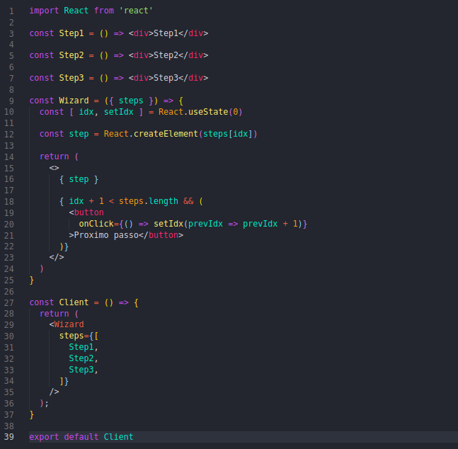

# 
 Design Sprint

### Histórico de versão 

| Data       | Versão | Descrição            | Autor(es)  |
| ---------- | ------ | -------------------- | ---------- |
| 15.03.2022 | 0.1    | Criação do command | [Lucas Melo](https://github.com/luucas-melo) |
| 21.03.2022 | 0.1    | Revisão do command | [Nilvan Peres](https://github.com/NilvanPeres) |

## Participantes

- [Lucas Melo](https://github.com/luucas-melo)

## Command

&emsp;&emsp;No pattern Command, uma operação é encapsulada como um objeto de comando e passada para o objeto invocador. O objeto invocador passa o comando para o objeto correspondente, que executa o comando. O padrão de comando encapsula ações como objetos. Nesse padrão temos uma uma pilha de comandos sempre que um comando é executado e enviado para a mesma.

&emsp;&emsp;No pattern command, o cliente que cria um comando não é o mesmo cliente que o executa. 

&emsp;&emsp;Os passos para aplicar o pattern command são:

<li>Defina uma interface Command com uma assinatura de método como execute()</li>
<li>Crie uma ou mais classes derivadas que encapsulam algum subconjunto do seguinte: um objeto "receptor", o método a ser invocado, os argumentos a serem transmitidos</li>
<li>Instancie um objeto Command para cada solicitação de execução adiada</li>
<li>Passe o objeto Command do criador (também conhecido como remetente) para o invocador (também conhecido como receptor)</li>
<li>O invocador decide quando executar()</li>

### Resultados

&emsp;&emsp;
   
Um exemplo de aplicação do pattern command é em um componente Wizard, que apresenta várias páginas de configuração para uma única ação que acontece apenas quando o usuário clica no botão "Concluir" na última página. Nesses casos, uma maneira natural de separar o código da interface do usuário do código do aplicativo é implementar o assistente usando um objeto de comando.

&emsp;&emsp;
Dessa forma, o objeto de comando é criado quando o componente Wizard é exibido pela primeira vez. Cada página do assistente armazena suas alterações de GUI no objeto de comando, para que o objeto seja preenchido à medida que o usuário progride.. Dessa forma, a classe de comando funcionará. [1]

    
    <figcaption align='center'>
        <b>Exemplo código Wizard component - React</b>
         
        <small>Autor: Lucas Melo, 2022.</small>
    </figcaption>

<strong>Pros do pattern Command </strong>

<li> dissocia o objeto que invoca a operação daquele que sabe realizá-la</li>
<li>ajuda na extensibilidade, pois podemos adicionar um novo comando sem alterar o código existente</li>
<li>permite que você crie uma sequência de comandos chamada macro. Para executar a macro, crie uma lista de instâncias de Comando e chame o método execute de todos os comandos.</li>
<li>Capacidade de desfazer/refazer facilmente</li>

<strong>Contras do pattern Command </strong>

<li>aumento no número de classes para cada comando individual</li>

## Referências

> [11] WIKIPEDIA CONTRIBUTORS. Command pattern. Disponível em: <https://en.wikipedia.org/wiki/Command_pattern>. Acesso em: 15 mar. 2022.

> [12] AND, A. Learning Python Design Patterns - Second Edition. Disponível em: <https://www.oreilly.com/library/view/learning-python-design/9781785888038/ch07s04.html>. Acesso em: 16 mar. 2022.

> [13] Design Patterns and Refactoring. Disponível em: <https://sourcemaking.com/design_patterns/command>. Acesso em: 16 mar. 2022.

‌
