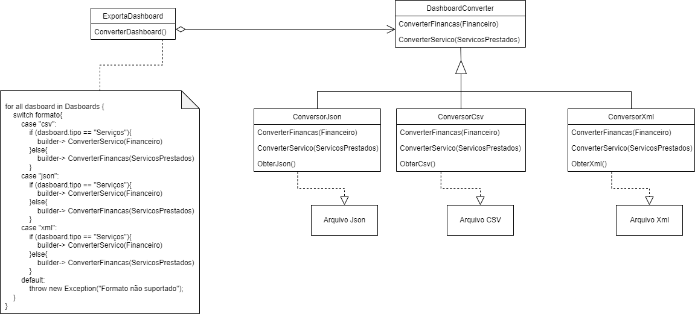

## Histórico de Versão 

|Data | Versão | Descrição | Autor(es)|
| :-:|:-:|:-:|:-: |
| 16.03.2022 | 0.1 | Adição Prototype | [Peniel Etèmana](https://github.com/zpeniel09) |
| 17.03.2022 | 0.2 | Adição do Builder | [Jonathan Jorge](https://github.com/Jonathan-Oliveira)|
| 20.03.2022 | 0.3 | Revisão Builder | [Nilvan Peres](https://github.com/NilvanPeres)|
| 20.03.2022 | 0.4 | Revisão Prototype | [Nilvan Peres](https://github.com/NilvanPeres) |

## Participantes

* [Jonathan Jorge](https://github.com/Jonathan-Oliveira)

- [Peniel Etèmana](https://github.com/zpeniel09)

## Prototype

&emsp;&emsp;
GoFs Criacionais são padrões que fornecem vários mecanismos de criação de objetos, que aumentam a flexibilidade e a reutilização do código existente. 

Permitem, nesse caso, usar mecanismos/recursos para facilitar tanto a incorporação de novos algoritmos para 
novos contextos quanto a seleção de qual algoritmo usar dado um contexto.

Entre os principais GoFs criacionais temos o Prototype,é um padrão de design criacional que permite copiar objetos existentes sem tornar seu código dependente de suas classes

&emsp;&emsp;
O padrão prototype deve ser aplicado quando: 
    <li>Quando  o sistema deve ser independente de como os produtos são criados e representados.</li>
    <li>Quando as classes que serão instanciadas são especificadas no tempo de execucação do código.[2]</li> 

&emsp;&emsp;
    O padrão Prototype(protótipo), da forma como foi descrito no livro Design Patterns: Elements of Reusable Object-Oriented Software, contém os seguintes elementos: 

  -  **prototype** — uma classe que declara uma interface para objetos capazes de clonar a si mesmo.
    
  -  **prototype concreto** — implementação de um prototype;
    
  -  **cliente** — cria um novo objeto através de um prototype que é capaz de clonar a si mesmo.

 
<h6>Figura 1: Diagrama descrevendo prototype design pattern.</h6>
<h6>Fonte: Wikipédia.</h6>

<strong>Uso desse padrão no nosso projeto, será represetado na figura 5</strong>

  
  <figcaption align='center'>
        <b>
            <a href='https://i.ibb.co/pPLVpyj/Screenshot-from-2022-03-20-19-27-16.png'>
               Figura 5: Aplicação do padrão Prototype - ToyExample
            </a>
        </b>   
       
        <small>Autor: <a href='https://github.com/NilvanPeres'>Nilvan Peres</a>, 2022.</small>
  </figcaption>

&emsp;&emsp;
    Esse padrão pode ser observado no produto, que quando é criado, ele possui uma estrutura com valores pré-definidos, que não sao necessários serem especificados no momento de criação.
    <li><b>Vantagens:</b> </li>
        <ol>
            <li>Adição e remoção de produtos em tempo de exucação, melhorando significamente o desempenho da aplicação.</li>
            <li>Especificando novos objetos a partir de alterações de valores.</li>
            <li>Especificando novos objetos a partir da variação de estruturas.</li>
        </ol>
    <li><b>Desvantagens:</b> </li>
        <ol>
            <li>Cada subclasse do Prototype deverá implementar uma operação de clone, o que é um processo complexo, pois os objetos internos podem não suportar o clone, ou possuir referências circulares.</li>
        </ol>

&emsp;&emsp;
    Podemos concluir que, o Prototype faz a criação de novos objetos, mas ao invés de criar objetos com valores não inicializados, ele cria objetos através da cópia dos valores de um protótipo. Esse padrão nos permitirá copiar objetos existentes sem que essa parte do código tenha dependência em classes. Quando quisermos criar um objeto igual, não precisamos acionar essas classes, basta fazer a exata cópia do objeto já criado.

## Builder

&emsp;&emsp;
    O Builder é um padrão de projeto de software  criacional quer permite a construção de objetos passo a passo. Permite a produção e representação de objetos complexos usando o mesmo código de construção, baseado em regras e parâmetros que sejam informados ao objeto responsável pela construção.

&emsp;&emsp;
    A estrutura desse padrão pode ser visualizado abaixo, na figura 3:

  
  <figcaption align='center'>
        <b>
            <a href='../../../../assets/img/gof/structure_builder.png'>
               Figura 3: Estrutura do padrão Builder
            </a>
        </b>   
       
      <small>Fonte: GAMMA et al., 1995 </small>
  </figcaption>

&emsp;&emsp;
    Esse padrão deve ser aplicado quando:
    <li>O algoritmo resposável pela criação do objeto é complexo e deve ser independente das partes e da forma que serão montadas.</li>
    <li> O processo de construção deve permitir diferentes representações para os ojetos que foram construídos.[2]</li> 

&emsp;&emsp;
    O padrão Builder poderia ser aplicado caso a aplicação tivesse a funcionalidade de baixar os dados do dashboard em diversos formatos, como por exemplo CSV, JSON, XML, etc. Para a aplicação da funcionalidade citada a cima, o padrão seria aplicado com a seguinte estrutura que será representada na figura 4:

  
  <figcaption align='center'>
        <b>
            <a href='../../../assets/img/gof/application_builder.png'>
               Figura 4: Estrutura da aplicação do padrão Builder
            </a>
        </b>   
       
        <small>Autor: <a href='https://github.com/Jonathan-Oliveira'>Jonathan Jorge</a>, 2022.</small>
  </figcaption>

&emsp;&emsp;
    Os participantes dessa estrutura são:
    <ul>
        <li> 
            Builder (ConverterDashboard)
            <ol>
                <li>
                    Especifica uma interface abstrata para criar partes de um objeto de Product. 
                </li>
            </ol>
        </li>
        <li>
            ConcreteBuilder (ConversorJson, ConversorCsv, ConversorXml)
            <ol>
                <li>
                    Constrói e monta partes do produto através da implementação da interface Builder. 
                </li>
                <li>
                    Define e mantém um registo da representação que cria. 
                </li>                
                <li>
                    Fornece uma interface para a recuperação do produto (ex., ObterCsv, ObterJSON, etc.).
                </li>
            </ol>
        </li>
        <li>
            Director (ExportaDashboard)
            <ol>
                <li>
                    Constrói um objeto usando a interface Builder.
                </li>
            </ol>
        </li>
        <li>
            Product ( Arquivo CSV,  Arquivo JSON,  Arquivo XML)
            <ol>
                <li>
                     Representa o objeto complexo em construção. O ConcreteBuilder constrói a representação interna do produto e define o processo pelo qual este é montado.
                </li>
                <li>
                    Inclui classes que definem as partes constituintes, incluindo interfaces para a montagem das peças no resultado final.
                </li>
            </ol>
        </li>
    </ul>

&emsp;&emsp;
    De acordo com GAMMA, a aplicação do builder tem as seguintes vantagens:
    <ol>
    <li> Permite variar a representação interna de um produto;</li>
    <li> Isola o código de construção e representação; </li>
    <li>  Proporciona um melhor controle sobre o processo de construção.</li>
    </ol>

&emsp;&emsp;
    Dessa forma, podemos concluir que, o padrão Builder facilita na separação de toda a lógica de criação dos objetos, evitando que as classes que representam esses objetos finais fiquem muito extensas e de pouca manutenibilidade, além de prover a implementação de múltiplos builders especializados, onde tem-se objetos construídos em cima de uma interface.

## Referências

> [1] Builder Disponível em: <https://refactoring.guru/pt-br/design-patterns/builder>. Acesso em 17, Mar de 2022.

> [2] GAMMA, E. et al. Design Patterns: Elements of Reusable Object-Oriented Software. USA:
Addison-Wesley Longman Publishing Co., Inc., 1995. ISBN 0201633612.

> [3] 007 – Padrão de Projeto BUILDER – Padrão GoF de Criação – Curso de Design Patterns Disponível em: <http://davesbalthazar.com.br/007-padrao-de-projeto-builder-padrao-gof-de-criacao-curso-de-design-patterns/>. Acesso em 17, Mar de 2022.

> [4] Desing Patterns na prática - Desvendando o Builder (parte 2) Disponível em: <http://www.linhadecodigo.com.br/artigo/2576/desing-patterns-na-pratica-desvendando-o-builder-parte-2.aspx>. Acesso em 17, Mar de 2022.

> [5] SERRANO, Milene. Arquitetura e Desenho de Software AULA - GOFS CRIACIONAIS.

> [6] Wikipédia. Disponível em: <https://pt.wikipedia.org/wiki/Prototype>. Acesso em: 16 mar. 2022.

> [7] Refactoring Guru. **Prototype**. Disponível em: <https://refactoring.guru/design-patterns/prototype>. Acesso em: 16 mar. 2022.

> [8] Wikipédia. Disponível em: <https://en.wikipedia.org/wiki/Prototype_pattern>. Acesso em: 16 mar. 2022.
