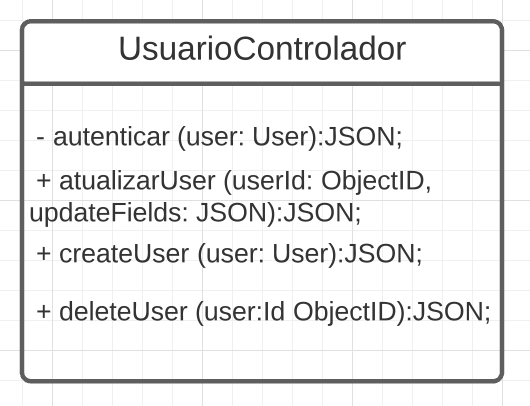
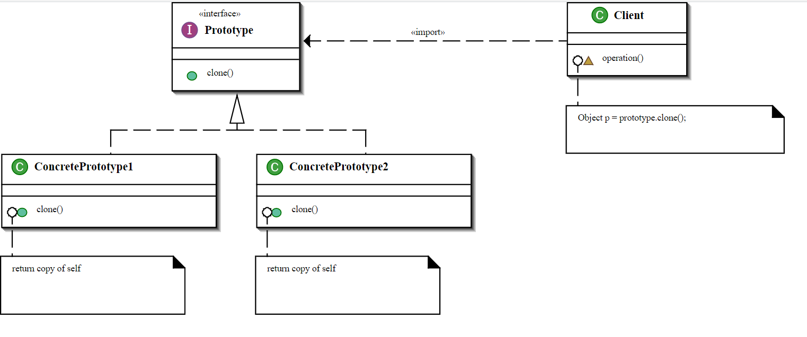
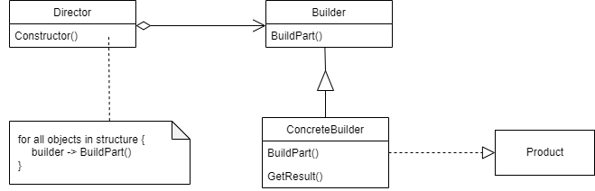

# <center> Criacionais

## Histórico de Versão<br>

|Data | Versão | Descrição | Autor(es)|
| :-:|:-:|:-:|:-: |
| 16.03.2022 | 0.1 | Adição Prototype | [Peniel Etèmana](https://github.com/zpeniel09) |
| 16.03.2022 | 0.1.1 | Adição do singleton | [Natanael Filho](https://github.com/fernandes-natanael) |
| 16.03.2022 | 0.1.2 | Adição do multiton | [Natanael Filho](https://github.com/fernandes-natanael) |
| 17.03.2022 | 0.2 | Adição do Builder | [Jonathan Jorge](https://github.com/Jonathan-Oliveira)|
| 18.03.2022 | 0.2.1 | Adição GOF Absract Factory | [Nilvan Peres](https://github.com/NilvanPeres)|
| 19.03.2022 | 0.2.2 | Revisão do singleton | [Jonathan Jorge](https://github.com/Jonathan-Oliveira) |
| 20.03.2022 | 0.3 | Revisão Builder | [Nilvan Peres](https://github.com/NilvanPeres)|
| 20.03.2022 | 0.4 | Revisão Prototype | [Nilvan Peres](https://github.com/NilvanPeres) |
| 21.03.2022 | 0.5 |Adição do Factory Method | [Henrique Melo](https://github.com/henriqueamorim20) |
| 21.03.2022 | 0.6 | Revisão Factory Method | [Nilvan Peres](https://github.com/NilvanPeres) |
| 21.03.2022 | 0.7 | Adição Introdução | [Peniel Etèmana](https://github.com/zpeniel09) |

## Participantes

* [Henrique Melo](https://github.com/henriqueamorim20)
* [Jonathan Jorge](https://github.com/Jonathan-Oliveira)
* [Nilvan Peres](https://github.com/NilvanPeres)
* [Natanael Filho](https://github.com/fernandes-natanael)
* [Peniel Etèmana](https://github.com/zpeniel09)

## Introdução    

&emsp;&emsp;Segundo o livro Design Patterns: Elements of Reusable Object-Oriented Software, os padrões de projetos criacionais fazem a abstração do processo de instanciação, tornando um sistema independente de como seus objetos são criados, compostos e representados.

&emsp;&emsp;Os padrões de projeto Criacionais se preocupam basicamente com a maneira como os objetos são criados, buscando reduzir a instabilidade e complexidade, criando objetos de maneira controlada.

&emsp;&emsp;O novo operador é considerado prejudicial, principalmente por espalhar objetos por todo o aplicativo. Podendo com o tempo gerar problemas ao alterar uma implementação devido ao fato das classes estarem fortemente acopladas.

&emsp;&emsp;Os Padrões de Criação buscam resolver esse problema separando o cliente do processo de inicialização real.

&emsp;&emsp;Fazendo uma analogia com uma situação real, quando um mecânico realiza o conserto de um carro ele faz a terceirização das peças, solicitando elas a um fornecedor, para então realizar a instalação, não se preocupando com todo o processo envolvido na criação desses componentes.
    
## Abstract Factory

<p align="justify">&emsp;&emsp;
    Esse padrão permite que uma interface seja responsável pela criação de famílias de objetos que possuem um "tema" em comum, sem a necessidade de especificar a classe concreta. 
</p>
<p align="justify">&emsp;&emsp;
    O abstract factory deve ser aplicado quando:
        <li> Um sistema que deveria ser ser independente em como os produtos são criados, associados e representados.</li>
        <li> Um sistema que deveria ser configurado com múltiplas famílias de produtos.</li>
        <li> Quando é desejado implementar uma classe de produtos, e você deseja que tenham acesso apenas a interface, e não a implementação.[2]</li> 
</p>
<p align="justify">&emsp;&emsp;
    <li><b>Vantagens:</b> </li>
        <ol>
            <li>Há o isolamento das classes concretas. A factory ajuda a encapsular a responsabilidade e o processo de criar ojetos e isola o cliente da classes de implemtações.</li>
            <li>As mudanças nas classes concretas ficam unitárias, tendo que alterar o código em apenas um lugar, caso haja alguma mudança de configuração na classe de fábrica concreta.</li>
            <li>Permite maior consistências dos produtos, permitindo que aplicação use uma família por vez.</li>
        </ol>
    <li><b>Desvantagens:</b> </li>
        <ol>
            <li>A extensão de novos produtos não ocorre de forma fácil, pois é necessário a alteração de diferentes trechos de códigos em múltiplos arquivos, a classe da fábrica abstrata e toda as suas subclasses.</li>
        </ol>
</p>
<p align="justify">&emsp;&emsp;
    Os principais participantes desse padrão são <b>AbstractFactory(interface para criação de produtos)</b>, <b>ConcreteFactory(uma fabrica que "produz" novos produtos), </b><b>Products(a instância do produto criado pela factory)</b>, <b> AbstractProduct (Interface para os produtos que serão criados)</b>. Para aplicar esse conceito no projeto, será feito um exemplo-TOY. Lembrando que são necessárias adaptações, pois o projeto está sendo desenvolvido em JavaScript, dessa forma, não é suportado herança de classes, por isso as classes concretas receberão mesmos métodos e propriedades para garantir que tenham as mesmas definições [3].
</p>

<p align='center'>
  
  <figcaption align='center'>
        <b>
            <a href='https://i.ibb.co/ryNmjxr/Screenshot-from-2022-03-19-12-26-02.png'>
               Figura 2: Aplicação do padrão AbstractFactory - ToyExample
            </a>
        </b>   
      <br>
        <small>Autor: <a href='https://github.com/NilvanPeres'>Nilvan Peres</a>, 2022.</small>
  </figcaption>
</p>


## Factory Method

&emsp;&emsp;O Factory Method é um padrão bastante adotado por diversas linguagens. Consiste basicamente na definição de uma interface comum para criação de objetos, deixando para as subclasses a responsabilidade de instanciá-los. Essa estrutura é composta pelas interfaces Product, ConcreteProduct, Creator e ConcreteCreator.

- Product: Se caracteriza como a interface comum dos produtos a serem criados;
  
- ConcreteProduct: Responsável pela implementação da interface Product, definindo produtos concretos;
  
- Creator: É uma classe abstrata sendo responsável pela declaração da operação factoryMethod, que retorna um objeto Product. Podendo ainda definir uma implementação padrão e assim retornar um ConcreteProduct específico ou também pode definir alguns métodos que invocam FactoryMethod;
  
- ConcreteCreator: Basicamente estende a classe Creator, realiza a redefinição do factoryMethod para retornar uma instância de um ConcreteProduct criado;

&emsp;&emsp;Em nosso projeto, é possível utilizar o Factory Method na classe "UsuarioControlador", onde pode ser implementado uma interface com os atributos e métodos necessários, uma ConcreteProduct que realize a implementação dos métodos, e por meio de uma ConcreteCreater realizar a redefinição específica para cada tipo de usuário.

<center>
  
  <figcaption align='center'>
        <b>
            <a href='../../../assets/img/factoryMethod/factoryMethod.png'>
              Figura 1: Factory Method
            </a>
        </b>   
      <br>
      <small>Autor: Henrique Melo</a>, 2022.</small>
    </figcaption>
</center>

## Prototype

<p align="justify">&emsp;&emsp;
GoFs Criacionais são padrões que fornecem vários mecanismos de criação de objetos, que aumentam a flexibilidade e a reutilização do código existente. 

Permitem, nesse caso, usar mecanismos/recursos para facilitar tanto a incorporação de novos algoritmos para 
novos contextos quanto a seleção de qual algoritmo usar dado um contexto.

Entre os principais GoFs criacionais temos o Prototype,é um padrão de design criacional que permite copiar objetos existentes sem tornar seu código dependente de suas classes

</p>

<p align="justify">&emsp;&emsp;
O padrão prototype deve ser aplicado quando: 
    <li>Quando  o sistema deve ser independente de como os produtos são criados e representados.</li>
    <li>Quando as classes que serão instanciadas são especificadas no tempo de execucação do código.[2]</li> 
</p>

<p align="justify">&emsp;&emsp;
    O padrão Prototype(protótipo), da forma como foi descrito no livro Design Patterns: Elements of Reusable Object-Oriented Software, contém os seguintes elementos:<br>
</p>

  -  **prototype** — uma classe que declara uma interface para objetos capazes de clonar a si mesmo.
    
  -  **prototype concreto** — implementação de um prototype;
    
  -  **cliente** — cria um novo objeto através de um prototype que é capaz de clonar a si mesmo.


<center>
 
<h6>Figura 1: Diagrama descrevendo prototype design pattern.</h6>
<h6>Fonte: Wikipédia.</h6>
</center>

<strong>Uso desse padrão no nosso projeto, será represetado na figura 5</strong>
<p align='center'>
  
  <figcaption align='center'>
        <b>
            <a href='https://i.ibb.co/pPLVpyj/Screenshot-from-2022-03-20-19-27-16.png'>
               Figura 5: Aplicação do padrão Prototype - ToyExample
            </a>
        </b>   
      <br>
        <small>Autor: <a href='https://github.com/NilvanPeres'>Nilvan Peres</a>, 2022.</small>
  </figcaption>
</p>
<p align="justify">&emsp;&emsp;
    Esse padrão pode ser observado no produto, que quando é criado, ele possui uma estrutura com valores pré-definidos, que não sao necessários serem especificados no momento de criação.
    <li><b>Vantagens:</b> </li>
        <ol>
            <li>Adição e remoção de produtos em tempo de exucação, melhorando significamente o desempenho da aplicação.</li>
            <li>Especificando novos objetos a partir de alterações de valores.</li>
            <li>Especificando novos objetos a partir da variação de estruturas.</li>
        </ol>
    <li><b>Desvantagens:</b> </li>
        <ol>
            <li>Cada subclasse do Prototype deverá implementar uma operação de clone, o que é um processo complexo, pois os objetos internos podem não suportar o clone, ou possuir referências circulares.</li>
        </ol>
</p>

<p align="justify">&emsp;&emsp;
    Podemos concluir que, o Prototype faz a criação de novos objetos, mas ao invés de criar objetos com valores não inicializados, ele cria objetos através da cópia dos valores de um protótipo. Esse padrão nos permitirá copiar objetos existentes sem que essa parte do código tenha dependência em classes. Quando quisermos criar um objeto igual, não precisamos acionar essas classes, basta fazer a exata cópia do objeto já criado.
</p>


## Builder
<p align="justify">&emsp;&emsp;
    O Builder é um padrão de projeto de software  criacional quer permite a construção de objetos passo a passo. Permite a produção e representação de objetos complexos usando o mesmo código de construção, baseado em regras e parâmetros que sejam informados ao objeto responsável pela construção.
</p>
<p align="justify">&emsp;&emsp;
    A estrutura desse padrão pode ser visualizado abaixo, na figura 3:
</p>

<p align='center'>
  
  <figcaption align='center'>
        <b>
            <a href='../../../assets/img/gof/structure_builder.png'>
               Figura 3: Estrutura do padrão Builder
            </a>
        </b>   
      <br>
      <small>Fonte: GAMMA et al., 1995 </small>
  </figcaption>
</p>

<p align="justify">&emsp;&emsp;
    Esse padrão deve ser aplicado quando:
    <li>O algoritmo resposável pela criação do objeto é complexo e deve ser independente das partes e da forma que serão montadas.</li>
    <li> O processo de construção deve permitir diferentes representações para os ojetos que foram construídos.[2]</li> 
</p>

<p align="justify">&emsp;&emsp;
    O padrão Builder poderia ser aplicado caso a aplicação tivesse a funcionalidade de baixar os dados do dashboard em diversos formatos, como por exemplo CSV, JSON, XML, etc. Para a aplicação da funcionalidade citada a cima, o padrão seria aplicado com a seguinte estrutura que será representada na figura 4:
</p>

<p align='center'>
  
  <figcaption align='center'>
        <b>
            <a href='../../../../../assets/img/gof/application_builder.png'>
               Figura 4: Estrutura da aplicação do padrão Builder
            </a>
        </b>   
      <br>
        <small>Autor: <a href='https://github.com/Jonathan-Oliveira'>Jonathan Jorge</a>, 2022.</small>
  </figcaption>
</p>

<p align="justify">&emsp;&emsp;
    Os participantes dessa estrutura são:
    <ul>
        <li> 
            Builder (ConverterDashboard)
            <ol>
                <li>
                    Especifica uma interface abstrata para criar partes de um objeto de Product. 
                </li>
            </ol>
        </li>
        <li>
            ConcreteBuilder (ConversorJson, ConversorCsv, ConversorXml)
            <ol>
                <li>
                    Constrói e monta partes do produto através da implementação da interface Builder. 
                </li>
                <li>
                    Define e mantém um registo da representação que cria. 
                </li>                
                <li>
                    Fornece uma interface para a recuperação do produto (ex., ObterCsv, ObterJSON, etc.).
                </li>
            </ol>
        </li>
        <li>
            Director (ExportaDashboard)
            <ol>
                <li>
                    Constrói um objeto usando a interface Builder.
                </li>
            </ol>
        </li>
        <li>
            Product ( Arquivo CSV,  Arquivo JSON,  Arquivo XML)
            <ol>
                <li>
                     Representa o objeto complexo em construção. O ConcreteBuilder constrói a representação interna do produto e define o processo pelo qual este é montado.
                </li>
                <li>
                    Inclui classes que definem as partes constituintes, incluindo interfaces para a montagem das peças no resultado final.
                </li>
            </ol>
        </li>
    </ul>
</p>

<p align="justify">&emsp;&emsp;
    De acordo com GAMMA, a aplicação do builder tem as seguintes vantagens:
    <ol>
    <li> Permite variar a representação interna de um produto;</li>
    <li> Isola o código de construção e representação; </li>
    <li>  Proporciona um melhor controle sobre o processo de construção.</li>
    </ol>
</p>

&emsp;&emsp;Dessa forma, podemos concluir que, o padrão Builder facilita na separação de toda a lógica de criação dos objetos, evitando que as classes que representam esses objetos finais fiquem muito extensas e de pouca manutenibilidade, além de prover a implementação de múltiplos builders especializados, onde tem-se objetos construídos em cima de uma interface.


## Singleton

&emsp;&emsp;Vemos que no Design Pattern o padrão Singleton possui uma peculiaridade, a qual seria a existência de um atributo estático  na classe que instância a própria classe, mas quais as vantagens para está pratica? Simplificando, classes públicas podem ser instâncias N vezes, logo é possível criar inúmeros objetos. Então, para aplicar o Singleton declaramos o construtor de uma classe como pública, e adicionamos uma variável estática, a qual limitará a criação de instâncias da classes.

&emsp;&emsp;Portanto, Singleton será usado quando a aplicação exigir a existência de uma única instância de uma classe, além disso, o acesso desta instância deverá ser através de um ponto bem conhecido.

&emsp;&emsp;Algumas vantagens da aplicação do Singleton:

- Acesso controlado a uma instância única.
- Menos variáveis globais para armazenar instâncias únicas.
- Permite um número variável de instâncias (alterando o padrão para controlar esse número).

&emsp;&emsp;Atualmente em nosso projeto esse padrão poderá ser aplicado na classe [Gerente](/DiagramaDeClasses). Para a aplicação é interessante exista apenas uma instância de gerente, pois assim evita-se a instância vários gerentes externos que não sejam o próprio gerente.

&emsp;&emsp;Segue um exemplo simplificado em Java de uma estrutura no padrão Singleton:

```java
class Gerente{
    protected Gerente instanceGerente;

    private Gerente() {}

    public static getInstanceGerente() {
        if (!instanceGerente) {
            this.instanceGerente = new Gerente();
        }
        return this.instanceGerente;
    }
}

```

## Multiton

&emsp;&emsp;O Multiton é um padrão que pouco se difere do Singleton. Basicamente, enquanto no Singleton a instância da classe está delimitada na criação de apenas **um** objeto, o Multiton delimita um número de múltiplos objetos, limitado a uma quantidade especificada, que serão criados,  fornecendo vários objetos para serem usados em caráter global para todo o projeto.

&emsp;&emsp;Como exemplo trago uma classe ProdutoLimpeza, nela queremos instanciar 4 produtos diferentes, sendo eles, cera automotiva, sabão para carro,  limpa vidros e espuma multiúso, a partir de uma estrutura de HashMap, podemos instanciar cada objeto de forma única possuindo valores conhecidos e diferentes. A estrutura se mantêm bem semelhante à utilizada no Singleton.

&emsp;&emsp;A situação atual em que se encontra o projeto não há classe que se beneficiária do uso de Multiton, já que não há limitações de N objetos. Além disso, mesmo usando o exemplo dos produtos de limpeza, a plataforma atualmente não possui  o objetivo de gerenciar produtos de limpezas, por isso não se torna viável. 

## Referências


> [1] SERRANO, Milene. Módulo Padrões de Projeto GoF(s) Criacionais. Disponível em : <https://aprender3.unb.br/course/view.php?id=11018&section=4>. Acesso em 16, mar de 2022.

> [2] GAMMA, E. et al. Design Patterns: Elements of Reusable Object-Oriented Software. USA:
Addison-Wesley Longman Publishing Co., Inc., 1995. ISBN 0201633612.

> [3] Design Patterns - Abstract Factory, DO FACTORY. Disponível em: <https://www.dofactory.com/javascript/design-patterns/abstract-factory>, Acesso em 18, mar de 2022.

> [4] Builder Disponível em: <https://refactoring.guru/pt-br/design-patterns/builder>. Acesso em 17, Mar de 2022.

> [5] 007 – Padrão de Projeto BUILDER – Padrão GoF de Criação – Curso de Design Patterns Disponível em: <http://davesbalthazar.com.br/007-padrao-de-projeto-builder-padrao-gof-de-criacao-curso-de-design-patterns/>. Acesso em 17, Mar de 2022.

> [6] Desing Patterns na prática - Desvendando o Builder (parte 2) Disponível em: <http://www.linhadecodigo.com.br/artigo/2576/desing-patterns-na-pratica-desvendando-o-builder-parte-2.aspx>. Acesso em 17, Mar de 2022.

> [7] Refactoring Guru. **Prototype**. Disponível em: <https://refactoring.guru/design-patterns/prototype>. Acesso em: 16 mar. 2022.

> [8] Wikipédia. Disponível em: <https://en.wikipedia.org/wiki/Prototype_pattern>. Acesso em: 16 mar. 2022.

> [9] **Single Pattern**. Departamento de Informática, UFMA, Maranhão. Disponível em: <http://www.deinf.ufma.br/~vidal/singleton.pdf>. Acesso em 16, mar de 2022.

> [10] **GOFs Criacionais**. Disponível em: <https://unbarqdsw2021-1.github.io/2021.1_G6_Curumim/padroes-de-projeto/gofs-criacionais/#multiton>. Acesso em 16, mar de 2022.
