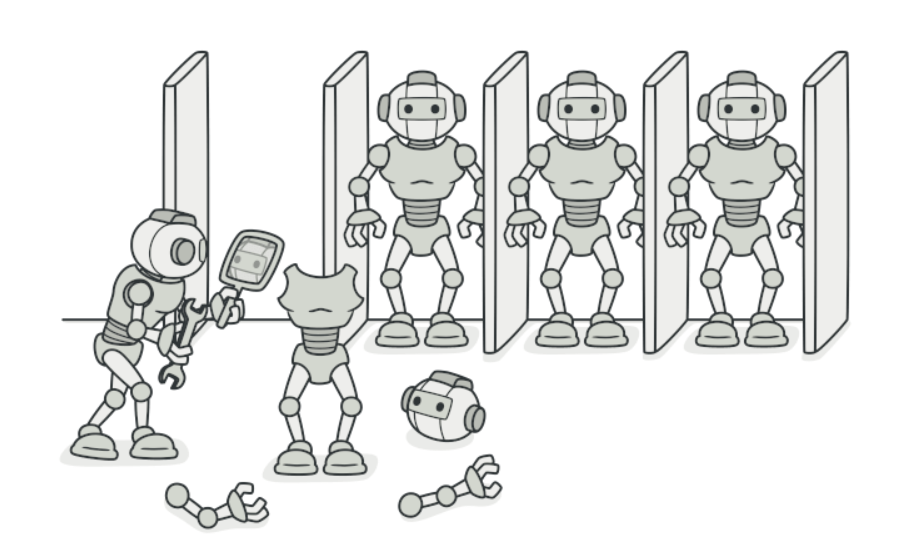
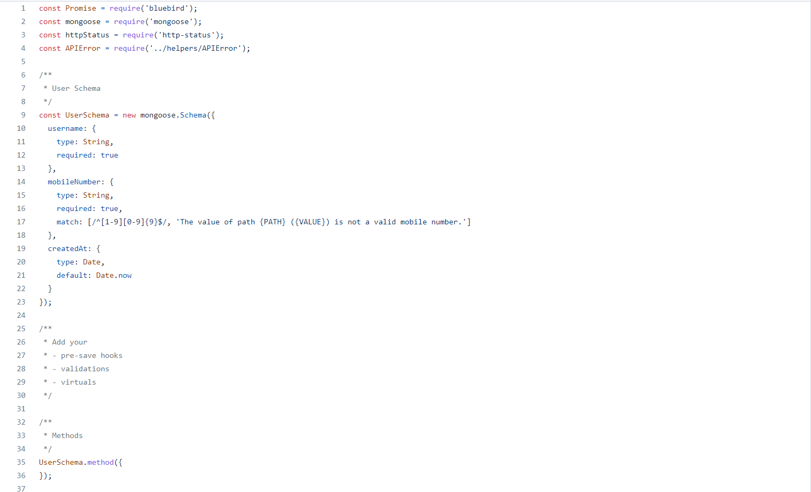
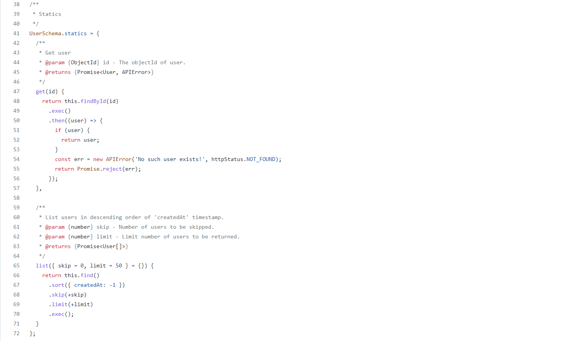
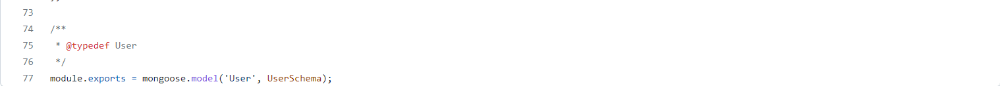

# 
 Prototype

### Histórico de versão 

| Data       | Versão | Descrição            | Autor(es)  |
| ---------- | ------ | -------------------- | ---------- |
| 16.03.2022 | 0.1    | Criação do documento | [Peniel Etèmana](https://github.com/zpeniel09) |

### Participantes

- Peniel Etèmana 

### Introdução

&emsp;&emsp;
GoFs Criacionais são padrões que fornecem vários mecanismos de criação de objetos, que aumentam a flexibilidade e a reutilização do código existente. 

Permitem, nesse caso, usar mecanismos/recursos para facilitar tanto a incorporação de novos algoritmos para 
novos contextos quanto a seleção de qual algoritmo usar dado um contexto.

Entre os principais GoFs criacionais temos o Prototype,é um padrão de design criacional que permite copiar objetos existentes sem tornar seu código dependente de suas classes

### Metodologia

    O Prototype faz a criação de novos objetos, mas ao invés de criar objetos com valores não inicializados, ele cria objetos através da cópia dos valores de um protótipo. 

    Esse padrão nos permitirá copiar objetos existentes sem que essa parte do código tenha dependência em classes. Quando quisermos criar um objeto igual, não precisamos acionar essas classes, basta fazer a exata cópia do objeto já criado.

### Resultados

    O padrão Prototype(protótipo), da forma como foi descrito no livro Design Patterns: Elements of Reusable Object-Oriented Software, contém os seguintes elementos: 

  -  **prototype** — uma classe que declara uma interface para objetos capazes de clonar a si mesmo.
    
  -  **prototype** concreto — implementação de um prototype;
    
  -  **cliente** — cria um novo objeto através de um prototype que é capaz de clonar a si mesmo.

 
<h6>Figura 1: Diagrama descrevendo prototype design pattern.</h6>
<h6>Fonte: Wikipédia.</h6>

 
<h6>Figura 2: Prototype.</h6>
<h6>Fonte: Refactoring Guru.</h6>

<strong>Uso desse padrão no nosso projeto</strong>

    Esse padrão pode ser observado no produto, que quando é criado, ele possui uma estrutura com valores pré-definidos, que não sao necessários serem especificados no momento de criação.

 
  
 
<h6>Fonte: Ki-Limpinho Backend.</h6>

[Link para o código](https://github.com/UnBArqDsw2021-2/2021.2_G2_Ki-Limpinho_Backend/blob/main/server/user/user.model.js)

## Referências

> [1] Arquitetura e Desenho de Software AULA - GOFS CRIACIONAIS Profa. Milene Serrano

> [2] Wikipédia. Disponível em: <https://pt.wikipedia.org/wiki/Prototype>. Acesso em: 16 mar. 2022.

>‌ [3] Refactoring Guru. **Prototype**. Disponível em: <https://refactoring.guru/design-patterns/prototype>. Acesso em: 16 mar. 2022.

> [4] Wikipédia. Disponível em: <https://en.wikipedia.org/wiki/Prototype_pattern>. Acesso em: 16 mar. 2022.
