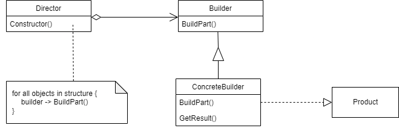
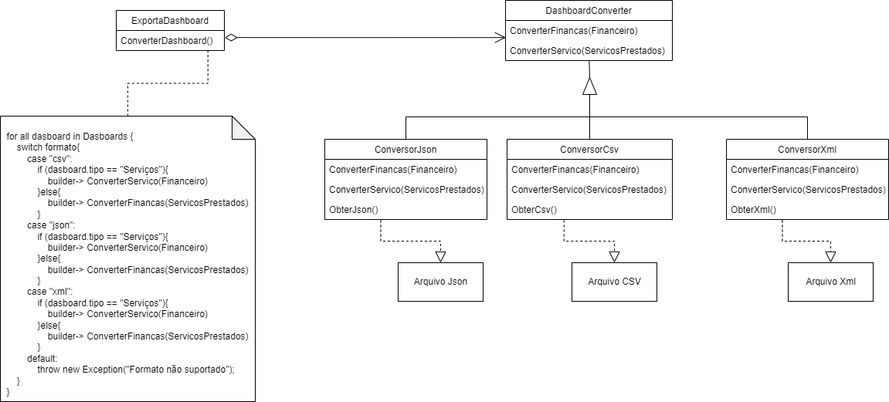

# 
 Design Sprint

## Histórico de Versão 

|Data | Versão | Descrição | Autor(es)|
| :-:|:-:|:-:|:-: |
| 01.12.2022 | 0.1 | Criação do documento | [Jonathan Jorge](https://github.com/Jonathan-Oliveira)|

## Participantes

* [Jonathan Jorge](https://github.com/Jonathan-Oliveira)

### Builder

&emsp;&emsp;

O Builder é um padrão de projeto de software  criacional quer permite a construção de objetos passo a passo. Permite a produção e representação de objetos complexos usando o mesmo código de construção, baseado em regras e parâmetros que sejam informados ao objeto responsável pela construção.

### Estrutura

  
  <figcaption align='center'>
        <b>
            <a href='../../../../assets/img/gof/structure_builder.png'>
               Figura 1: Estrutura do padrão Builder
            </a>
        </b>   
       
      <small>Fonte: GAMMA et al., 1995 </small>
  </figcaption>

### Aplicação

&emsp;&emsp;

O padrão Builder poderia ser aplicado caso a aplicação tivesse a funcionalidade de baixar os dados do dashboard em diversos formatos, como por exemplo CSV, JSON, XML, etc. Para a aplicação da funcionalidade citada a cima, o padrão seria aplicado com a seguinte estrutura:

### Estrutura

  
  <figcaption align='center'>
        <b>
            <a href='../../../../assets/img/gof/application_builder.png'>
               Figura 2: Estrutura da aplicação do padrão Builder
            </a>
        </b>   
       
        <small>Autor: <a href='https://github.com/Jonathan-Oliveira'>Jonathan Jorge</a>, 2022.</small>
  </figcaption>

#### Participantes

##### Builder (ConverterDashboard)

* Especifica uma interface abstrata para criar partes de um objeto de Product.

##### ConcreteBuilder (ConversorJson, ConversorCsv, ConversorXml)

* Constrói e monta partes do produto através da implementação da interface Builder.
* Define e mantém um registo da representação que cria.
* Fornece uma interface para a recuperação do produto (ex., ObterCsv, ObterJSON, etc.).

##### Director (ExportaDashboard)

* Constrói um objeto usando a interface Builder.

##### Product ( Arquivo CSV,  Arquivo JSON,  Arquivo XML)

* Representa o objeto complexo em construção. O ConcreteBuilder constrói a representação interna do produto e define o processo pelo qual este é montado.
* Inclui classes que definem as partes constituintes, incluindo interfaces para a montagem das peças no resultado final.

### Consequências

De acordo com GAMMA, a aplicação do builder tem as principais consequências:

    > Permite variar a representação interna de um produto;

    > Isola o código de construção e representação;

    > Proporciona um melhor controle sobre o processo de construção.

### Conclusão

O padrão Builder facilita na separação de toda a lógica de criação dos objetos, evitando que as classes que representam esses objetos finais fiquem muito extensas e de pouca manutenibilidade, além de prover a implementação de múltiplos builders especializados, onde tem-se objetos construídos em cima de uma interface.

## Referências

> [1] GAMMA, E. et al. Design Patterns: Elements of Reusable Object-Oriented Software. USA:
Addison-Wesley Longman Publishing Co., Inc., 1995. ISBN 0201633612.

> [2] Builder Disponível em: <https://refactoring.guru/pt-br/design-patterns/builder>. Acesso em 17, Mar de 2022.

> [3] 007 – Padrão de Projeto BUILDER – Padrão GoF de Criação – Curso de Design Patterns Disponível em: <http://davesbalthazar.com.br/007-padrao-de-projeto-builder-padrao-gof-de-criacao-curso-de-design-patterns/>. Acesso em 17, Mar de 2022.

> [4] Desing Patterns na prática - Desvendando o Builder (parte 2) Disponível em: <http://www.linhadecodigo.com.br/artigo/2576/desing-patterns-na-pratica-desvendando-o-builder-parte-2.aspx>. Acesso em 17, Mar de 2022.
