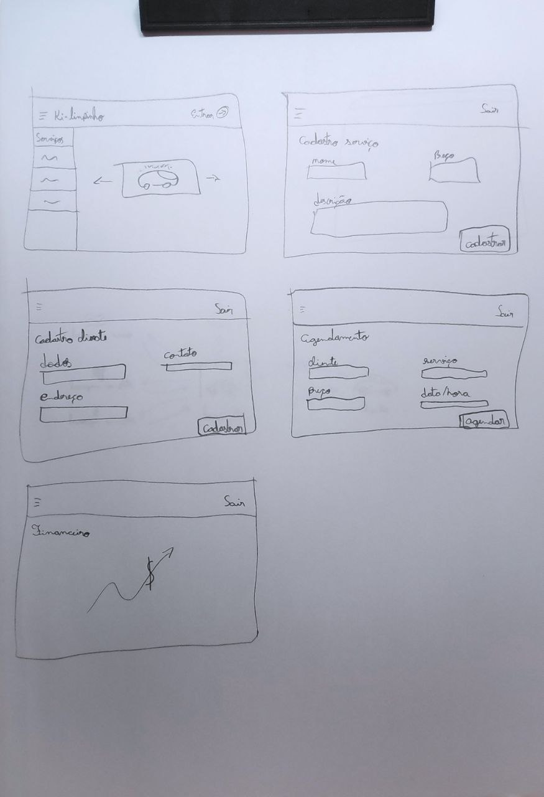

# 
 Protótipo de Baixa Fidelidade

|Data|Versão|Descrição|Autor(es)|
|-----|------|---------|----------|
|30/01/2022|0.1| Versão inicial | [Lucas Lima](https://github.com/mibasFerraz), [Jonathan Jorge](https://github.com/Jonathan-Oliveira), [Yuri Alves](https://github.com/yuriAlves5) |
| 04.02.2022 | 0.1.1 | Revisão e correção do documento, primeira entrega | [Natanael Filho](https://github.com/fernandes-natanael) |
| 07.03.2022 | 0.2 | Ajustes para terceira entrega  | [Jonathan Jorge](https://github.com/Jonathan-Oliveira)  |

## Participantes

* [Lucas Lima](https://github.com/mibasFerraz)
* [Jonathan Jorge](https://github.com/Jonathan-Oliveira)
* [Yuri Alves](https://github.com/yuriAlves5)

## Introdução

&emsp;&emsp;Os protótipos de baixa fidelidade são feitos  à mão no papel. Eles visam definir a interação do usuário com a aplicação da forma mais simples o possível, e esse tipo de protótipo tem como objetivo coletar feedbacks rápidos, por isso acabam não levando em conta o refinamento do design, além disso, o principal foco é a arquitetura e as funcionalidades. São utilizados para ajudar na definição do projeto e na elicitação de requisitos do produto.

## Metodologia

&emsp;&emsp;O grupo decidiu reunir três membros e fazer um protótipo de baixa fidelidade com base nos requisitos que foram elicitados anteriormente visando  na funcionalidade e arquitetura da solução a ser desenvolvida não levando em consideração os detalhes visuais ou refinamentos estéticos.

## Resultados

Abaixo temos o protótipo de baixa fidelidade produzido:

<a href="../assets/img/prototipagem/prototipoBaixa.jpeg">Figura 1: Protótipo de Baixa Fidelidade</a>

<small>
Autores: <a href='https://github.com/mibasFerraz'>  Lucas Lima</a>, <a href='https://github.com/Jonathan-Oliveira'>Jonathan Jorge</a>,<a href='https://github.com/yuriAlves5'>  Yuri Alves</a>, 2022
</small>
 
O protótipo de baixa fidelidade reproduzido contêm 5 principais telas do sistema sendo a tela inicial, a tela de cadastro de usuário, a tela de cadastro de serviços, a tela de agendamento e a tela de dashboard, onde é possível visualizar os dados financeiros do lava-jato.

##  Referências

> [1] BARBOSA. Simone. SILVA. Bruno. 2010. Interação Humano-computador.

> [2] Fidelidade de protótipos: Baixa, Média ou Alta, conheça os tipos: https://www.vitaminaweb.com.br/fidelidade-de-prototipos-baixa-media-ou-alta/. Acesso em: 31 fev. 2022.

> [3] Protótipos de Baixa fidelidade x Alta fidelidade. Qual escolher para seu produto?: https://medium.com/pan-design/prot%C3%B3tipos-de-baixa-fidelidade-x-alta-fidelidade-qual-escolher-para-seu-produto-6f3d0f95733c/. Último acesso em Acesso em: 31 fev. 2022.

> [4] Protótipo de baixa fidelidade: o que é e como desenvolver em um projeto?: https://www.digitalhouse.com/br/blog/prototipo-de-baixa-fidelidade/. Acesso em: 31 fev. 2022.