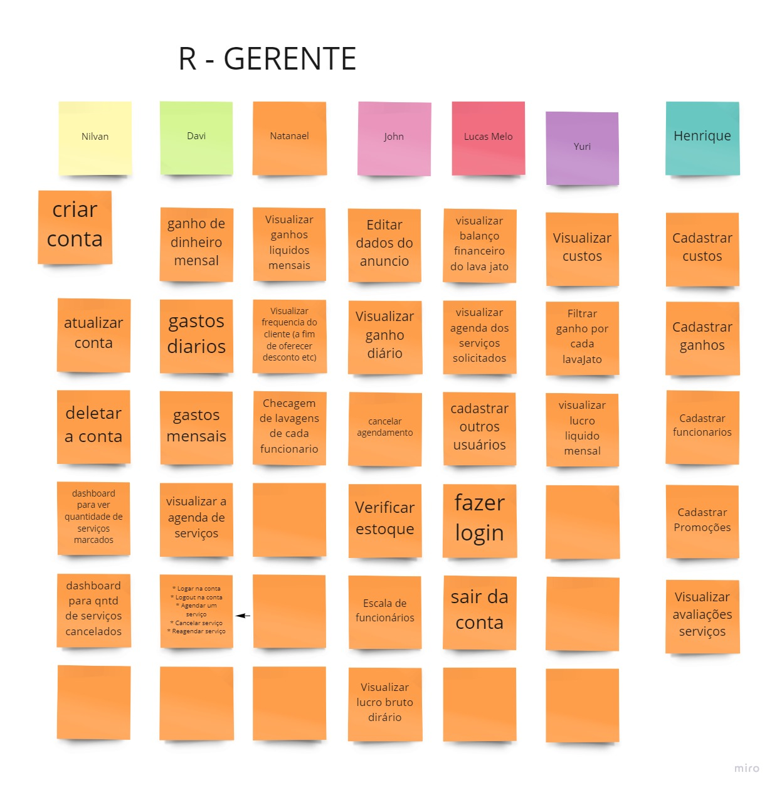
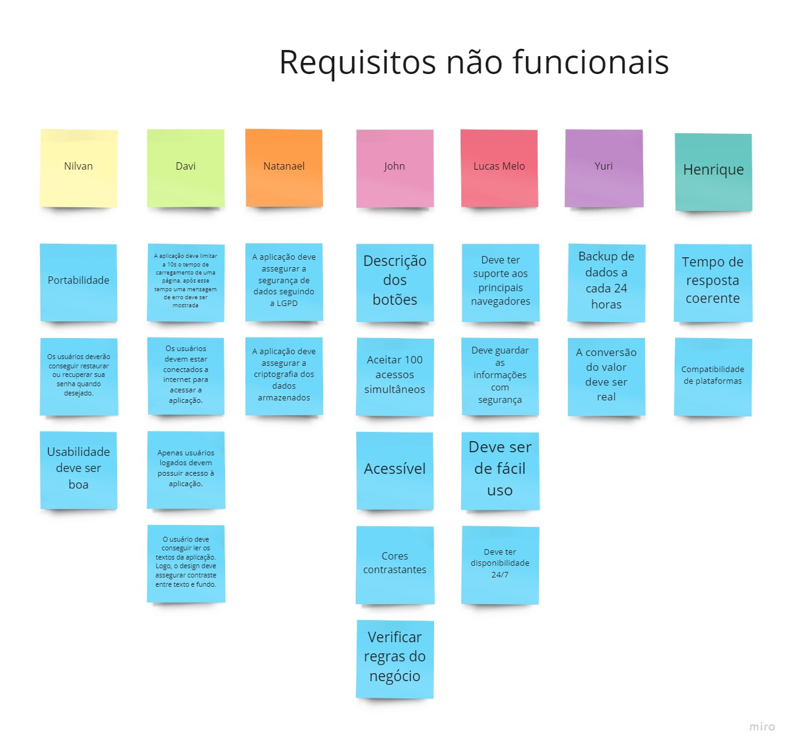
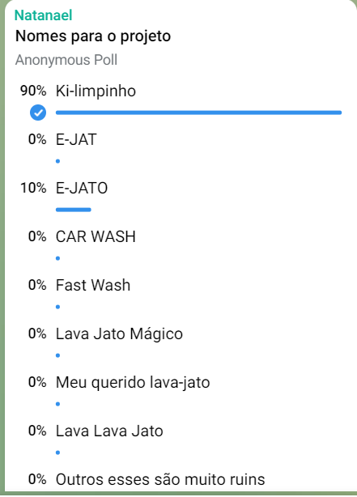

# 
 Brainstorm

### Histórico de Versão
|    Data    | Versão | Descrição            | Autor(es)       |
| :--------: | :----: | :------------------: | :-------------: |
| 04.02.2022 |  0.1   | Criação do documento | Davi Matheus |
| 04.02.2022 |  0.2   | Revisão do documento |Lucas Melo |
| 04.02.2022 | 0.2.1 | Revisão e correção do documento, primeira entrega | Natanael Filho |

## 1. Introdução

&emsp;&emsp;
O Brainstorming, também caracterizado como uma "tempestade de ideias", é um método usado para criar e explorar a capacidade criativa de indivíduos ou grupos. A técnica é muito dinâmica e prática que permite uma discussão bem abrangente considerando opiniões e pontos de vistas pessoais de cada participante sobre os aspectos do projeto e as possíveis abordagens. Assim, o brainstorm propõe que um grupo de pessoas se reúna e utilize seus pensamentos e ideias para poderem chegar a um consenso na solução de problemas.

## 2. Metodologia

&emsp;&emsp;
Para a realização do Brainstorming foi utilizado a ferramenta Miro. Por meio dessas duas ferramentas e por meio de chamadas, os integrantes do grupo colaboraram com diversas ideias relacionadas com o projeto em cada integrante usou a funcionalidade de post-it do Miro para colocar uma ideia ou opinião sobre o que o sistema do projeto em questão deveria conter, buscando conhecer as várias funcionalidades que poderiam estar presentes no projeto.

&emsp;&emsp;
 Através desse brainstorm conseguimos elicitar requisitos funcionais e não funcionais, em que  após essas discussões, o grupo compreendeu melhor o escopo do projeto. Para fechar essa fase foi realizado um último Brainstorming para escolher o nome do projeto.

## 3. *Brainstorming* requisitos funcionais.

### 3.1. *Brainstorming* requisitos funcionais para o cliente

    
    <figcaption align='center'>
        <b>Figura 1: Brainstorm para gerar requisitos funcionais para o cliente</b>
         
        <small>Fonte: Autor</small>
    </figcaption>

### 3.2. *Brainstorming* requisitos funcionais para o gerente

    
    <figcaption align='center'>
        <b>Figura 2: Brainstorm para gerar requisitos funcionais para o gerente</b>
         
        <small>Fonte: Autor</small>
    </figcaption>

### 3.3. *Brainstorming* requisitos funcionais para o gerente

**ID**|**Descrição**|**Tipo de Requisito**
:----:|-------------|:--------------------:
BS01  | O cliente deve ser capaz de se cadastrar na plataforma | RF
BS02  | O cliente após se cadastrar deverá receber um email de confirmação                    | RF
BS03  | O cliente poderá editar sua conta.                             | RF
BS04  | O cliente deve ser capaz de deletar  sua conta                     | RF
BS05  | O cliente deve ser capaz logar na sua conta uma vez que ja tenha se cadastrado                         | RF
BS06  | O cliente deve ser capaz de sair(logout) da sua conta                          | RF
BS07  | O cliente deve ser capaz de agendar um serviço                            | RF
BS08  | O cliente deve ser capaz de cancelar um serviço                      | RF
BS09  | O cliente deve ser capaz de reagendar um serviço                        | RF
BS10  | O cliente deve ser capaz de atualizar seu cadastro                              | RF
BS11  | O cliente deve ser capaz de escolher forma de pagamento                | RF
BS12  | O cliente deve ser capaz de avaliar um serviço                  | RF
BS13  | O cliente deve ser capaz de verificar status dos serviços contrados ou agendados      | RF
BS14  | O cliente deve receber um bonus/ cupons por sua fidelidade           | RF
BS15  | O gerente deve ser capaz de se cadastrar na plataforma                           | RF
BS16  | O gerente deve ser capaz editar sua conta.                      | RF
BS17  | O gerente deve ser capaz de deletar  sua conta | RF
BS18  | O gerente deve ser capaz logar na sua conta uma vez que ja tenha se cadastrado    | RF
BS19  | O gerente deve ser capaz de sair(logout) da sua conta             | RF
BS20  | O gerente deve ser capaz de visualizar o dashboard da quantidade de serviços marcadados e agendados          | RF
BS21  | O gerente deve ser capaz de visualizar o dashboard da quantidade de serviços cancelados       | RF
BS22  | O gerente deve ser capaz de visualizar o dashboard de lucros mensais     | RF
BS23  | O gerente deve ser capaz de visualizar o dashboard de gastos mensais       | RF
BS24  | O gerente deve ser capaz de visualizar as avaliações de serviço      | RF

<h6 align="center">Tabela 1: Requisitos Funcionais elicitados a partir do brainstorming</h6>
<h6 align="center">Fonte: Autor(es)</h6>

## 4. *Brainstorming* requisitos não funcionais.

    
    <figcaption align='center'>
        <b>Figura 3: Brainstorm para gerar requisitos não funcionais</b>
         
        <small>Fonte: Autor</small>
    </figcaption>

## 4.1. *Resultado* requisitos não funcionais.

**ID**|**Descrição**|**Tipo de Requisito**
:----:|-------------|:--------------------:
BS01  | O aplicativo deve ser acessível | RNF
BS02  | O aplicativo deve ser intuitivo                   | RNF
BS03  | Apenas usuários logados devem possuir acesso à aplicação.                            | RNF
BS04  | O usuário deve conseguir ler os textos da aplicação. Logo, o design deve assegurar contraste entre texto e fundo.                 | RNF
BS05  | Os usuários devem estar conectados a internet para acessar a aplicação.                        | RNF
BS06  | A aplicação deve limitar a 10s o tempo de carregamento de uma página, após esse tempo uma mensagem de erro deve ser mostrada                         | RNF
BS07  | A aplicação deve assegurar a segurança de dados seguindo a LGPD                         | RNF
BS08  | A aplicação deve assegurar a criptografia dos dados armazenados               | RNF
BS09  | A aplicação deve ser Compativel com outras plataformas                  | RNF
BS10  | A aplicação deve dar o Backup de dados a cada 24 horas                            | RNF

|Legenda|Descrição|
|:--:|:--:|
|BS|Brainstorm|
|RF|Requisito Funcional|
|RNF|Requisito Não Funcional|
<h6>Tabela 2: Legenda dos acrônimos contidos na Tabela 1</h6>
<h6>Fonte: Autor</h6>

## 5. *Brainstorming*  para a escolha do nome do projeto.

&emsp;&emsp;
Por fim, o último Brainstorming feito até o momento foi para definição do nome do projeto. Para isso, no dia 01 de fevereiro de 2021, foi pedido aos integrantes do grupo para escrever vários potenciais nomes para o projeto no grupo do Telegram e depois foi feito uma enquete para decidir qual nome os integrantes mais se interessaram. 

    
    <figcaption align='center'>
        <b>Figura 4: Votação para o nome do projeto</b>
         
        <small>Fonte: Autor</small>
    </figcaption>

&emsp;&emsp;
Como pode ser visto na imagem acima, o nome escolhido "Ki-limpinho" ganhou com quase unanimidade.

## 6. Conclusão

&emsp;&emsp;
Como pode ser percebido, a técnica de Brainstorming vem se provando eficiente para a geração de ideias, no escopo desse projeto. Essa técnica quando usada junto a enquetes também se mostrou muito útil e eficaz para tomada de decisões.

## 7. Referências

> https://unbarqdsw2021-1.github.io/2021.1_G6_Curumim/base/requisitos/elicitacao/brainstorming/
> https://unbarqdsw2021-1.github.io/2021.1_G01_Animalesco_docs/#/pages/brainstorming?id=_5-conclus%c3%a3o